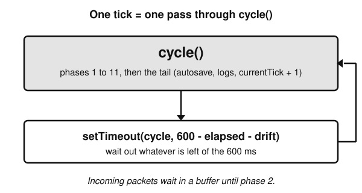
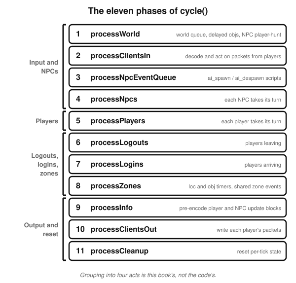
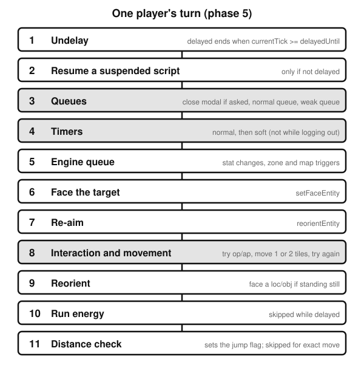
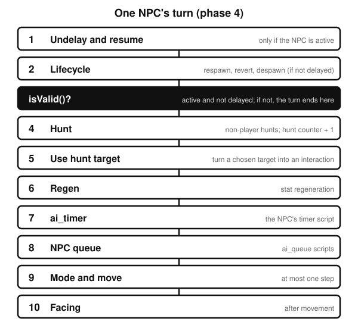
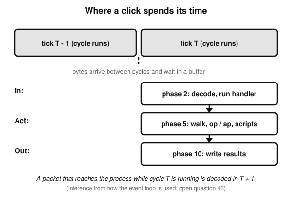
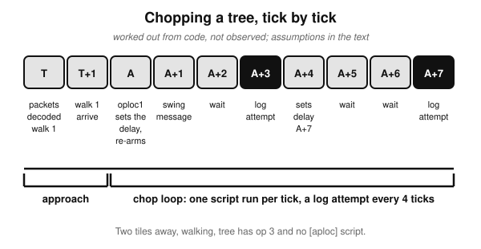

# A Short Introduction to the Tick

*How the LostCityRS engine runs a game, six hundred milliseconds at a time*

## Before you start

If you open a script in the Content repository and read `p_delay(2)` or `settimer`, or open the engine and find a function called `processPlayers`, you are looking at the same thing from two sides. Both are about **ticks**. Almost every rule in the game, from how fast you walk to how often a tree can give you a log, is a rule about ticks.

This book explains what a tick is and what happens inside one. It is short on purpose. It is meant to give you the vocabulary and the mental model, so that when you go on to read the scripts and the engine you already know what each word means and where in the tick it happens.

Three things to know about how it was written.

- **Everything comes from reading code.** The facts in this book were read from the engine, the content scripts and a few client files, at the commits listed in the last chapter. The server was never run. Where a statement about timing is an inference from several facts rather than something read in one place, the text says so.
- **Each chapter ends with its sources.** The prose stays clean; the footer lists where each claim was checked, using the same pointers as the detailed notes in `docs/tick/`. A pointer like `05#8` means rule 8 of note 05. Open the note when you want the proof.
- **It describes one revision.** The engine here replicates revision 274. Nothing in this book relies on how the real game behaves; if the code and your memory of the game disagree, the code is what this book describes.

## 1. The heartbeat

The engine is a single loop. Each time round the loop is called a **tick**, and a tick is meant to last 600 milliseconds. That figure is a constant in the code: `TICKRATE: number = 600`.

A useful picture here is a metronome, as an analogy and nothing more. A metronome does not care what the musicians are doing; it clicks at a fixed rate, and everyone plays against the clicks. The game works the same way. Players and non-player characters do not act continuously. They act when a tick comes round, and everything that is going to happen in a tick happens inside one function, `World.cycle()`.

*Figure 1. A tick is one pass through `cycle()`, followed by a wait for whatever remains of the 600 ms.*

Inside `cycle()` the engine calls eleven functions in a fixed order. This book calls them **phases**, numbered 1 to 11. After the eleventh it runs a short tail of housekeeping and adds one to a counter, `currentTick`. That counter is the game's clock. Scripts read it (the `map_clock` command pushes it), and when a script says something happens "in three ticks", it means three increments of that counter.

Then the engine schedules the next tick. At the end of `cycle()` it calls `setTimeout` with the time left in the 600 ms, taking off how long this tick took and any lateness it has already accumulated. The next tick is only scheduled once the current one has finished, so ticks do not overlap. From that, it follows (an inference, not observed) that a slow tick delays the next one rather than running alongside it.

Two special cases are worth knowing about. During a world shutdown the engine sets the tick rate to 0 and runs ticks back to back, to get everyone saved and out quickly. And a developer cheat, `::speed`, can change the tick rate outside production. In normal running the figure is 600.

If something goes badly wrong, an exception that escapes a phase without being caught, then `cycle()` removes every player and the process exits. No further tick is scheduled. Most phases catch errors per player or per NPC so that one bad entity does not take the server down, but not all of them do, and later chapters point out which.

> **What to remember**
>
> - A tick is one pass through `World.cycle()`, targeted at 600 ms.
> - `cycle()` runs eleven phases in a fixed order, then a short tail that adds one to `currentTick`.
> - Script delays and timers are all counted in ticks.
> - The next tick is scheduled when the current one ends, so ticks never overlap.

**Where this comes from.** `00-overview.md` "Tick length and rescheduling"; `11#12`, `11#19`-`11#22`. `Engine-TS/src/engine/World.ts:120` (the 600 constant), `Engine-TS/src/engine/World.ts:163` (`tickRate`), `Engine-TS/src/engine/World.ts:342-343` (drift), `Engine-TS/src/engine/World.ts:503-508` (increment and reschedule), `Engine-TS/src/engine/World.ts:509-526` (crash path). `map_clock` pushes `currentTick`: `Engine-TS/src/engine/script/handlers/ServerOps.ts:16-17`. Not observed: how closely a running server keeps to 600 ms (open question 44).

## 2. What lives in the world

Before the phases make sense you need to know what they operate on. There are only a handful of kinds of thing.

**Players** are the people logged in. Each has a connection to a client, a position, an inventory, stats, and a set of pending work: queues of scripts waiting to run and timers counting down. The engine keeps them in a list called `playerLoop`, and the order of that list matters, because in most phases one player is fully processed before the next. The order is not by player number. It depends on the low bits of the player's network address and then on login order.

**NPCs** are the non-player characters. Each has an id called a `nid`, and they are processed in ascending `nid` order. An NPC has a type, and its type supplies a default **mode**, which is how it behaves when nothing else is going on. If a type does not set one, the default is to wander.

**Locs** are things placed in the map: a tree, a door, a rock. **Objs** are items lying on the ground. Both can change and then change back. A tree becomes a stump and later a tree again, and an item dropped on the floor is removed after a while. These changes are driven by timers that are processed in phase 8.

**Zones** are the engine's way of dividing the map. When something changes in a zone, such as a loc being swapped, the change is recorded as a zone event, and the packets that tell nearby players about it are built from those events.

**Scripts** are where the game rules live. They are written in RuneScript, in `.rs2` files under `Content/scripts/`. (A separate repository, `RuneScriptTS`, holds the compiler; it was not read for this book.) The engine does not know what woodcutting is. It knows that when a player operates on a loc of a certain kind, it should look for a script registered for that trigger and run it. A header like `[oploc1,_tree]` is that registration: a trigger name, followed by what it applies to. How the compiler turns the second half into a lookup key was not read for this book (open question 5).

**The client** is a separate program that talks to the engine over a socket. It sends the engine small messages called **packets**, such as "I clicked here" or "I chose option 1 on that tree", and it receives packets back that tell it what to draw and what to say. The engine is the authority. The client displays the state the engine tells it about.

> **What to remember**
>
> - Players and NPCs are processed one at a time, in a fixed order; players by `playerLoop` order, NPCs by `nid`.
> - Locs and objs are changed and restored by timers in phase 8.
> - Game rules live in scripts; the engine finds them by trigger.
> - Clients send packets in; the engine sends packets back.

**Where this comes from.** `02#1`-`02#3` (`playerLoop` order); `04` rule 2 and `00-overview.md` "Per-tick order of one NPC" (ascending `nid`); `04b#1` (default mode `WANDER`, `Engine-TS/src/cache/config/NpcType.ts:110`); `08` (loc/obj timers, zone events). Scripts and triggers: `../flows/click-loc-woodcutting.md`. Player order: `Engine-TS/src/engine/World.ts:146`, `Engine-TS/src/engine/World.ts:910-934`.

## 3. Eleven steps, in order

Here is the whole tick at a glance. The four groups on the left are this book's way of making it easier to hold in your head; the code has no such grouping.

*Figure 2. The eleven phases of `cycle()`, in the order they run.*

**Input and NPCs (phases 1 to 4).**

1. **`processWorld`** runs scripts that were put on the world queue, ordered by arrival and due when their delay has run out. This is where a `world_delay` script comes back. It also places items that were dropped with a delay, and lets NPCs with a player-hunt look for someone to hunt, though they do not act on the choice yet.
2. **`processClientsIn`** is where the players' packets are read. For each player, in `playerLoop` order, the engine decodes the packets that arrived since last tick and runs their handlers at once. There is a cap on how many it handles per player per tick. Chapter 6 covers this.
3. **`processNpcEventQueue`** runs `ai_spawn` and `ai_despawn` scripts that were queued when NPCs appeared or disappeared.
4. **`processNpcs`** gives each NPC its turn. Chapter 5 covers this.

**Players (phase 5).**

5. **`processPlayers`** gives each player its turn: delays, queues, timers, interaction and movement. It is where most game scripts run, and chapter 4 covers it.

**Logouts, logins and zones (phases 6 to 8).**

6. **`processLogouts`** handles players who are leaving. A logout is requested by a script, by an idle packet, or by a timeout, and the player is only removed when certain conditions hold, such as having no pending engine work.
7. **`processLogins`** admits players waiting to log in. A player who joins in phase 7 of tick T is present in phases 9 to 11 of that tick, but has its first packet decode and its first turn in tick T + 1.
8. **`processZones`** runs the loc and obj timers, which is when a stump turns back into a tree, and then turns each zone's recorded events into a buffer that is shared by everyone who can see that zone.

**Output and reset (phases 9 to 11).**

9. **`processInfo`** prepares the update blocks that describe each player and NPC: their appearance, animation, and movement. It does this once per entity.
10. **`processClientsOut`** writes each connected player's packets: the map, the player and NPC lists, zone changes, inventories, stats and interface changes.
11. **`processCleanup`** clears the per-tick state, such as the record of how a player moved this tick, so the next tick starts clean.

After phase 11 comes the tail. It handles shutdown, requests an autosave for every player on each tick that is a multiple of 1500, writes a check-in log line every 50th tick, flushes logs, and then increments `currentTick`.

### Why the order matters

The order was not arbitrary, and a few consequences are worth holding on to.

- **Input is read before anything acts on it.** A click is decoded in phase 2 and can take effect in phase 5 of the same tick.
- **NPCs move before players.** So in phase 5 a player sees an NPC where it stands after this tick's movement, while an NPC in phase 4 sees a player where it stood before this tick's movement. This is an inference from the phase order and the per-entity notes.
- **Most output comes last.** Movement, appearance, animations, inventories and stats are gathered in phases 9 and 10, after everything that could change them has run. Some packets are written earlier, at the moment a script or handler creates them; chapter 6 covers which.
- **State that means "this tick" is cleared at the very end.** Phase 11 resets it only after phase 10 has read it.

> **What to remember**
>
> - 1 world, 2 packets in, 3 NPC events, 4 NPCs, 5 players, 6 logouts, 7 logins, 8 zones, 9 info, 10 packets out, 11 cleanup.
> - Players act in phase 5, after NPCs and before the output phases.
> - `currentTick` is incremented once, in the tail, so every phase of a tick sees the same number.

**Where this comes from.** `00-overview.md` "Phases" (one row per phase, with the ordering rule for each), `Engine-TS/src/engine/World.ts:340-508`. Phase 1: `01#2`, `01#4`. Phase 2: `02#5`, `02#6`. Phase 3: `03#13`. Phase 6: `07#6`, `07#7`. Phase 7: `07#16`, `07#17`. Phase 8: `08#18`. Phase 9: `09#16`. Phase 10: `10#1`. Phase 11: `11#4`, `11#12`, autosave `11` rule 15. NPCs before players: the inference at the end of `00-overview.md` "Per-tick order of one NPC" (from `04§Inf`).

## 4. A player's turn

Phase 5 is where a player's pending work gets done. The whole turn for one player finishes before the next player's turn starts, and the turn has eleven steps in a fixed order.

*Figure 3. The eleven steps of one player's turn. The three shaded steps are the ones that run scripts most often.*

There is no early exit. Every player in the list goes through every step, and each step decides for itself whether it is allowed to do anything. Understanding those decisions is most of what you need to read a script, so it is worth going through the vocabulary.

### Delay, and the suspended script

A script can pause itself for a number of ticks with `p_delay(n)`. When it does, the player becomes **delayed**, and the script is stored on the player in a **suspended** state. `delayedUntil` is set to the current tick plus one plus `n`.

Step 1 of every turn clears the delay once the clock has caught up. Step 2 then resumes the stored script, as long as the player is not delayed. Putting those together gives an inference: `p_delay(n)` called in tick T resumes in step 2 of this player's turn in tick T + 1 + n. So `p_delay(0)` is a one-tick pause.

### Who is allowed to act: `canAccess`

Most steps check one condition before running a script. A player can be accessed when it is not **protected**, not delayed, and has no main or chat **modal** open. A modal is an interface that wants the player's attention, such as a dialogue box or the bank. A side panel does not count.

The word "protected" needs a moment. While a script runs with protection, the player is flagged so that nothing else can run protected scripts on them at the same time. Scripts run by queues, normal timers and interactions are protected. Soft timers are not. In practice the flag is held while a script runs and is reset at the end of the tick.

### Queues

A **queue** is a list of scripts waiting to run on this player, each with a delay. They run in the order they were added.

- The **normal queue** holds three kinds of entry: normal, **strong** and **long**. They run first.
- The **weak queue** runs after it. What makes an entry weak is what clears it: every time the engine closes the player's interfaces (`closeModal`), the weak queue is emptied, and that happens whenever the player clicks to move or interact. The normal queue is not cleared that way.
- A **strong** entry anywhere in the normal queue makes the engine close the player's modal before the queue is processed, every tick that entry is waiting.
- The **long** queue entry has special logout behaviour, which matters in phase 6.

The counter works like this. On every visit the entry's delay goes down by one, whether or not the player can be accessed. The entry runs when the value before the decrement is zero or below, and the player can be accessed. So an entry with delay `d` is skipped `d` times and runs on the next visit. If the player is blocked, the counter keeps going down and the entry runs on the first visit when access is possible.

There is also a third list, the **engine queue**, which the engine itself uses. Level-ups, for example, enqueue the stat-change scripts there, and moving into a new zone enqueues the zone triggers. Its entries have no delay.

### Timers

A **timer** is a script that runs repeatedly. A player can have any number of them, each identified by its script. Setting a timer that already exists replaces it and restarts its clock.

A timer does not count down. It stores the tick it last fired, and fires again when the current tick reaches that plus its interval. A **normal** timer only fires when the player can be accessed. A **soft** timer ignores access entirely, and so it can fire while the player is delayed or has a modal open. Normal timers are processed first, then soft ones. If the player is logging out, neither runs.

### Interaction and movement: op and ap

This is step 8, and it is the most involved. When you click on a loc, an NPC, an item or another player, the engine records a **target** and which option you chose. Each turn it tries to **interact**.

There are two ways an interaction can fire, called **op** and **ap**. The code only uses those abbreviations, so what follows describes how they behave. An **op** script runs when the player is within operating distance of the target. An **ap** script runs earlier: when the player is within an approach range, which starts at ten tiles, and has line of sight. If a target has both, the op script is tried first.

Step 8 does three things in order. It tries to interact before moving. If nothing fired, it moves the player, up to one tile when walking or two when running. Then it tries again.

One rule here catches people out. An op on a loc or an item only fires on a tick in which the player took no step. So after walking up to a tree, the op fires the tick after arrival. An op on a player or an NPC can fire in the arrival tick itself.

Another rule shapes loops such as woodcutting. A script that re-arms the interaction with `p_oploc` does not run again until the next tick, so a loop built that way runs at most once per tick.

> **What to remember**
>
> - A player's turn has eleven steps, no early exit, and each step has its own gate.
> - `canAccess` means not protected, not delayed, and no main or chat modal.
> - Queues count down on every visit; timers compare the clock to the last firing; soft timers ignore `canAccess`.
> - Interaction is attempt, move, attempt. A loc op fires only on a tick without a step.

**Where this comes from.** `00-overview.md` "Per-tick order of one player", `Engine-TS/src/engine/World.ts:692-726`. Delay and resume: `05#4`-`05#7`, `Engine-TS/src/engine/entity/Player.ts:2171-2187`; inference in `05` Inferences. Access: `05#8`, `Engine-TS/src/engine/entity/Player.ts:816-832`. Queues: `05#9`-`05#13`, `Engine-TS/src/engine/entity/Player.ts:874-889`, `Engine-TS/src/engine/entity/Player.ts:897-913`. Timers: `05#16`-`05#19`, `Engine-TS/src/engine/entity/Player.ts:945-961`. Engine queue: `05#20`-`05#21`. Interaction and movement: `06#5`, `06#6`, `06#9`, `06#13`-`06#14`, `06#17`, `06#19`. Not checked: the `rsmod` routefinder that decides what "close enough" means (open question 4).

## 5. An NPC's turn

NPCs get their turn in phase 4, before any player. Each one runs through its own ordered list, and the first thing to learn is that an NPC's turn is gated differently from a player's.

*Figure 4. The steps of one NPC's turn. The dark row is the gate.*

An NPC has no `canAccess`. It has a single check, `isValid()`, which is true when the NPC is **active** and not **delayed**. That check comes after the first two steps. The first step (undelay, then resume a suspended script) is for active NPCs. The second, the lifecycle of respawning, reverting and despawning, is for NPCs that are not delayed, and it includes inactive NPCs that are waiting to respawn. Everything after the gate is skipped for an NPC that is not valid.

The steps after the gate are a short list: hunting, regeneration, the `ai_timer` script, the queue of `ai_queue` scripts, and then the mode.

### Modes

A **mode** is what the NPC is currently doing, and it decides what happens in step 9. There are modes with no target, and modes that need one.

| Mode | Needs a target | What it does each tick |
|---|---|---|
| `NONE` | no | only walks any waypoints a script has queued |
| `WANDER` | no | the default for an NPC type; each tick there is a 1 in 8 chance of choosing a nearby tile to walk to |
| `PATROL` | no | walks between the type's patrol points, pausing at each for its configured delay |
| `PLAYERESCAPE` | player | steps away from the player |
| `PLAYERFOLLOW` | player | re-paths to the player's current position every tick |
| `PLAYERFACE`, `PLAYERFACECLOSE` | player | turns to face the player without moving; the second gives up if the player is more than one tile away |
| `OPPLAYER`, `APPLAYER`, `QUEUE1` to `QUEUE20` and the loc, obj and NPC variants | yes | all handled by one step, `aiMode`, which is how an NPC runs `ai_op` and `ai_ap` scripts against a target |

A mode that needs a target but has none, or whose target is no longer valid, makes the NPC fall back to its defaults. Every mode that moves does so by at most one step per tick.

### Time and ordering

Two differences from players follow from the structure. First, an NPC's timer counts only the turns on which the NPC was valid, whereas a player's timer compares absolute ticks. Second, the NPC queue only counts an entry's delay down while the NPC is not delayed, whereas the player queue counts down on every visit.

> **What to remember**
>
> - An NPC's turn is gated by `isValid()` (active and not delayed), checked after undelay, resume and lifecycle.
> - Modes decide behaviour; the default is to wander.
> - An NPC moves at most one tile per tick.

**Where this comes from.** `00-overview.md` "Per-tick order of one NPC", `Engine-TS/src/engine/entity/Npc.ts:109-192`; the gate: `04#4`, `Engine-TS/src/engine/entity/Npc.ts:152-155`. Modes: `04b#1` to `04b#16` (`NONE`, `WANDER` at `Engine-TS/src/engine/entity/Npc.ts:716-739`, `PATROL` at `Engine-TS/src/engine/entity/Npc.ts:741-781`, the player modes, `aiMode` at `Engine-TS/src/engine/entity/Npc.ts:907-934`), `Engine-TS/src/engine/entity/NpcMode.ts:1-96`. Timers and queues compared with players: the "Player versus NPC" table in `05` (`04#12`, `04#13`). Not checked: how often content NPC types override the default mode, and what their `ai_op`/`ai_ap` scripts do (open question 28).

## 6. Packets, in and out

The client and the engine never talk in real time. They talk in packets, and ticks decide when those packets take effect.

*Figure 5. A click is buffered between ticks, decoded in phase 2, acted on in phase 5 and answered in phase 10.*

### Coming in

Bytes from a client are not read during a tick. A handler appends each chunk to a buffer, and phase 2 is where the buffer is read. So clicking early or late in the 600 ms window matters: a packet that reaches the process while a tick is running is only decoded in the next tick. That is an inference from how the loop works and from the code that buffers the bytes.

In phase 2, for each player, the engine reads packets one at a time and runs each handler straight away. There are limits. Packets are split into categories, and a player can have at most five accepted user actions, which includes clicks, button presses and chat, and twenty client events per tick. Anything over a limit stays in the buffer and is read first on the next tick, in order. Nothing is thrown away.

What a handler does depends on its kind.

- **Movement and interaction packets only arm state.** They record waypoints, a target, and the chosen option. The walking and the script run later, in phase 5.
- **Button, inventory and dialogue packets run their script immediately,** during phase 2.
- **If the player is delayed, movement and interaction packets are consumed and discarded.** They are not saved for later. The client is told to clear its walking flag.

A move or interaction packet that arrives while a modal is open, with no delay, is accepted and closes the modal.

### Going out

Writing a packet to a client works differently. In most cases the engine writes it to the socket at the moment it is created. There is no output queue and no separate flush. So the `mes` command, which shows a chat message, sends its packet right there in the script, mid-phase.

But much of what a player sees is deferred. Changes to a player's appearance and animation are recorded as masks in the earlier phases and encoded in phase 9, then sent as part of the player and NPC lists in phase 10. Inventory changes and stat changes are only marked in the earlier phases, and the packets are written in phase 10.

Phase 10 sends, for each connected player, in this order: camera and multiway changes, the player list, the NPC list, zone updates, inventories and run weight, stats and run energy, and then any interface changes. A player without a connection is skipped. So a script that calls `mes`, `anim`, `inv_add` and `stat_advance` in one run produces the message first, and the animation, inventory update and stat update afterwards, in that order.

> **What to remember**
>
> - Packets wait in a buffer until phase 2. A packet arriving mid-tick is read next tick.
> - Moves and ops only arm state in phase 2; phase 5 acts on it.
> - Packets for the client are mostly written immediately, but animations, inventories and stats are deferred to phase 10.
> - A delayed player's movement and op packets are dropped.

**Where this comes from.** `02#4`-`02#7`, `02#9`, `02#12`, `02#13`, `02#15`, `02#16`; `10#1`, `10#5`, `10#7`, `10#11`-`10#13`. `Engine-TS/src/engine/entity/NetworkPlayer.ts:68-71` (decode loop), `Engine-TS/src/network/game/client/ClientGameProtCategory.ts:5-8` (limits), `Engine-TS/src/engine/World.ts:617-629` (move-click flag block), `Engine-TS/src/engine/entity/NetworkPlayer.ts:191-228` (writes go straight to the socket). The arrival window is an inference (`scenarios.md` "When does a packet get processed?"); open question 46. Client side: what the client does with these packets is mostly not read (open questions 6, 14).

## 7. One click, tick by tick

To see all of this together, take a single action: a player clicks "Chop down" on a tree.

The assumptions matter, so here they are. The tree is two tiles away in a straight line, the player is walking, not running, and is not delayed or in a dialogue. The tree's type has op 1 and op 3 and no `[aploc]` script exists for it, which is not confirmed (open questions 8 and 9). Both packets, the route and the interaction, were fully buffered before the tick began.

*Figure 6. The chop loop under those assumptions. Worked out from code, not observed.*

**Tick T.** In phase 2 the engine decodes the move packet and queues one waypoint, then decodes the loc-op packet and sets the tree as the player's target. In phase 5 step 8 the player tries to interact, which fails because the loc is not in operating range, and then moves one tile.

**Tick T + 1.** The player takes the second step and arrives. The op does not fire, because a step was taken this tick and a loc op only fires on a tick without one.

**Tick A (the tick after arrival, T + 2).** There is no step, so the post-move attempt runs the `[oploc1,_tree]` script. In `woodcut.rs2` that is `@attempt_cut_tree`. It checks the level, the free inventory space and the axe. Then `%action_delay` is less than `map_clock`, so it sets `%action_delay` to the current tick plus three, calls `p_oploc(1)` to re-arm the interaction, and returns.

**Tick A + 1.** The re-armed op runs the same script. This time `%action_delay` is in the future, so the script shows the swing: it plays the animation, makes the chop sound and writes "You swing your axe at the tree.". It is not yet time for a log, so it calls `p_oploc(3)`.

**Tick A + 2.** Op 3 runs `@cut_tree`. `%action_delay` is neither earlier than nor equal to the clock, so it only re-arms with `p_oploc(3)`.

**Tick A + 3.** The clock now equals `%action_delay`. The script plays the animation and runs `@get_logs`. It rolls against the success chance. On success it writes a message, advances the stat and adds the logs, and then a second roll decides whether the tree is replaced by its next stage (a stump). If it is, the script returns without re-arming and the interaction ends. In every other case, including a failed roll, it calls `p_oploc(3)` again.

**Tick A + 4.** The delay is now behind the clock, so it is set to A + 7, and the loop continues.

So the pattern, under those assumptions, is a script run on every tick and a chance of a log every fourth tick. What the player sees follows the output rules from chapter 6. The message arrives at once. The animation, the inventory change and the experience change come out of phase 10 of that tick.

A reader who wants to check this against the code should open `woodcut.rs2` and follow the tick numbers. It is a good test of the vocabulary in this book.

> **What to remember**
>
> - A click is a pair of packets: a route and an op. Both are read in phase 2.
> - Walking takes one tile per tick; a loc op fires on the first tick with no step.
> - A script that re-arms itself with `p_oploc` runs at most once per tick.
> - This timeline is worked out from code. It has not been observed on a running server.

**Where this comes from.** `scenarios.md` scenario 1 (every row cites its rule); `../flows/click-loc-woodcutting.md`; `06#17`, `06#19`, `06` Inferences. `Content/scripts/skill_woodcutting/scripts/woodcut.rs2:1-3`, `Content/scripts/skill_woodcutting/scripts/woodcut.rs2:55-62`, `Content/scripts/skill_woodcutting/scripts/woodcut.rs2:64-78`, `Content/scripts/skill_woodcutting/scripts/woodcut.rs2:108-115`, `Content/scripts/skill_woodcutting/scripts/woodcut.rs2:117-142`. Open and not checked: the tree's op 3 (open question 8), any `[aploc]` script (9), the initial value of `%action_delay`, the success-chance procs, and a real run (10).

## 8. Reading a script with this book

Here is a short crib for the commands you are most likely to meet first. For each, the point is when it takes effect in tick terms.

| Command | What it does, in tick terms |
|---|---|
| `[oploc1,_tree]` | A trigger. It runs in phase 5 step 8 when the player operates on a matching loc. |
| `p_oploc(n)` | Re-arms an interaction with the same loc. It first stops the current action, which closes any modal and clears the weak queue. It first fires on the next tick at the earliest. |
| `p_delay(n)` | Suspends the script and delays the player. It resumes in step 2 of the player's turn in tick T + 1 + n. |
| `queue`, `weakqueue`, `strongqueue`, `longqueue` | Adds a script to a queue with a delay. Each differs in what clears it or what it does to the open interface. |
| `settimer`, `softtimer` | Sets a repeating script. Normal timers need `canAccess`; soft timers do not. |
| `world_delay(d)` | Puts the script on the world queue. It resumes in phase 1, on the (d + 2)th visit. |
| `mes`, `sound_synth` | Written to the socket at once, during the script. |
| `anim` | Sets a mask. The client receives it in phase 10, in the player list. |
| `inv_add`, `stat_advance` | Change state. The packets are written in phase 10. |
| `loc_change` | Records a zone event. It goes into the shared buffer in phase 8 and out to players in phase 10. |
| `map_clock` | Pushes `currentTick`. |

Two habits help when reading. First, ask which phase a script runs in. A script triggered by a click on a world object runs in phase 5. A script triggered by a button press runs in phase 2. A timer runs in phase 5 and a `world_delay` script comes back in phase 1. That tells you what state the world is in when it runs. Second, ask whether the effect is immediate or deferred. A deferred effect is not yet visible to the client when the script finishes, but it is already in the player's state, so a later line of the same script can rely on it.

There are limits to what this book can tell you about scripts. How the compiler registers triggers (open question 5), how the interpreter keeps a suspended script's state (15), and whether the compiler stops unprotected scripts from calling protected commands (30) were not read.

> **What to remember**
>
> - Work out the phase a script runs in, then whether each effect is immediate or sent in phase 10.
> - `p_delay(n)` resumes in tick T + 1 + n; `p_oploc` re-runs next tick; `world_delay(d)` resumes on the (d + 2)th phase-1 visit.

**Where this comes from.** `p_oploc`: `06#19`, `Engine-TS/src/engine/script/handlers/PlayerOps.ts:387-401`. `p_delay`: `05#4`, `Engine-TS/src/engine/script/handlers/PlayerOps.ts:376-380`. `world_delay`: `01#2`, `01#4`, `Engine-TS/src/engine/World.ts:535-539`, `Engine-TS/src/engine/World.ts:1249-1250`. Queues and timers: `05#9`-`05#19`. Immediate and deferred effects: `10#1`, `10#5`, `10#7`, `10#11`-`10#13`, `response` sections 2 to 7 in `../flows/server-response-woodcutting.md`. Zone events: `08#27`. Open question 19 notes that a content comment for `world_delay(1)` does not match the (d + 2) reading.

## 9. Glossary and where to go next

**Glossary**

- **tick**: one pass through `World.cycle()`, targeted at 600 ms. (`00-overview.md`)
- **phase**: one of the eleven functions `cycle()` calls in order. (`00-overview.md`)
- **`currentTick`**: the game clock, incremented once at the end of each tick. (`11#12`)
- **`playerLoop`**: the engine's list of players, in the order they are processed. (`02#1`)
- **nid**: an NPC's id; NPCs are processed in ascending order. (`04`)
- **loc**: a placed object in the map, such as a tree. **obj**: an item on the ground. (`08`)
- **zone**: a division of the map that records changes to its locs and objs as events, which are sent to the players who have it in view. (`08`)
- **packet**: a message between client and engine. (`02`, `10`)
- **delayed**: a player or NPC paused by `p_delay` or similar. (`05#4`)
- **suspended**: a script stored in the middle of its run, waiting for a delay to end. (`05#5`)
- **protect**: a flag set while a protected script runs. (`05#6`, `05#7`)
- **modal**: an interface that makes the player busy: main or chat, not side. (`05#8`)
- **`canAccess`**: true when a player is not protected, not delayed, and has no main or chat modal. (`05#8`)
- **queue** (normal, weak, strong, long, engine): scripts waiting to run with a delay. (`05#9`-`05#13`)
- **timer** (normal, soft): a repeating script. (`05#16`-`05#19`)
- **op, ap**: the two ways an interaction can fire: `op` when within operating distance of the target, `ap` when within approach range with line of sight. (`06#5`-`06#9`)
- **mode**: what an NPC is currently doing. (`04b#1`)
- **mask**: a flag on an entity that says an update block should be sent. (`09`)
- **trigger**: the registration of a script for an event, such as `[oploc1,_tree]`. (`../flows/click-loc-woodcutting.md`)

**Where to go next**

| Chapter | Detailed notes |
|---|---|
| 1 The heartbeat | `docs/tick/00-overview.md`, `docs/tick/11-cleanup-and-tail.md` |
| 3 Eleven steps | `docs/tick/00-overview.md` and notes 01 to 11 |
| 4 A player's turn | `docs/tick/05-players-queues-timers.md`, `docs/tick/06-players-interaction-movement.md` |
| 5 An NPC's turn | `docs/tick/03-npc-event-queue.md`, `docs/tick/04-npcs.md`, `docs/tick/04b-npc-modes.md` |
| 6 Packets | `docs/tick/02-clients-in.md`, `docs/tick/09-info.md`, `docs/tick/10-clients-out.md` |
| 7 One click | `docs/tick/scenarios.md`, `docs/flows/click-loc-woodcutting.md`, `docs/flows/move-opclick.md` |

For the full picture of which phase reads and writes which state, use `docs/tick/ordering-matrix.md`.

**Not covered, and not verified**

- Nothing here was observed on a running server. Tick scheduling in practice (open question 44), packet arrival windows (46), the phase-5 interaction timings (33) and the woodcutting cadence (10) all need a run.
- The pathfinder (4), the RuneScript compiler and interpreter (5, 15), and the client's decoding of what the engine sends (6, 14, 31) were not read.
- Content was read for one skill only, woodcutting. What other scripts do with queues, timers and delays is open (51).

## About this book and its sources

**Question answered:** What is a game tick in this engine, and what happens inside one, in terms a reader can carry into the scripts?

**Based on commits:**
- Engine-TS: `1d25566c` (branch `calum-research`, based on `274`)
- Content: `65b754f76` (branch `calum-research`; only `Content/scripts/skill_woodcutting/scripts/woodcut.rs2` was read)
- Client-TS: `7d6ca61` (branch `calum-research`; only the packet-writer sites cited in the flow notes)

**Method:** compiled from the verified notes in `docs/tick/` and `docs/flows/`, with the cited lines re-opened for the key facts (tick constant, scheduling, phase order, `canAccess`, queue and timer rules, the woodcutting script). Code read, nothing run. If these commit hashes no longer match the submodules, re-verify before relying on any figure.

**Pointer notation.** `05#8` is rule 8 in `docs/tick/05-players-queues-timers.md`. `05§Inf` would mean that note's Inferences section. `response` is `docs/flows/server-response-woodcutting.md`.
