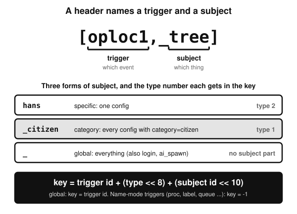
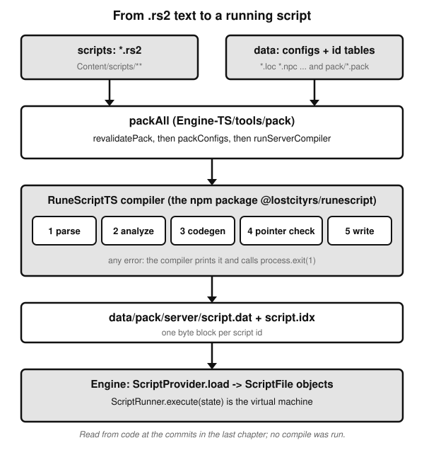
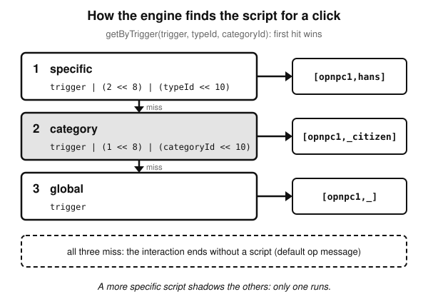
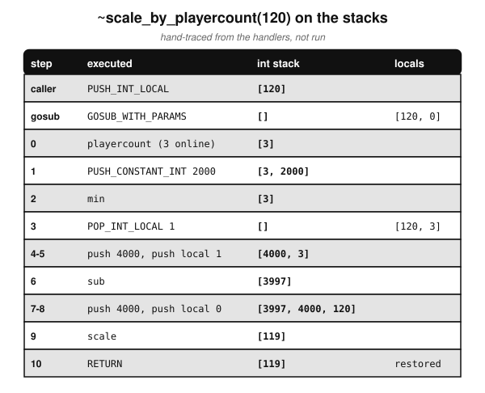
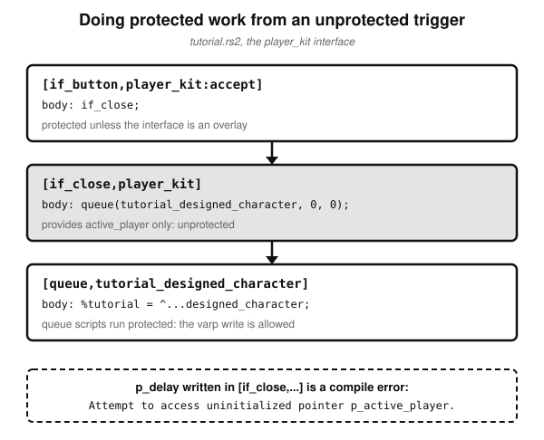
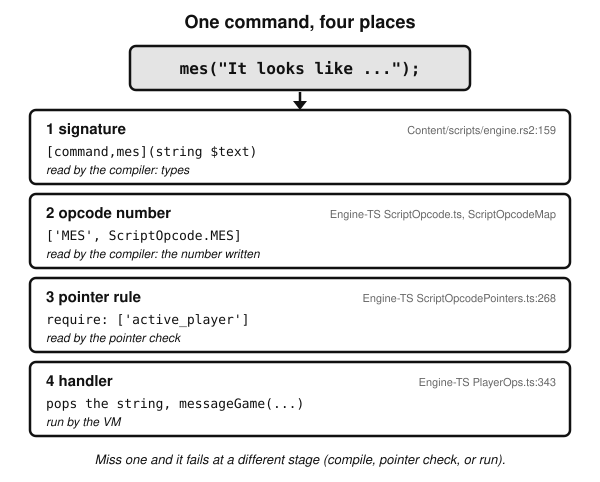

# An Introduction to RuneScript

*What the scripting language is, how a `.rs2` file becomes something the engine runs, and how to read one*

## Before you start

[The tick guide](a-short-introduction-to-the-tick.md) ended with a crib for reading scripts, and it leaned on one line without explaining it: `[oploc1,_tree]`. It said the header is a trigger name followed by what it applies to, that the engine finds scripts by trigger, and that scripts run protected. It also used `p_oploc`, `mes`, `p_delay` and `queue` as if they were part of the language. This book is about that language. It answers four questions the tick guide left open. What is a header, and how is it turned into something the engine can look up? What is a command, and where does it come from? What does "protected" mean to the compiler, as opposed to the engine's `canAccess`? And what does a script look like once it has been compiled?

The language is called **RuneScript**. Scripts are written in `.rs2` files under `Content/scripts/`, compiled by a separate repository (`RuneScriptTS`) into a binary file, and run by a small virtual machine inside the engine. If you want to know why the project writes its own scripting language at all, that is [the project history note](../history/project-origins.md), the second book in the series. This book starts from the assumption that scripts exist and asks how they work.

Four things to know about how it was written.

- **Everything comes from reading code, and nothing was compiled.** The checkout this book was written against has no installed packages, no generated parser and no `data/pack` folder, so the compiler was never run. Every listing of compiled output in this book is a **hand-trace** of the compiler's source, and says so. Where the text states something that follows from several facts rather than one line, it is labelled as an inference.
- **Each chapter ends with its sources.** The prose stays clean; the footer gives the file-and-line pointers and links to the long evidence notes in `docs/books/runescript-intro/`. Those notes were the first draft of this book and are left untouched.
- **It describes one revision.** The engine here replicates revision 274. The compiler read is `RuneScriptTS` at the commit listed in the last chapter. Whether the compiler that `npm install` puts in `node_modules` is that same commit was not checked, so the two could differ.
- **It assumes the tick guide.** Words such as phase 5, `canAccess`, protected, queue, `p_delay` and `world_delay` are used as that book defined them.

## 1. One script, read slowly

Here is a complete, real script. It is the whole of it: a header and one statement.

From `Content/scripts/skill_thieving/scripts/chest/trapped_chest.rs2:110-111`:
```
[oploc1,loc_2572]
mes("It looks like this chest has already been looted.");
```

The first line is the **header**. It is the only part of a script that is not code, and it does two jobs. It says *when* the script runs, and it says *which script this is*. The first word, `oploc1`, is the **trigger**: "a player chose option 1 on a loc". The second, `loc_2572`, is the **subject**: which loc. Together they say "run this when a player picks the first option on the loc named `loc_2572`". The name exists because the id table `Content/pack/loc.pack:2573` contains `2572=loc_2572`, and the loc is defined in `Content/scripts/_unpack/225/all.loc:12741-12748` as a "Chest" whose first option, `op1=Open`, is what the player clicked.

Everything after the header, up to the next header or the end of the file, is the **body**. Here it is one statement, a call to the **command** `mes`. A command is a built-in operation. This one is declared in `Content/scripts/engine.rs2:159` as `[command,mes](string $text)`, and it is carried out by an engine function at `Engine-TS/src/engine/script/handlers/PlayerOps.ts:343-347`, which pops the string and calls `state.activePlayer.messageGame(message)`. Chapter 8 follows a command through all the places it has to exist.

There is no `return` written. The compiler adds one: the code generator ends every script with the default returns and a `RETURN` (`RuneScriptTS/src/compiler/codegen/CodeGenerator.ts:193-194` calls it, and `:212-231` is the function). Putting that together, the compiled script is, by hand-trace, three instructions: push the string, call command `mes`, return.

The compiler also gives the script a number, its **lookup key**. For a header with a specific subject the key is the trigger's id, plus the subject type shifted left 8 bits, plus the subject's id shifted left 10 bits. The trigger `oploc1` has id 66 (`RuneScriptTS/src/runescript/trigger/ServerTriggerType.ts:470-475`), a specific subject has type number 2, and the loc's id is 2572. So the key is 66 + 512 + 2,633,728 = 2,634,306. That is arithmetic worked by hand from the code, not read off a compiled file. The point of the number is that the engine can compute the very same value when a player clicks that loc, and so find this script. Chapter 4 shows where each part of the sum comes from.



*Figure 1. The two halves of a header, the three forms a subject can take, and how they become a number. Chapters 3 and 4 explain each.*

Finally, a word about *when* it runs, in terms of the tick guide. The player's click is decoded in phase 2 and arms an interaction. In phase 5, step 8, the engine looks for the script, and if it finds one it runs it protected: `this.executeScript(ScriptRunner.init(opTrigger, this, target), true)` at `Engine-TS/src/engine/entity/Player.ts:1176`. The chat message is written to the socket at once, as the tick guide said of `mes`.

A useful picture here is a sorting office, as an analogy and nothing more. A letter is addressed with a trigger and a subject; the compiler files each script into a numbered pigeonhole; the engine turns a click into an address and checks the pigeonhole. The rest of this book is about how the pigeonholes are numbered, what is on the cards inside them, and the machine that reads the cards.

> **What to remember**
>
> - A script is a header plus a body. The header gives a trigger and a subject; the body is statements.
> - Commands such as `mes` are built into the engine; the script only calls them.
> - The compiler adds the final `RETURN`, and turns the header into a numeric lookup key that the engine can recompute from a click.

**Where this comes from.** `Content/scripts/skill_thieving/scripts/chest/trapped_chest.rs2:110-111`; `Content/pack/loc.pack:2573`; `Content/scripts/_unpack/225/all.loc:12741-12748`; `Content/scripts/engine.rs2:159`; `Engine-TS/src/engine/script/handlers/PlayerOps.ts:343-347`; `RuneScriptTS/src/compiler/codegen/CodeGenerator.ts:193-194`, `RuneScriptTS/src/compiler/codegen/CodeGenerator.ts:212-231`; `RuneScriptTS/src/runescript/trigger/ServerTriggerType.ts:470-475`; `Engine-TS/src/engine/entity/Player.ts:1176`. The key arithmetic was done by hand (`python3 -c "print(66+(2<<8)+(2572<<10))"` gives 2634306). Not checked: whether `loc_2572` is placed anywhere in the world map. Detailed notes: [evidence chapter 6, section 6.1](../books/runescript-intro/06-writing-a-first-script.md) and [chapter 2](../books/runescript-intro/02-script-anatomy-and-lookup.md).

## 2. From text to bytes

The engine never reads `.rs2` files. It reads one binary file produced from all of them, and this chapter is about how that file is made.



*Figure 2. The build pipeline, from the source files to the engine's virtual machine.*

### The build

The entry point is a function called `packAll`. The `build` script in `Engine-TS/package.json` runs it (`"build": "tsx tools/pack/Build.ts"` at `Engine-TS/package.json:14`, and `Build.ts` does nothing but `await packAll(modelFlags);` at `Engine-TS/tools/pack/Build.ts:7`). The normal start-up runs it too, but only when something is missing: `Engine-TS/src/app.ts:14` tests whether the cache has the expected contents or `data/pack/server/script.dat` exists, and calls `packAll` if not. What `npm start` does when the Content sources have changed but all those checks pass was not verified; the `dev` script (`"dev": "tsx watch src/app.ts"` at `Engine-TS/package.json:19`) is the one built to watch for changes, though the watcher itself was not re-read for this book.

Inside `packAll` the order matters. It clears a cache, then calls `revalidatePack()`, which makes the id tables agree with the names found in the sources, then `packConfigs`, which packs the data files. Only then does it decide whether to run the script compiler: `// relies on reading configs/interfaces for compile-time context`, then `if (shouldRunServerCompiler())` (`Engine-TS/tools/pack/PackAll.ts:125-144`). The compiler is skipped unless `script.idx` is missing or something it depends on is newer than `script.dat`: a `.rs2` file, a config of a kind in the list at `Engine-TS/tools/pack/PackAll.ts:21`, one of the id tables, or one of a few engine source files (`Engine-TS/tools/pack/PackAll.ts:35-70`).

### What the engine hands the compiler

The compiler is a separate project, `RuneScriptTS`, imported by the engine as an npm package: `import { CompileServerScript } from '@lostcityrs/runescript';` at `Engine-TS/tools/pack/Compiler.ts:3`. The project's own README says that as of February 2026 this TypeScript code replaced an earlier Kotlin one (`RuneScriptTS/README.md:68-69`). That history is Book 2's subject.

The language itself does not know what a loc, an NPC or an inventory is. The engine tells it, by building tables of **symbols**, each a name paired with an id, in `Engine-TS/tools/pack/Compiler.ts` (the function `runServerCompiler` starts at line 107). There are three sources.

- **Commands.** Every entry of the engine's `ScriptOpcodeMap` becomes a command symbol, with the opcode number the engine gave it, and the engine's pointer rules are copied alongside (`Engine-TS/tools/pack/Compiler.ts:108-147`). The compiler learns the *number* of a command from the engine and its *signature* from `Content/scripts/engine.rs2` (chapter 8).
- **Names for things.** Ids for NPCs, objs, locs, inventories, varps, params, enums and others are loaded from the `.pack` files, loaded with `CompilerTypeInfo.load(...)`, as for `npc.pack` at `Engine-TS/tools/pack/Compiler.ts:174`, through to the script table at line 195.
- **Facts from the packed configs.** Some things are only known after `packConfigs` has run. The compiler learns each varp's `protect` flag this way: `varpInfo.protect[id] = varp.protect;` at `Engine-TS/tools/pack/Compiler.ts:237`. This is why the packer has to run before the compiler, and it matters in chapter 7, because it means that editing a config can change whether an existing script type-checks.

`CompileServerScript` needs at least the `command` and `runescript` symbol tables and, unless told otherwise, reads from `../content/scripts`, writes to `./data/pack/server` and checks pointers (`RuneScriptTS/src/runescript/ServerScriptCompilerApplication.ts:31-32` and `:36-40`). Engine-TS passes only the symbols (the call is at `Engine-TS/tools/pack/Compiler.ts:337-376`), so those defaults apply. On a case-sensitive file system the default folder name, all lower case, would not match a directory called `Content`; how the project's own setup deals with that was not checked.

### Five stages

The compiler runs five numbered steps, and each stops the whole process early if its stage reported errors (`RuneScriptTS/src/compiler/ScriptCompiler.ts:238-265`): parse every file; analyze the syntax trees (register each script's symbol and header, then type-check bodies); generate code; check pointers; write. The pointer check (stage 4) is the one that is particular to this engine, and chapter 7 explains it.

When a stage finds an error, the diagnostics handler prints `file:line:col: TYPE: message` and then calls `process.exit(1)` (`RuneScriptTS/src/compiler/diagnostics/DiagnosticsHandler.ts:100` and `:143-145`). The function that writes `script.dat` is called after the stages in `run` (`RuneScriptTS/src/compiler/ScriptCompiler.ts:218-224`), so by hand-trace of that code, an error exits before any new output is written. What the caller does with the exit was not checked.

### The output file

The writer produces two files. `script.idx` lists the byte length of each script, and `script.dat` holds the bytes, preceded by a count and a version number: `private static readonly VERSION = 27;` at `RuneScriptTS/src/runescript/writer/JagFileScriptWriter.ts:17`, and the loop that writes lengths and bytes for every id from 0 to the last is at `:47-67`. An id with no script gets a length of 0, "Gap, no size". The engine checks the same number, `public static readonly COMPILER_VERSION = 27;` (`Engine-TS/src/engine/script/ScriptProvider.ts:12`), and refuses to start on a mismatch with the message at `:49-52`.

`ScriptProvider.parse` then turns each entry into a `ScriptFile` and stores it three ways (`Engine-TS/src/engine/script/ScriptProvider.ts:59-76`): in an array by **script id**, in a map by **full name** (`scriptNames.set(script.name, id)`, where the name is the whole header such as `[opnpc1,hans]`), and in a map by **lookup key**, the number from chapter 1. Chapter 4 is about those three.

### Ids and the pack files

A `.pack` file is a plain list of `id=name` lines: `Content/pack/npc.pack:1-3` begins `0=hans`, `1=man`, `2=man2`. Where a name is missing from its pack, the packer behaves differently by kind. For the kinds sent to the client (`loc`, `npc`, `obj`, `seq` and a few more), a missing name is an error, "Missing ... pack ID for ...", unless verification is turned off. For the server-only kinds (`enum`, `inv`, `param`, `struct`, `dbtable` and others), the name is simply given the next free id and the file is rewritten (`Engine-TS/tools/pack/PackFile.ts:143-151` and `:162-173`). The declarations show which is which: `LocPack = new PackFile('loc', validateConfigPack, '.loc', true)` has a trailing `true`, `EnumPack = new PackFile('enum', validateConfigPack, '.enum')` does not (`Engine-TS/tools/pack/PackFile.ts:290` and `:284`).

**Script ids** are made the same way. `regenScriptPack` crawls every `.rs2` file, takes every line that starts with `[`, keeps the text through the closing `]`, and registers any name it has not seen with the next id (`Engine-TS/tools/pack/PackFile.ts:255-274` and `:366-402`). The file `engine.rs2` is skipped, because its `[command,...]` entries are signatures and not scripts (`:370`). The result lives in `script.pack`, which is on Content's ignore list (`Content/.gitignore:4`, and `category.pack`, which is built the same way from `category=` lines, at `:6`).

Two inferences follow, labelled as such. First, since `script.pack` is regenerated from the sources and not committed, a script's id is an accident of the order names were first seen on one machine. That is harmless as long as the id is used only inside one `script.dat`, which is where calls between scripts store it, but whether an id is ever saved somewhere longer-lived (a player file, say) was not checked. Second, `regenScriptPack` only ever adds names (lines 264-273: load, register what is missing, save), so a script deleted from the sources would keep its id and leave a gap in `script.dat`. Neither was observed.

### The data languages

Most of the files next to scripts are not RuneScript. They are plain config files of one shape: a name in brackets, then `key=value` lines. The parser skips blank lines and `//` comments, and rejects a duplicate name or a line with no `=` (`Engine-TS/tools/pack/config/PackShared.ts:219-257`). The extension tells the packer what kind of thing each block is. A loc looks like this.

From `Content/scripts/skill_woodcutting/configs/trees/willow.loc:1-12`:
```
[willowtree]
name=Willow
desc=These trees are found near water.
model=plants_willowtree
width=2
length=2
mapscene=3
op1=Chop down
op3=hidden
category=tree
param=next_loc_stage,treestump2_green
param=ent,macro_ent_willow
```

Three details there matter later. `op1=Chop down` is the text of the first option; `op3=hidden` is the "hidden" third option that `Content/scripts/skill_woodcutting/scripts/woodcut.rs2:2` mentions in a comment. `category=tree` is where the `_tree` of `[oploc1,_tree]` comes from. And the `param=` lines attach named values that scripts read back with commands such as `loc_param(next_loc_stage)`, which `Content/scripts/skill_woodcutting/scripts/woodcut.rs2:137` does.

| Extension | One block defines | A real example |
|---|---|---|
| `.loc` | a placed-object type such as a tree or chest | `Content/scripts/skill_woodcutting/configs/trees/willow.loc:1-12` |
| `.npc` | a non-player character type | `Content/scripts/_unpack/225/all.npc:1-8` |
| `.constant` | lines of the form `^name = value`, with no blocks | `Content/scripts/engine.constant:1-2` (`^true = 1`, `^false = 0`) |
| `.varp` | a player variable | `Content/scripts/tutorial/configs/tutorial.varp:1-2` |
| `.dbtable` | the columns of a database table | `Content/scripts/skill_woodcutting/configs/trees.dbtable:1-7` |
| `.dbrow` | one row of such a table | `Content/scripts/skill_woodcutting/configs/trees.dbrow:1-4` |

Other kinds exist, among them `.obj`, `.inv`, `.seq`, `.param`, `.struct`, `.enum`, `.varbit`, `.varn`, `.vars`, `.hunt` and `.mesanim`; each has a pack declared in `Engine-TS/tools/pack/PackFile.ts:280-307`. This book did not read their parsers. In particular, `^constant` values are plain text, which the compiler reads against whatever type is expected where the constant is used (chapter 5).

> **What to remember**
>
> - `packAll` packs the data first, then runs the compiler, which needs the data's ids and some of its flags.
> - The compiler has five stages and stops at the first stage that reports errors; the pointer check is stage 4.
> - The output is `script.dat` plus `script.idx`, loaded by `ScriptProvider` into three lookups: by id, by name, by key.
> - Script ids come from a generated, uncommitted file; most config files are a separate, simpler language.

**Where this comes from.** `Engine-TS/package.json:14`, `Engine-TS/package.json:19`; `Engine-TS/tools/pack/Build.ts:7`; `Engine-TS/src/app.ts:14`; `Engine-TS/tools/pack/PackAll.ts:21`, `Engine-TS/tools/pack/PackAll.ts:35-70`, `Engine-TS/tools/pack/PackAll.ts:125-144`; `Engine-TS/tools/pack/Compiler.ts:3`, `Engine-TS/tools/pack/Compiler.ts:108-147`, `Engine-TS/tools/pack/Compiler.ts:174`, `Engine-TS/tools/pack/Compiler.ts:237`; `RuneScriptTS/src/runescript/ServerScriptCompilerApplication.ts:31-40`; `RuneScriptTS/src/compiler/ScriptCompiler.ts:218-224`, `RuneScriptTS/src/compiler/ScriptCompiler.ts:238-265`; `RuneScriptTS/src/compiler/diagnostics/DiagnosticsHandler.ts:100`, `RuneScriptTS/src/compiler/diagnostics/DiagnosticsHandler.ts:143-145`; `RuneScriptTS/src/runescript/writer/JagFileScriptWriter.ts:17`, `RuneScriptTS/src/runescript/writer/JagFileScriptWriter.ts:47-67`; `Engine-TS/src/engine/script/ScriptProvider.ts:12`, `Engine-TS/src/engine/script/ScriptProvider.ts:49-52`, `Engine-TS/src/engine/script/ScriptProvider.ts:59-76`; `Engine-TS/tools/pack/PackFile.ts:143-151`, `Engine-TS/tools/pack/PackFile.ts:162-173`, `Engine-TS/tools/pack/PackFile.ts:255-274`, `Engine-TS/tools/pack/PackFile.ts:280-307`, `Engine-TS/tools/pack/PackFile.ts:366-402`; `Content/.gitignore:4`, `Content/.gitignore:6`; `Engine-TS/tools/pack/config/PackShared.ts:219-257`; `RuneScriptTS/README.md:68-69`. Not checked: the `*Config.ts` parsers, the dev watcher, what `npm install` puts in `node_modules`, and what happens to a stale `script.dat` on a plain `npm start`. Not run: no build, no `script.dat` inspected. Detailed notes: [evidence chapter 1](../books/runescript-intro/01-toolchain-and-config-files.md).

## 3. Headers and triggers

Every script begins with a header, and the grammar for it is short. From `RuneScriptTS/src/antlr/RuneScriptParser.g4:11-15`:
```
script
    : LBRACK trigger=identifier COMMA name=scriptName MUL? RBRACK
      ((LPAREN parameterList? RPAREN) (LPAREN typeList? RPAREN)?)?
      statement*
    ;
```

Read it left to right. A trigger, a comma, a name (which for most triggers is the subject), an optional `*`, then optionally a list of parameters in the first pair of parentheses and a list of return types in the second. After that come the statements. There is no end marker: the script goes on until the parser meets the next `[` at the start of a header. That last part is an inference from the grammar, which was not run.

Names are generous. An identifier is lexed as one token of `[a-zA-Z0-9_+.:]+` (`RuneScriptTS/src/antlr/RuneScriptLexer.g4:74`), so a colon, a dot or a plus is just a letter. That is how `player_kit:accept` (interface and component) and `.chatnpc` are single names.

Here are real headers, most of them the first line of the script.

| Header | Where | What it shows |
|---|---|---|
| `[opnpc1,_citizen]` | `Content/scripts/npc/scripts/man.rs2:1` | a script for every NPC whose config has `category=citizen` |
| `[oploc1,_tree]` | `Content/scripts/skill_woodcutting/scripts/woodcut.rs2:1` | the same for locs of category `tree` |
| `[ai_spawn,_]` | `Content/scripts/npc/scripts/ai_spawn.rs2:1` | a global script: every NPC |
| `[login,_]` | `Content/scripts/login_logout/login.rs2:1` | a trigger that allows only the global subject |
| `[proc,scale_by_playercount](int $base)(int)` | `Content/scripts/general/scripts/player_count.rs2:1` | a procedure: one int parameter, one int result |
| `[label,levelup](stat $stat)` | `Content/scripts/levelup/scripts/levelup.rs2:23` | a label, which takes a parameter and returns nothing |
| `[queue,tutorial_designed_character]` | `Content/scripts/tutorial/scripts/tutorial.rs2:139` | a named script that `queue(...)` can schedule |
| `[softtimer,pk_skull_timer]` | `Content/scripts/skill_combat/scripts/pvp/pk_skull.rs2:40` | a named timer script |
| `[if_button,player_kit:accept]` | `Content/scripts/tutorial/scripts/tutorial.rs2:133` | an interface button; the subject is `interface:component` |
| `[inv_button1,crafting_jewelry:rings_inv]` | `Content/scripts/skill_crafting/scripts/jewellery/jewellery.rs2:1` | a button on an inventory component |
| `[mapzone,0_29_75]` | `Content/scripts/music/scripts/move.rs2:1` | the subject is a map square, `level_mx_mz` |
| `[advancestat,attack]` | `Content/scripts/levelup/scripts/levelup.rs2:3` | the subject is a stat |
| `[command,mes](string $text)` | `Content/scripts/engine.rs2:159` | not a script: a command's signature (chapter 8) |

A script may be a single line. `Content/scripts/skill_woodcutting/scripts/woodcut.rs2:1` is `[oploc1,_tree] @attempt_cut_tree;`: the whole script is a jump to a label of another name, and `Content/scripts/music/scripts/move.rs2:1` is the same shape for music. Chapter 6 shows why that works.

### Three kinds of subject

What follows the comma depends on the trigger. Each trigger is declared in the compiler with a **subject mode** (`RuneScriptTS/src/compiler/trigger/SubjectMode.ts:6-30`), and there are three.

- **Name.** The "subject" is just part of the script's name and refers to nothing. This is the default when a trigger's declaration says nothing (`RuneScriptTS/src/runescript/trigger/ServerTriggerType.ts:45-49`). Procs, labels, queues, timers and walk triggers are like this.
- **None.** Only the global form `_` is allowed. `login` and `opplayer1` are declared this way (`RuneScriptTS/src/runescript/trigger/ServerTriggerType.ts:1079-1084` and `:638-643`).
- **Type.** The subject refers to a config of a given type (npc, loc, stat, interface, ...), and may also be a category or the global form.

The check itself reads cleanly. From `RuneScriptTS/src/compiler/semantics/ScriptRegistration.ts:204-213`:
```
if (subject === '_') {
    this.checkGlobalScriptSubject(trigger, script);
    return;
}

// Check for category reference subject
if (subject.startsWith('_')) {
    this.checkCategoryScriptSubject(trigger, script, subject.substring(1));
    return;
}
```

So: **exactly `_` is global; `_` followed by a name is a category; anything else is a specific config of the trigger's type.** That settles the question the tick guide left open. `[oploc1,_tree]` is the `oploc1` trigger with the category subject `tree`, and `tree` must be a category name, which comes from `category=tree` lines like the one in the willow config in chapter 2. The category form is legal only if the trigger permits it, otherwise the compiler reports "Trigger '%s' does not allow category subjects." (`RuneScriptTS/src/compiler/diagnostics/DiagnosticMessage.ts:41`).

### What happens to a header

When the compiler registers a script, `ScriptRegistration.visitScript` goes through the header in a fixed order (`RuneScriptTS/src/compiler/semantics/ScriptRegistration.ts:107-182`): look up the trigger name, and complain if it is unknown; allow a `*` only on commands; check the subject; read the parameters and check the trigger allows them; work out the return types, defaulting to "none" for triggers that cannot return and "unit" for those that can; and finally add the script to the symbol table, failing with `[%s,%s] is already defined.` if the same trigger and name exist already. Only a few triggers accept parameters: proc (with returns, `RuneScriptTS/src/runescript/trigger/ServerTriggerType.ts:60-67`), label (`:69-75`), debugproc (`:77-83`), queue (`:757-762`), and the two timers (`:904-916`).

### The triggers that matter first

There are many triggers. The compiler's list is a class with one entry per trigger, each giving a number, a subject mode and the **pointers** it provides (chapter 7). The engine keeps its own copy of the numbering as an enum, and the two must agree: `OPNPC1 = 10` in `Engine-TS/src/engine/script/ServerTriggerType.ts:13` matches `id: 10` at `RuneScriptTS/src/runescript/trigger/ServerTriggerType.ts:134-139`. Only a few ids were compared by hand. One difference was found: the engine enum has `AI_WALKTRIGGER = 156` (`Engine-TS/src/engine/script/ServerTriggerType.ts:150`), while a search of `RuneScriptTS/src` for that name finds nothing, so no script can be written with that trigger in this compiler.

This table lists some of the families, with the pointers the compiler says each provides and where the engine looks the script up. "Protected" is as chapter 7 defines it.

| Trigger | Subject | Pointers it starts with | Where the engine looks it up |
|---|---|---|---|
| `opnpc1` (id 10) | npc | `active_player`, `p_active_player`, `active_npc` (`RuneScriptTS/src/runescript/trigger/ServerTriggerType.ts:134-139`) | `Player.getOpTrigger` and `getApTrigger`, run protected (`Engine-TS/src/engine/entity/Player.ts:1017`, `Engine-TS/src/engine/entity/Player.ts:1051`, `Engine-TS/src/engine/entity/Player.ts:1176`, `Engine-TS/src/engine/entity/Player.ts:1198`) |
| `oploc1` (66) | loc | same, with `active_loc` (`RuneScriptTS/src/runescript/trigger/ServerTriggerType.ts:470-475`) | the same functions |
| NPC acting on a target (`ai_op...`, `ai_ap...`) | npc | not re-read | `Npc.getTrigger`, run **unprotected** (`Engine-TS/src/engine/entity/Npc.ts:1066-1070`, `Engine-TS/src/engine/entity/Npc.ts:944-955`) |
| `queue` (116) | name | `active_player`, `p_active_player` (`RuneScriptTS/src/runescript/trigger/ServerTriggerType.ts:757-762`) | the queue processor, run protected (`Engine-TS/src/engine/entity/Player.ts:910-911`) |
| `timer` (138) and `softtimer` (137) | name | `timer` has both player pointers, `softtimer` only `active_player` (`RuneScriptTS/src/runescript/trigger/ServerTriggerType.ts:904-916`) | `Player.processTimers`: a normal timer runs protected, a soft one does not (`Engine-TS/src/engine/entity/Player.ts:945-960`) |
| `ai_timer` (139) | npc | `active_npc` (`RuneScriptTS/src/runescript/trigger/ServerTriggerType.ts:918-923`) | `Npc.processTimers` (`Engine-TS/src/engine/entity/Npc.ts:550-556`) |
| `if_button` (147) | component | `active_player`, `last_com` (`RuneScriptTS/src/runescript/trigger/ServerTriggerType.ts:975-979`) | `IfButtonHandler`, protected only when the interface is not an overlay (`Engine-TS/src/network/game/client/handler/IfButtonHandler.ts:31-34`) |
| `if_close` (148) | interface | `active_player` only (`RuneScriptTS/src/runescript/trigger/ServerTriggerType.ts:981-986`) | `Player.closeModal`, run unprotected (`Engine-TS/src/engine/entity/Player.ts:782-785`) |
| `login` (157), `logout` (158) | none | both player pointers (`RuneScriptTS/src/runescript/trigger/ServerTriggerType.ts:1079-1091`) | `Engine-TS/src/engine/entity/Player.ts:525-527`; `Engine-TS/src/engine/World.ts:780-788` |
| `ai_spawn` (166) | npc | `active_npc` (`RuneScriptTS/src/runescript/trigger/ServerTriggerType.ts:1142-1147`) | `Engine-TS/src/engine/World.ts:1296-1299` |
| `mapzone`, `zone` and their `exit` forms | map square or zone | both player pointers (`RuneScriptTS/src/runescript/trigger/ServerTriggerType.ts:1107-1126`) | looked up **by name**, then queued as engine-queue entries (`Engine-TS/src/engine/entity/Player.ts:580-615`) |
| `debugproc` (2) | name | `active_player` (`RuneScriptTS/src/runescript/trigger/ServerTriggerType.ts:77-83`) | by name, from a `::name` cheat, only when not in production and with staff level at least 4 (`Engine-TS/src/network/game/client/handler/ClientCheatHandler.ts:57-62`) |

For the `op` and `ap` pair, the tick guide's reading holds: the engine runs the operate script when the player is in operating distance, and otherwise the approach script when the player is within approach range (`Engine-TS/src/engine/entity/Player.ts:1170` and `:1186`). The two lookups differ by seven: `getOpTrigger` uses `this.targetOp + 7` and `getApTrigger` uses `this.targetOp` (`Engine-TS/src/engine/entity/Player.ts:1017` and `:1051`). So, as an inference, `targetOp` holds the approach trigger and the operate trigger's id is seven higher.

> **What to remember**
>
> - A header is a trigger, a subject, optional parameters and optional return types.
> - A subject is specific (`hans`), a category (`_citizen`, `_tree`) or global (`_`). Some triggers allow only some forms.
> - Name-mode triggers (proc, label, queue, timers) have a name, not a subject.
> - Which pointers a trigger starts with, and whether the engine runs it protected, differ by trigger.

**Where this comes from.** `RuneScriptTS/src/antlr/RuneScriptParser.g4:11-15`; `RuneScriptTS/src/antlr/RuneScriptLexer.g4:74`; `RuneScriptTS/src/compiler/trigger/SubjectMode.ts:6-30`; `RuneScriptTS/src/compiler/semantics/ScriptRegistration.ts:107-182`, `RuneScriptTS/src/compiler/semantics/ScriptRegistration.ts:204-213`; `RuneScriptTS/src/runescript/trigger/ServerTriggerType.ts:45-49`; `RuneScriptTS/src/compiler/diagnostics/DiagnosticMessage.ts:41`; `Engine-TS/src/engine/script/ServerTriggerType.ts:13`, `Engine-TS/src/engine/script/ServerTriggerType.ts:150`. The Content headers are cited in the table. Not checked: every trigger's pointer set (the table gives the ones read), every trigger's engine call site, and whether all compiler and engine ids agree (spot checks only). Detailed notes: [evidence chapter 2](../books/runescript-intro/02-script-anatomy-and-lookup.md).

## 4. How the engine finds a script

Chapter 1 left a number behind. This chapter explains how it is built and used, and answers the second half of the tick guide's question about `[oploc1,_tree]`: how the engine goes from a click to this script.



*Figure 3. The engine tries three keys in order, from the most specific to the global one, and the first script found wins.*

### Building the key

The compiler's writer builds the key in `generateLookupKey`. From `RuneScriptTS/src/runescript/writer/BinaryScriptWriter.ts:63-68`:
```
// Special case for no name.
if (subjectMode === SubjectMode.Name) {
    return -1;
}

let lookupKey = trigger.id;
```
and then, for subjects that refer to something (`RuneScriptTS/src/runescript/writer/BinaryScriptWriter.ts:80-81`):
```
const type = subjectType === ScriptVarType.CATEGORY ? 1 : 2;
lookupKey += (type << 8) | (subjectId << 10);
```

In words. A name-mode script has no key (`-1`). A global script has just the trigger's id. A category script adds `1 << 8` and the category's id shifted by ten. A specific script adds `2 << 8` and the config's id shifted by ten. The low eight bits hold the trigger id, which tops out at 167 in the engine's enum and so fits. Bits 8 and 9 say which form it is. The rest is the id from the pack file of chapter 2.

### Using the key

At load time every script with a key goes into one map. At run time the engine tries the three forms most specific first. From `Engine-TS/src/engine/script/ScriptProvider.ts:124-134`:
```
static getByTrigger(trigger: TargetOp, type: number = -1, category: number = -1): ScriptFile | undefined {
    let script = ScriptProvider.scriptLookup.get(trigger | (0x2 << 8) | (type << 10));
    if (script) {
        return script;
    }
    script = ScriptProvider.scriptLookup.get(trigger | (0x1 << 8) | (category << 10));
    if (script) {
        return script;
    }
    return ScriptProvider.scriptLookup.get(trigger);
}
```

Three worked examples, by hand-arithmetic from this code and the pack files, and not run.

- A player picks "Talk-to" on the NPC `hans`. That NPC has id 0 (`Content/pack/npc.pack:1`) and the trigger is `opnpc1`, id 10. The first lookup is `10 | 512 | 0` = 522. The compiler wrote `[opnpc1,hans]` (`Content/scripts/areas/area_lumbridge/scripts/hans.rs2:1`) with key 10 + (2 << 8) + (0 << 10), which is also 522. Hans's own script wins.
- A player picks "Talk-to" on `man` (id 1). No `[opnpc1,man]` exists, so the first key (10 | 512 | 1024 = 1546) misses. The second looks for category `citizen`, and `Content/scripts/npc/scripts/man.rs2:1`, `[opnpc1,_citizen]`, was filed under exactly that key. The `man` config carries `category=citizen` (`Content/scripts/_unpack/225/all.npc:30`, inside the block that starts at line 1).
- An NPC with neither gets the third lookup, `scriptLookup.get(10)`, which finds a global `[opnpc1,_]` script if there is one.

If all three miss, the interaction ends without a script. The engine's `defaultOp` sends "Nothing interesting happens." (`Engine-TS/src/engine/entity/Player.ts:1142`), reached from `tryInteract` when the player is in operating distance (`Engine-TS/src/engine/entity/Player.ts:1227`). In a non-production run it first sends `No trigger for [...]` naming what was missing (`Engine-TS/src/engine/entity/Player.ts:1139`).

Two inferences, labelled. First: because the lookup returns at the first hit, a more specific script **shadows** the others completely; it does not also run them. A script that wants both has to call the other explicitly. Second: the category form is what lets one script serve every tree or every citizen, which is how `woodcut.rs2` can have one `[oploc1,_tree]` for all the locs configured with `category=tree`.

The same global form explains `[ai_spawn,_]`. The engine calls `getByTrigger(ServerTriggerType.AI_SPAWN, type.id, type.category)` when an NPC is added, and if it finds a script it puts a spawn event on the NPC event queue (`Engine-TS/src/engine/World.ts:1296-1299`); `Content/scripts/npc/scripts/ai_spawn.rs2:1` has subject `_`, so its key is just the trigger's id, 166, which is the third lookup.

### Scripts with no key

A script with no key is found another way. It is found by **id**, when a call has the id baked into the calling script, or by **full name**, with `getByName` (`Engine-TS/src/engine/script/ScriptProvider.ts:105-111`).

The id route is how a call such as `~scale_by_playercount(...)` or `queue(tutorial_designed_character, 0, 0)` works. When the compiler resolves the name against its expected type it finds the script's symbol, and the code generator pushes it as a constant (`RuneScriptTS/src/compiler/codegen/CodeGenerator.ts:806-811`); the writer turns a script symbol into the id of the string `[trigger,name]` in `script.pack` (`RuneScriptTS/src/runescript/SymbolMapper.ts:72-73`).

The name route is used by the cheat handler for `debugproc`, and for the map triggers. The engine builds the name by hand: `ScriptProvider.getByName(\`[mapzone,0_${x >> 6}_${z >> 6}]\`)` at `Engine-TS/src/engine/entity/Player.ts:582`, with a comment at line 581 that says `// todo: getByTrigger needs more bits to lookup by coord`. The coordinate does not fit the key's layout. The compiler still computes a key for such scripts from the packed coordinate (`RuneScriptTS/src/runescript/writer/BinaryScriptWriter.ts:74-75`), which by inference is a truncated number never used by the engine; whether it could collide with another script's key was not analysed.

One quirk of the loader is worth knowing, as an observation and not as a claim about behaviour. The compiler writes `-1` for "no key" (`RuneScriptTS/src/runescript/writer/BinaryScriptWriter.ts:65`), `ScriptFile.decode` reads it with `g4s()`, a signed read (`Engine-TS/src/engine/script/ScriptFile.ts:99` and `Engine-TS/src/io/Packet.ts:251-255`), and the loader compares with `0xffffffff` (`Engine-TS/src/engine/script/ScriptProvider.ts:73`). In JavaScript `-1` is not `4294967295`, so by reading, name-mode scripts also land in the map under the key `-1`, each overwriting the last. That is harmless unless something looks up `-1`. Nothing was run to confirm it.

> **What to remember**
>
> - Key = trigger id, plus `1 << 8` or `2 << 8` for category or specific, plus the subject's id shifted by 10. Global is just the trigger id. Name-mode scripts get `-1`.
> - The engine tries specific, then category, then global, and stops at the first hit.
> - Procs, labels and queues are reached by id; map triggers and debug procs by full name.

**Where this comes from.** `RuneScriptTS/src/runescript/writer/BinaryScriptWriter.ts:63-68`, `RuneScriptTS/src/runescript/writer/BinaryScriptWriter.ts:74-75`, `RuneScriptTS/src/runescript/writer/BinaryScriptWriter.ts:80-81`; `Engine-TS/src/engine/script/ScriptProvider.ts:73`, `Engine-TS/src/engine/script/ScriptProvider.ts:105-111`, `Engine-TS/src/engine/script/ScriptProvider.ts:124-134`; `Engine-TS/src/engine/entity/Player.ts:581-582`, `Engine-TS/src/engine/entity/Player.ts:1139`, `Engine-TS/src/engine/entity/Player.ts:1142`, `Engine-TS/src/engine/entity/Player.ts:1227`; `Engine-TS/src/engine/World.ts:1296-1299`; `RuneScriptTS/src/compiler/codegen/CodeGenerator.ts:806-811`; `RuneScriptTS/src/runescript/SymbolMapper.ts:72-73`; `Engine-TS/src/engine/script/ScriptFile.ts:99`; `Engine-TS/src/io/Packet.ts:251-255`; `Content/pack/npc.pack:1`; `Content/scripts/areas/area_lumbridge/scripts/hans.rs2:1`; `Content/scripts/npc/scripts/man.rs2:1`; `Content/scripts/npc/scripts/ai_spawn.rs2:1`. Arithmetic worked by hand. Not checked: whether the NPC event queue is drained as the tick guide describes for this particular script (that note, `docs/tick/03-npc-event-queue.md`, was not re-read), and key collisions. Detailed notes: [evidence chapter 2, sections 2.4 to 2.6](../books/runescript-intro/02-script-anatomy-and-lookup.md).

## 5. The language

RuneScript is small. This chapter covers what its source text can say. It is a tour, not a manual, and every example is real code from the woodcutting skill, which the tick guide used for its worked click.

### Statements

From `RuneScriptTS/src/antlr/RuneScriptParser.g4:34-45`, a statement is one of: a block in braces, a return, an `if`, a `while`, a `switch`, a declaration, an array declaration, an assignment, an expression, or an empty statement. There is no `for`, no `do`, no `break` and no `continue` in the grammar, and `else if` is not a keyword: it is an `else` whose statement is another `if`.

Here is the start of a real label. From `Content/scripts/skill_woodcutting/scripts/woodcut.rs2:17-24`:
```
[label,attempt_cut_tree]
// find tree in db
db_find(woodcutting_trees:tree, loc_type);
def_dbrow $data = db_findnext;
if ($data = null) {
    ~displaymessage(^dm_default);
    return;
}
```

A lot of the language is visible in those eight lines. `//` starts a comment (`RuneScriptTS/src/antlr/RuneScriptLexer.g4:59-60`). `db_find(...)` is a command called for its effect. `def_dbrow $data = db_findnext;` declares a **local variable**, whose name starts with `$`, with its type written into the keyword (`def_dbrow`), and gives it a value; `db_findnext` is a command with no arguments, written bare, which the code generator allows for any command that takes none (`RuneScriptTS/src/compiler/codegen/CodeGenerator.ts:806-807`). `null` is a literal. `~displaymessage(^dm_default)` calls a **proc**, and `^dm_default` is a **constant**. `return;` leaves the script. The character in front of a name says what kind of thing it is: `$` a local, `%` a game variable (`.%` the secondary player's), `^` a constant, `~` a proc, `@` a label jump (`RuneScriptTS/src/antlr/RuneScriptLexer.g4:21-30`).

The other statement forms are in the same file. From `Content/scripts/skill_woodcutting/scripts/woodcut.rs2:200-213`:
```
[proc,woodcutting_successchance](dbrow $data, obj $axe)(int, int)
def_int $count = calc(db_getfieldcount($data, woodcutting_trees:successchance) - 1);
while ($count >= 0) {
    def_obj $db_axe;
    def_int $tree_chance_low;
    def_int $tree_chance_high;
    $db_axe, $tree_chance_low, $tree_chance_high = db_getfield($data, woodcutting_trees:successchance, $count);
    if ($db_axe = $axe) {
        return($tree_chance_low, $tree_chance_high);
    } else {
        $count = calc($count - 1);
    }
}
return(null, null);
```

This proc takes two parameters and returns two ints, so its header has two parentheses. It has a `while` loop, an `if` with an `else`, a **multiple assignment** (three variables on the left, one call returning three values on the right), and a `return` with a list in parentheses. The parentheses after `return` are part of the syntax: the grammar is `RETURN (LPAREN expressionList? RPAREN)? SEMICOLON` (`RuneScriptTS/src/antlr/RuneScriptParser.g4:51-53`), so `return 5;` does not parse.

### Conditions are not expressions

The thing that surprises people most is that conditions have their own grammar. From `RuneScriptTS/src/antlr/RuneScriptParser.g4:117-124`:
```
condition
    : LPAREN condition RPAREN                                                   # ConditionParenthesizedExpression
    | condition op=(LT | GT | LTE | GTE) condition                              # ConditionBinaryExpression
    | condition op=(EQ | EXCL) condition                                        # ConditionBinaryExpression
    | condition op=AND condition                                                # ConditionBinaryExpression
    | condition op=OR condition                                                 # ConditionBinaryExpression
    | expression                                                                # ConditionNormalExpression
```

Equal is a single `=` and not-equal is `!`; and is `&` and or is `|` (`RuneScriptTS/src/antlr/RuneScriptLexer.g4:23-26`). There is no `==`, no `&&`, no unary `!`. The last alternative lets the parser accept a bare expression, but the type checker then throws it out: any condition that is not built from these binary operators is reported as "Conditions are only allowed to be binary expressions." (`RuneScriptTS/src/compiler/diagnostics/DiagnosticMessage.ts:56`, raised at `RuneScriptTS/src/compiler/semantics/TypeChecking.ts:249` after the walk at `:258-275`). That is why a test of a boolean is written out: `if (oc_members($product) = true) {` at `Content/scripts/skill_woodcutting/scripts/woodcut.rs2:27`. Two more rules from `RuneScriptTS/src/compiler/semantics/TypeChecking.ts:543-619`: `&` and `|` need booleans on both sides, `<` and its relatives need numbers, and two strings cannot be compared with `=` or `!` at all (`:612-614`).

`&` and `|` **short-circuit**. The code generator gives each side its own block of instructions with a conditional branch, so the right side is not evaluated when the left decides (`RuneScriptTS/src/compiler/codegen/CodeGenerator.ts:312-323`). Precedence is not a table in the grammar. In a left-recursive ANTLR rule an earlier alternative binds more tightly, so relational operators bind tighter than `=` and `!`, which bind tighter than `&`, which binds tighter than `|`. That is ANTLR's documented rule, not tested here because the generated parser is absent from the checkout, so it is an inference. It is supported by `Content/scripts/skill_woodcutting/scripts/woodcut.rs2:56`, `if ($level > 0 & ~woodcutting_axe_checker(true) = null) {`, which only makes sense as `($level > 0) & (... = null)`.

### Arithmetic lives inside `calc`

The expression grammar has no `+` or `*` of its own. Arithmetic exists only in the `calc(...)` rule, with `* / %` binding tighter than `+ -` (`RuneScriptTS/src/antlr/RuneScriptParser.g4:126-137`; `calc` is one alternative of `expression` at `:106`). Real use: `%action_delay = calc(map_clock + 3);` at `Content/scripts/skill_woodcutting/scripts/woodcut.rs2:59`. Content also has named commands for the same job, such as `$respawnrate = add(120, random(80));` at `Content/scripts/skill_woodcutting/scripts/woodcut.rs2:127`. Spaces matter: an integer literal is lexed as an optional `-` followed by digits (`RuneScriptTS/src/antlr/RuneScriptLexer.g4:49`), so by the lexer rule `5-3` would be the two tokens `5` and `-3`. Content writes `calc($count - 1)`.

### Bare names are resolved by the type that is expected

This is the central trick of the language, and the least obvious. In `inv_add(inv, $product, 1)` (`Content/scripts/skill_woodcutting/scripts/woodcut.rs2:134`) the first argument is the bare word `inv`. The signature, `[command,inv_add](inv $inv, namedobj $obj, int $count)` at `Content/scripts/engine.rs2:825`, says the first parameter has type `inv`. The type checker visits each argument with the parameter's type as a **hint**, and `resolveSymbol` looks the name up among every symbol with that name, preferring one whose type fits the hint (`RuneScriptTS/src/compiler/semantics/TypeChecking.ts:1293-1313`). Here it finds the inventory called `inv` (`Content/pack/inv.pack:94` is `93=inv`). So the same word can mean different things in different places, and a config is named without any sigil.

Two consequences. First, if nothing is found and a string is expected, the word is treated as plain text, unless the thing found is a command (`RuneScriptTS/src/compiler/semantics/TypeChecking.ts:1316-1319` and `:1411-1413`). Otherwise the error is `'%s' could not be resolved to a symbol.` (`RuneScriptTS/src/compiler/diagnostics/DiagnosticMessage.ts:26`). Second, **constants** are text re-read against the hint. `^true = 1` is declared at `Content/scripts/engine.constant:1`. The checker takes a constant's text and, unless a string is expected, parses it as an expression, applies the hint, and requires the result to be constant (`RuneScriptTS/src/compiler/semantics/TypeChecking.ts:1026-1050`).

### Locals and types

A local must be declared before use, and a declaration may not reuse a name that exists in any enclosing scope: `SymbolTable.insert` walks up through the parent tables and refuses the insert if the name is found (`RuneScriptTS/src/compiler/symbol/SymbolTable.ts:30-40`). A `def_` with no initializer gets the type's default value: `0` for `int` and `boolean`, `-1` for `coord` and the other int-based types, and `''` for `string` (`RuneScriptTS/src/compiler/codegen/CodeGenerator.ts:421-433` pushes `symbol.type.defaultValue`; the values are at `RuneScriptTS/src/compiler/type/PrimitiveType.ts:41-52`). The code generator numbers locals per base type, in declaration order with parameters first (`RuneScriptTS/src/compiler/writer/BaseScriptWriter.ts:276-282`), so the engine keeps one array for ints and one for strings.

Type names come from three places. There are a handful of primitives (`int`, `boolean`, `coord`, `string`, `char`, `long`, and `mapzone`, which is only a script subject) at `RuneScriptTS/src/compiler/type/PrimitiveType.ts:41-52`. There are many "script var types", one for each kind of config (`seq`, `npc`, `loc`, `obj`, `namedobj`, `stat`, `inv`, `interface`, `dbrow` and so on), all int-based with a default of `-1` (`RuneScriptTS/src/runescript/type/ScriptVarType.ts:40-65`). And there are internal types for variables and scripts. By the type-mismatch message (`RuneScriptTS/src/compiler/diagnostics/DiagnosticMessage.ts:25`) these are separate types even where they share a stack, so an `npc` is not an `int`; that is an inference, not tested. The one exception this book found is that a `namedobj` may be used where an `obj` is expected (`RuneScriptTS/src/runescript/ServerScriptCompiler.ts:78-79`). `-1` is "null" for every int-based type, which is the meaning of the `null` in `if ($data = null)` above.

### Strings and `switch`

Strings use double quotes. Inside them, a `<` that is not a recognised tag starts an interpolated expression that ends at the matching `>`, while tags such as `<br>` and `<col=...>`, and the speech tag `<p,name>`, are kept as literal text (`RuneScriptTS/src/antlr/RuneScriptLexer.g4:82-87`). The code generator pushes each text part, the code of each interpolated expression, and a final `JOIN_STRING` (`RuneScriptTS/src/compiler/codegen/CodeGenerator.ts:765-784`). So `mes("You need a Woodcutting level of <tostring($level)> to chop down this tree.");` at `Content/scripts/skill_woodcutting/scripts/woodcut.rs2:37` builds its text at run time. The `<p,neutral>` prefix seen in dialogue is not interpreted by the compiler: the engine's `split_init` command strips it at run time and looks the name up as a `mesanim` (`Engine-TS/src/engine/script/handlers/StringOps.ts:83-86`).

A `switch` looks like this. From `Content/scripts/skill_woodcutting/scripts/woodcut.rs2:6-14`:
```
[oplocu,_tree]
switch_obj(last_useitem) {
    case bronze_axe, iron_axe, steel_axe, black_axe, mithril_axe, adamant_axe, rune_axe :
        p_oploc(1); // gets delayed by a tick >:(
    // case raw_herring, herring :
    //     mes("This is not the mightiest tree in the forest.");
    //     return;
    case default : ~displaymessage(^dm_default);
}
```

The type is in the keyword, `switch_obj`, and a `case` may list several keys. There is no fall-through: the code generator ends every case with a branch to the end of the `switch` (`RuneScriptTS/src/compiler/codegen/CodeGenerator.ts:380` and `:383`), and code is shared between keys by listing them together, as above. That is the compiler's lowering, so it is a statement about the compiler rather than a line in the grammar.

### What is not there

Arrays are in the grammar (`RuneScriptTS/src/antlr/RuneScriptParser.g4:75-77`), but the engine's handlers for the three array opcodes just `throw new Error('unimplemented')` (`Engine-TS/src/engine/script/handlers/CoreOps.ts:263-273`). A search of `Content/scripts` for array declarations found none. And there is no `for` or `break`; the loop in the example above is a `while` with a counter.

> **What to remember**
>
> - Statements are `if`, `while`, `switch`, declarations, assignments (including several at once) and expression statements. There is no `for` and no `break`.
> - Conditions use only `< > <= >= = ! & |` and must be built from them, so test booleans with `= true`. Arithmetic needs `calc(...)`.
> - Sigils tell you what a name is: `$` local, `%` game variable, `^` constant, `~` proc, `@` label.
> - A bare word is resolved by the type expected in that position, which is how configs are named without a prefix.

**Where this comes from.** `RuneScriptTS/src/antlr/RuneScriptParser.g4:34-45`, `RuneScriptTS/src/antlr/RuneScriptParser.g4:51-53`, `RuneScriptTS/src/antlr/RuneScriptParser.g4:75-77`, `RuneScriptTS/src/antlr/RuneScriptParser.g4:106`, `RuneScriptTS/src/antlr/RuneScriptParser.g4:117-124`, `RuneScriptTS/src/antlr/RuneScriptParser.g4:126-137`; `RuneScriptTS/src/antlr/RuneScriptLexer.g4:21-30`, `RuneScriptTS/src/antlr/RuneScriptLexer.g4:49`, `RuneScriptTS/src/antlr/RuneScriptLexer.g4:82-87`; `RuneScriptTS/src/compiler/semantics/TypeChecking.ts:249`, `RuneScriptTS/src/compiler/semantics/TypeChecking.ts:543-619`, `RuneScriptTS/src/compiler/semantics/TypeChecking.ts:1026-1050`, `RuneScriptTS/src/compiler/semantics/TypeChecking.ts:1293-1313`, `RuneScriptTS/src/compiler/semantics/TypeChecking.ts:1316-1319`; `RuneScriptTS/src/compiler/codegen/CodeGenerator.ts:312-323`, `RuneScriptTS/src/compiler/codegen/CodeGenerator.ts:380-384`, `RuneScriptTS/src/compiler/codegen/CodeGenerator.ts:421-433`, `RuneScriptTS/src/compiler/codegen/CodeGenerator.ts:765-784`; `RuneScriptTS/src/compiler/symbol/SymbolTable.ts:30-40`; `RuneScriptTS/src/runescript/ServerScriptCompiler.ts:78-79`; `Engine-TS/src/engine/script/handlers/CoreOps.ts:263-273`; `Engine-TS/src/engine/script/handlers/StringOps.ts:83-86`; `Content/pack/inv.pack:94`. The array search was `grep -rnE "def_[a-z_]*array"` over `Content/scripts` (no matches). Not run: the generated ANTLR parser is absent, so precedence rests on ANTLR's documented rule. Not checked: the AST builder, and every context in which a type mismatch can arise. Detailed notes: [evidence chapter 3](../books/runescript-intro/03-syntax-semantics-and-the-vm.md).

## 6. Bytecode and the machine that runs it

When the compiler has checked a script it turns it into a short list of instructions for a stack machine. This chapter follows one small proc all the way through, then looks at the machine.

From `Content/scripts/general/scripts/player_count.rs2:1-4`:
```
[proc,scale_by_playercount](int $base)(int)
//not sure if it caps at 2k player count or not
def_int $playercount = min(playercount, 2000);
return (scale(sub(4000, $playercount), 4000, $base));
```

The woodcutting script calls it as `$respawnrate = ~scale_by_playercount($respawnrate);` (`Content/scripts/skill_woodcutting/scripts/woodcut.rs2:136`). The code generator lowers each part in a fixed way. A command call becomes its arguments followed by a command instruction (`RuneScriptTS/src/compiler/codegen/CodeGenerator.ts:580-595`). A `def_` becomes the initial value followed by a pop into a local (`:410-435`). A `return` becomes the values followed by a `RETURN` (`:237-241`). A proc call becomes arguments followed by `GOSUB_WITH_PARAMS` and the callee's id (`:614-624`). After the last statement the generator adds the default returns, here a pushed `0` for the declared `int` result and another `RETURN` (`:212-231`).

By hand-trace of those functions, the 13 instructions of this proc are: the command `playercount`; push 2000; command `min`; pop into local 1; push 4000; push local 1; command `sub`; push 4000; push local 0; command `scale`; `RETURN`; then the default return, push 0 and `RETURN`. Local 0 is the parameter `$base` and local 1 is `$playercount`, because both are int-based and parameters are numbered first (`RuneScriptTS/src/compiler/writer/BaseScriptWriter.ts:276-282`). The byte-level layout (opcode numbers, operand widths, the trailer) is in the evidence notes, hand-traced; it is left out here because the opcode numbers come from counting an enum and were not re-derived for this book.

### The machine

One running script is one `ScriptState` object (`Engine-TS/src/engine/script/ScriptState.ts:35-62`). It holds the current script and a program counter, a stack of gosub frames, an **int stack** and a **string stack**, two arrays of locals (one for ints, one for strings), and a set of pointer bits. The interpreter is a loop (`Engine-TS/src/engine/script/ScriptRunner.ts:137-157`). In outline: while `state.execution` is `RUNNING`, check the program counter, count instructions and throw `Too many instructions` past 500,000, fetch `opcodes[++state.pc]`, find `ScriptRunner.HANDLERS[opcode]` and call it. Every opcode, including the plain language ones such as push, pop, branch and return, is a handler in that one table, assembled from `CoreOps`, `ServerOps`, `PlayerOps` and the other handler files (`Engine-TS/src/engine/script/ScriptRunner.ts:38-56`).



*Figure 4. The int stack and locals while `~scale_by_playercount(120)` runs with three players online. Hand-traced from the handlers, not run.*

Figure 4 shows the run. The caller pushes its argument and executes `GOSUB_WITH_PARAMS`. That handler refuses to go deeper than 50 nested calls, looks the callee up by id, saves the caller's script, position and locals as a frame, and starts the callee with its arguments popped off the stacks into its first locals (`Engine-TS/src/engine/script/handlers/CoreOps.ts:236-245`, `Engine-TS/src/engine/script/ScriptState.ts:334-347` and `:359-376`). The commands then work on the stack: `SUB` pops `b` then `a` and pushes `a - b` (`Engine-TS/src/engine/script/handlers/NumberOps.ts:14-18`), `MIN` pushes `Math.min(a, b)` (`:114-117`), and `SCALE` pops three and pushes `(a * c) / b` (`:124-127`). With three players, `min(3, 2000)` is 3, `sub(4000, 3)` is 3997, and `scale(3997, 4000, 120)` is 3997 times 120 divided by 4000, which is 119.91. Pushing truncates with `num | 0` (`Engine-TS/src/engine/script/ScriptState.ts:304-306` and `Engine-TS/src/util/Numbers.ts:7-9`), so 119 is left on the stack. `RETURN` pops the frame and restores the caller's script, position and locals (`Engine-TS/src/engine/script/handlers/CoreOps.ts:206-212` and `Engine-TS/src/engine/script/ScriptState.ts:324-332`). The return value was never copied anywhere: it was on the stack all along, and the caller's next instruction takes it. A proc returning two values works the same way, and `$a, $b = ~proc();` pops them in reverse (`RuneScriptTS/src/compiler/codegen/CodeGenerator.ts:463-484`).

### Jumps replace; calls nest

A **label** call, `@name`, looks like a call but behaves differently. `JUMP_WITH_PARAMS` calls `gotoFrame`, which records a debug frame, **sets the frame pointer to 0 and empties the frame list**, and starts the label (`Engine-TS/src/engine/script/handlers/CoreOps.ts:255-261` and `Engine-TS/src/engine/script/ScriptState.ts:349-357`). The current script is replaced. When the label returns there is nothing left to return to, and the whole thing ends as if the original script had returned. That is why `[oploc1,_tree] @attempt_cut_tree;` can be a complete script (chapter 3): the label simply runs as the script. Labels are declared to return nothing (`RuneScriptTS/src/runescript/ServerScriptCompiler.ts:76`), which is why a jump cannot be used as an expression.

### Branches and `switch`

An `if` becomes a condition, a conditional branch and a block. Each branch carries a **relative** offset, `jumpLocation - context.curIndex - 1` (`RuneScriptTS/src/runescript/writer/BinaryScriptWriter.ts:288`), and the engine's handler adds it to the program counter with `state.pc += state.intOperand` (`Engine-TS/src/engine/script/handlers/CoreOps.ts:153-160`); the interpreter's own `++state.pc` supplies the last `+ 1`. A `switch` pops the key and looks it up in a table written with the script. If the key is found, the program counter moves by the stored offset; if not, execution continues with the next instruction, which is a branch to the `default` block (`Engine-TS/src/engine/script/handlers/CoreOps.ts:275-286`).

### Pausing: a script is an object

The engine can stop a script and carry on because the script's whole state is the `ScriptState` object. A handler that wants to pause sets `state.execution` to something other than `RUNNING`. `p_delay` sets `SUSPENDED` (`Engine-TS/src/engine/script/handlers/PlayerOps.ts:376-380`, which also sets `delayed` and `delayedUntil = World.currentTick + 1 + ...`), and `p_pausebutton` sets `PAUSEBUTTON` (`Engine-TS/src/engine/script/handlers/PlayerOps.ts:425-427`). The loop then exits, and `executeScript` parks the state on the player as `activeScript` (`Engine-TS/src/engine/entity/Player.ts:2211-2218`). Resuming is calling `execute` on the same object: it sets `RUNNING` and carries on from the next instruction, with the stacks, frames and locals as they were. The tick guide's `p_delay` rule follows from this. Step 2 of the player's turn resumes a `SUSPENDED` script (`Engine-TS/src/engine/World.ts:695-696`), and a click on "Click here to continue" resumes a `PAUSEBUTTON` one (`Engine-TS/src/network/game/client/handler/ResumePauseButtonHandler.ts:8-13`). The state numbers are `ABORTED -1`, `RUNNING 0`, `FINISHED 1`, `SUSPENDED 2`, `PAUSEBUTTON 3`, `COUNTDIALOG 4`, `NPC_SUSPENDED 5` and `WORLD_SUSPENDED 6` (`Engine-TS/src/engine/script/ScriptState.ts:26-33`). The NPC and world resume paths were not traced.

This is why a conversation in a script is straight-line code. A dialogue proc calls `p_pausebutton`, the engine parks the script, the world carries on for as many ticks as the player takes, and a later click resumes it on the line after.

> **What to remember**
>
> - A compiled script is a list of stack-machine instructions; values live on an int stack and a string stack, and locals in two arrays.
> - A proc call nests a frame; a label jump replaces the current script.
> - A paused script is just its `ScriptState`, kept on the player; resuming continues it where it stopped.
> - The byte-level listings in the evidence notes were not re-verified for this book, so they are left out.

**Where this comes from.** `Content/scripts/general/scripts/player_count.rs2:1-4`; `Content/scripts/skill_woodcutting/scripts/woodcut.rs2:136`; `RuneScriptTS/src/compiler/codegen/CodeGenerator.ts:212-231`, `RuneScriptTS/src/compiler/codegen/CodeGenerator.ts:237-241`, `RuneScriptTS/src/compiler/codegen/CodeGenerator.ts:410-435`, `RuneScriptTS/src/compiler/codegen/CodeGenerator.ts:463-484`, `RuneScriptTS/src/compiler/codegen/CodeGenerator.ts:580-595`, `RuneScriptTS/src/compiler/codegen/CodeGenerator.ts:614-624`; `RuneScriptTS/src/compiler/writer/BaseScriptWriter.ts:276-282`; `RuneScriptTS/src/runescript/writer/BinaryScriptWriter.ts:288`; `RuneScriptTS/src/runescript/ServerScriptCompiler.ts:76`; `Engine-TS/src/engine/script/ScriptState.ts:26-33`, `Engine-TS/src/engine/script/ScriptState.ts:35-62`, `Engine-TS/src/engine/script/ScriptState.ts:304-306`, `Engine-TS/src/engine/script/ScriptState.ts:324-332`, `Engine-TS/src/engine/script/ScriptState.ts:334-347`, `Engine-TS/src/engine/script/ScriptState.ts:349-357`, `Engine-TS/src/engine/script/ScriptState.ts:359-376`; `Engine-TS/src/engine/script/ScriptRunner.ts:38-56`, `Engine-TS/src/engine/script/ScriptRunner.ts:137-157`; `Engine-TS/src/engine/script/handlers/CoreOps.ts:153-160`, `Engine-TS/src/engine/script/handlers/CoreOps.ts:206-212`, `Engine-TS/src/engine/script/handlers/CoreOps.ts:236-245`, `Engine-TS/src/engine/script/handlers/CoreOps.ts:255-261`, `Engine-TS/src/engine/script/handlers/CoreOps.ts:275-286`; `Engine-TS/src/engine/script/handlers/NumberOps.ts:14-18`, `Engine-TS/src/engine/script/handlers/NumberOps.ts:114-127`; `Engine-TS/src/engine/script/handlers/PlayerOps.ts:376-380`, `Engine-TS/src/engine/script/handlers/PlayerOps.ts:425-427`; `Engine-TS/src/util/Numbers.ts:7-9`; `Engine-TS/src/engine/entity/Player.ts:2211-2218`; `Engine-TS/src/engine/World.ts:695-696`; `Engine-TS/src/network/game/client/handler/ResumePauseButtonHandler.ts:8-13`. The 119 is arithmetic by hand from the quoted handlers. Not checked: the exact bytes of a compiled script, opcode numbers, the NPC and world suspension paths. Nothing was produced by the compiler. Detailed notes: [evidence chapter 3, sections 3.4 to 3.8](../books/runescript-intro/03-syntax-semantics-and-the-vm.md).

## 7. Pointers and protected access

The tick guide said a script runs "protected" and that a player must pass `canAccess` for a queue or timer to start. That is the runtime half. This chapter is about the other half: the compiler checks, before a script ever runs, that it only calls commands its trigger makes safe.

### Scripts are handed entities

A script does not take its player or NPC as an argument. The engine hands it entities when it starts, and the language names them with **pointers**: `active_player`, `active_npc`, `active_loc` and `active_obj`, and the dotted second copies `.active_player` and so on. There is no `self` keyword. The lexer's keywords are `if else while case default return calc` plus the `def_`, `switch_` and array prefixes (`RuneScriptTS/src/antlr/RuneScriptLexer.g4:37-46`), and no `[command,self` line exists in `Content/scripts/engine.rs2` (searched, no match). "Self" exists only inside the engine, as `ScriptState.self` (`Engine-TS/src/engine/script/ScriptState.ts:68`).

The compiler knows 22 pointer names (`RuneScriptTS/src/compiler/pointer/PointerType.ts:2-23`): the entity pointers above plus `p_active_player` and `.p_active_player`; the search-result pointers `find_player`, `find_npc`, `find_loc`, `find_obj` and `find_db`; and the event pointers `last_com`, `last_int`, `last_item`, `last_slot`, `last_targetslot`, `last_useitem` and `last_useslot`. The runtime has far fewer. Its `ScriptPointer` has ten members: the entity pointers and the two protected player forms (`Engine-TS/src/engine/script/ScriptPointer.ts:1-12`). The `find_` and `last_` pointers exist only for the compiler.

How does the engine decide which entity goes where? `ScriptRunner.init` puts the script's owner into the primary field of its class, and puts the target into the primary field of its class when that is a different class from the owner, or into the secondary field when it is the same class (`Engine-TS/src/engine/script/ScriptRunner.ts:70-116`). So a player clicking an NPC gets `active_player` as the clicker and `active_npc` as the NPC. A player operating on another player gets `active_player` as the clicker and `.active_player` as the target. An NPC acting on a player gets `active_npc` as the NPC and `active_player` as the target. That answers what the dot means: **the second entity of the same class**.

A dotted command is the same opcode with a flag. The writer sets the flag to 1 when the command's name starts with `.` (`RuneScriptTS/src/runescript/writer/BinaryScriptWriter.ts:322-329`), and handlers pick the field from it (`Engine-TS/src/engine/script/ScriptState.ts:185-191`). `.%` on a variable works alike: `.%pk_predator1 = uid;` at `Content/scripts/skill_combat/scripts/pvp/pk_skull.rs2:22` writes a varp of the secondary player, and `POP_VARP` picks the player from bit 16 of its operand (`Engine-TS/src/engine/script/handlers/CoreOps.ts:41-47`).

### What "protected" means at run time

The tick guide covered this from the tick's side. Here are the lines. `Player.runScript` refuses to run a protected script at all if the player already has a protected one or is delayed, and otherwise sets the protected pointer bit and the player's `protect` flag while it runs. From `Engine-TS/src/engine/entity/Player.ts:2171-2181`:
```
runScript(script: ScriptState, protect: boolean = false, force: boolean = false) {
    if (!force && protect && (this.protect || this.delayed)) {
        // can't get protected access, bye-bye
        return -1;
    }

    if (protect) {
        script.pointerAdd(ScriptPointer.ProtectedActivePlayer);
        this.protect = true;
    }
```

`canAccess()` is `!this.protect && !this.busy()` (`Engine-TS/src/engine/entity/Player.ts:825-832`, setting aside a shutdown case), and the queue and timer processors only start a script when it is true. A resumed script runs with `force` true (`Engine-TS/src/engine/World.ts:696`). From the call sites in the files read, these run protected: operate and approach scripts (`Engine-TS/src/engine/entity/Player.ts:1176` and `:1198`), normal and weak queue entries (`:911` and `:923`), normal timers (`:958`), and `login` (`:527`). These do not: soft timers (`:958`) and `if_close` (`:784`). An `if_button` script is protected only when the interface's root is not an overlay (`Engine-TS/src/network/game/client/handler/IfButtonHandler.ts:34`). NPC scripts are run without a protect flag (`Engine-TS/src/engine/entity/Npc.ts:946`), and this book did not read what protection means for NPCs.

One more fact belongs here, as an observation. `closeModal`, which `if_close;` calls, also resets the flag: `if (!this.delayed) { this.protect = false; }` is at `Engine-TS/src/engine/entity/Player.ts:764-766`. What follows from that for a protected script that calls `if_close;` part-way through was not traced.

### What the compiler enforces

Every command has pointer rules, kept in the engine and passed to the compiler (chapter 2). Each rule says which pointers the command **requires**, which it **sets**, and which it **corrupts**. From `Engine-TS/src/engine/script/ScriptOpcodePointers.ts:268-271`:
```
[ScriptOpcode.MES]: {
    require: ['active_player'],
    require2: ['active_player2']
},
```

`mes` needs an active player, and its dotted form needs the second one. A protected command is more demanding. From `Engine-TS/src/engine/script/ScriptOpcodePointers.ts:317-330`:
```
[ScriptOpcode.P_DELAY]: {
    require: ['p_active_player'],
    corrupt: [
        // everything except active is assumed corrupted
        ...POINTER_GROUP_FIND,
        'last_com',
        'last_int',
        'last_item',
        'last_slot',
        'last_targetslot',
        'last_useitem',
        'last_useslot'
    ]
},
```

`p_delay` requires `p_active_player`, and corrupts the search and event pointers, because a delay lets other code run in between. The `p_` in a name is a convention and not syntax: the compiler never reads the prefix, only the `require` list. A count of entry headers in the file gives 248 commands with a rule. Some commands **set** a pointer. `p_finduid` sets `p_active_player` and `active_player`, marked `conditional: true` (`Engine-TS/src/engine/script/ScriptOpcodePointers.ts:334-338`), and the graph builder adds the setting only on the true branch of `if (p_finduid(...) = true)` (`RuneScriptTS/src/compiler/codegen/script/config/GraphGenerator.ts:127-148`).

The check, stage 4, is a **path search**. For each pointer, and for each instruction that requires it, the checker searches backwards along every route through the script that could have reached that instruction. A route is blocked by an instruction that sets the pointer. If the search reaches an instruction that corrupts the pointer, the error is "Attempt to access corrupted pointer %s."; if it reaches the very start of the script and the trigger does not provide the pointer, it is "Attempt to access uninitialized pointer %s." (`RuneScriptTS/src/compiler/codegen/script/config/PointerChecker.ts:182-231`, with the search itself at `RuneScriptTS/src/compiler/codegen/script/config/PointerChecker.ts:373-414`, and the messages at `RuneScriptTS/src/compiler/diagnostics/DiagnosticMessage.ts:106-109`). The trigger's own pointers count as set at entry (`RuneScriptTS/src/compiler/codegen/script/config/PointerChecker.ts:192-203`).

Two features make this more than a lookup. First, a call counts as requiring whatever the callee requires: the checker works out each proc's and label's requirements by analysing its body (`RuneScriptTS/src/compiler/codegen/script/config/PointerChecker.ts:145-166`, used at `:650-662`), so Content needs no annotations. A comment such as `// requires active_player` above `[proc,pk_skull]` (`Content/scripts/skill_combat/scripts/pvp/pk_skull.rs2:28`) is documentation and, as far as the code shows, is never read by the checker. Second, game variables count. Reading a player variable requires `active_player`, and **writing** one requires `p_active_player` when the variable is protected and `active_player` when it is not (`RuneScriptTS/src/compiler/codegen/script/config/PointerChecker.ts:664-706`, the write rule at `:679`). A varp is protected unless its config says `protect=no`, because the default is `protect = true` (`Engine-TS/src/cache/config/VarPlayerType.ts:85`), and the compiler learns each flag from the packed config (`Engine-TS/tools/pack/Compiler.ts:237`, stored by `RuneScriptTS/src/runescript/CompilerTypeInfoProtectedLoader.ts:33-37`). That is the reason, noted in chapter 2, that editing `protect=no` on a varp changes how existing scripts type-check.

The trigger has a say too. `if_button` and the inventory button triggers provide `p_active_player` only when the subject's interface is not an overlay (`RuneScriptTS/src/runescript/ServerPointerChecker.ts:27-53`, key line `:52`), which matches the engine's `root.overlay == false` at `Engine-TS/src/network/game/client/handler/IfButtonHandler.ts:34`. The compile-time and run-time rules agree.

### Why `p_delay` in a soft timer is a compile error

A soft timer's trigger provides only `active_player` (`RuneScriptTS/src/runescript/trigger/ServerTriggerType.ts:904-909`), and `p_delay` requires `p_active_player`, so by the rule above a `p_delay` written in a soft timer, or in `[if_close,...]` (`RuneScriptTS/src/runescript/trigger/ServerTriggerType.ts:981-986`), is rejected with "Attempt to access uninitialized pointer p_active_player." (The message is built from the rule; the compiler was not run to produce it.) But `queue` requires only `active_player` (`Engine-TS/src/engine/script/ScriptOpcodePointers.ts:410-413`), and so do `settimer` and `softtimer` (`:433-440`), so all three are allowed there. That is the idiom for doing protected work from an unprotected trigger, and Content uses it.

From `Content/scripts/tutorial/scripts/tutorial.rs2:133-141`:
```
[if_button,player_kit:accept]
if_close;

[if_close,player_kit]
queue(tutorial_designed_character, 0, 0);

[queue,tutorial_designed_character]
%tutorial = ^newbie_basics_instructor_designed_character;
allowdesign(false);
```



*Figure 5. The accept button closes the interface; the close script cannot write a protected varp, so it queues a script that can.*

The chain, by reading and not by running. The button script calls `if_close;`, whose handler calls `closeModal()` (`Engine-TS/src/engine/script/handlers/PlayerOps.ts:246-248`). `closeModal` finds the open interface and runs its `[if_close,...]` script **unprotected** (`Engine-TS/src/engine/entity/Player.ts:782-785`). That script does one thing, `queue(...)`, which adds the queue script to the player's normal queue (`Engine-TS/src/engine/script/handlers/PlayerOps.ts:149-158`). The queue processor later runs it **protected** (`Engine-TS/src/engine/entity/Player.ts:910-911`). It may then write `%tutorial`, whose varp has no `protect=no` (`Content/scripts/tutorial/configs/tutorial.varp:1-2`) and so is protected. The compiler required `p_active_player` for that write, and the queue trigger provides it (`RuneScriptTS/src/runescript/trigger/ServerTriggerType.ts:757-762`).

The `logout` trigger is not like those two. The compiler declares it with `p_active_player` (`RuneScriptTS/src/runescript/trigger/ServerTriggerType.ts:1086-1091`), and the engine adds the protected bit by hand before running it (`Engine-TS/src/engine/World.ts:786-788`). A soft timer can still write a varp that is marked `protect=no`: `[softtimer,pk_skull_timer]` calls `~clear_pk_skull`, which does `%pk_skull = 0;` (`Content/scripts/skill_combat/scripts/pvp/pk_skull.rs2:35-41`), and `pk_skull` is declared `protect=no` at `Content/scripts/_unpack/225/all.varp:97-99`.

### What the engine checks again at run time

Very little. The checks found in the handlers are these. Reading an `active_` pointer that is null throws (`Engine-TS/src/engine/script/ScriptState.ts:185-191`). Writing a protected varp or varbit without the protected bit throws "%<name> requires protected access" (`Engine-TS/src/engine/script/handlers/CoreOps.ts:41-59`, with the varbit twin at `:84`). And many inventory commands do the same for a protected inventory unless it has shared scope (`Engine-TS/src/engine/script/handlers/InvOps.ts:57-66` and similar lines). `p_delay`'s handler has no such check (`Engine-TS/src/engine/script/handlers/PlayerOps.ts:376-380`), so the safety of the `p_` commands rests wholly on the compile-time rule. Two inferences, labelled. A command whose pointer entry leaves out `p_active_player` but which really changes protected state would be caught nowhere, and was not looked for. And the design intent, that at most one script at a time may change a player in ways that depend on the player's state, is a reading of the mechanisms and not a statement in the code.

> **What to remember**
>
> - A script is handed entities, named by pointers. There is no `self`; the dot means the second entity of the same class.
> - Each command declares what pointers it requires, sets and corrupts, and the compiler walks every path to check them. `p_` is a naming habit; the `require` list is the rule.
> - Writing a protected varp needs `p_active_player`. `queue` needs only `active_player`, so an unprotected trigger can queue a script that runs protected.
> - At run time the engine re-checks only a few things, and `p_delay` is not one of them.

**Where this comes from.** `RuneScriptTS/src/antlr/RuneScriptLexer.g4:37-46`; `RuneScriptTS/src/compiler/pointer/PointerType.ts:2-23`; `Engine-TS/src/engine/script/ScriptPointer.ts:1-12`; `Engine-TS/src/engine/script/ScriptState.ts:68`, `Engine-TS/src/engine/script/ScriptState.ts:185-191`; `Engine-TS/src/engine/script/ScriptRunner.ts:70-116`; `RuneScriptTS/src/runescript/writer/BinaryScriptWriter.ts:322-329`; `Engine-TS/src/engine/script/handlers/CoreOps.ts:41-59`, `Engine-TS/src/engine/script/handlers/CoreOps.ts:84`; `Engine-TS/src/engine/script/handlers/InvOps.ts:57-66`; `Engine-TS/src/engine/script/handlers/PlayerOps.ts:149-158`, `Engine-TS/src/engine/script/handlers/PlayerOps.ts:246-248`, `Engine-TS/src/engine/script/handlers/PlayerOps.ts:376-380`; `Engine-TS/src/engine/entity/Player.ts:764-766`, `Engine-TS/src/engine/entity/Player.ts:782-785`, `Engine-TS/src/engine/entity/Player.ts:825-832`, `Engine-TS/src/engine/entity/Player.ts:910-911`, `Engine-TS/src/engine/entity/Player.ts:2171-2181`; `Engine-TS/src/engine/entity/Npc.ts:946`; `Engine-TS/src/engine/World.ts:696`, `Engine-TS/src/engine/World.ts:786-788`; `Engine-TS/src/network/game/client/handler/IfButtonHandler.ts:34`; `Engine-TS/src/engine/script/ScriptOpcodePointers.ts:268-271`, `Engine-TS/src/engine/script/ScriptOpcodePointers.ts:317-330`, `Engine-TS/src/engine/script/ScriptOpcodePointers.ts:334-338`, `Engine-TS/src/engine/script/ScriptOpcodePointers.ts:410-413`, `Engine-TS/src/engine/script/ScriptOpcodePointers.ts:433-440`; `RuneScriptTS/src/compiler/codegen/script/config/PointerChecker.ts:145-166`, `RuneScriptTS/src/compiler/codegen/script/config/PointerChecker.ts:182-231`, `RuneScriptTS/src/compiler/codegen/script/config/PointerChecker.ts:373-414`, `RuneScriptTS/src/compiler/codegen/script/config/PointerChecker.ts:650-662`, `RuneScriptTS/src/compiler/codegen/script/config/PointerChecker.ts:664-706`; `RuneScriptTS/src/compiler/codegen/script/config/GraphGenerator.ts:127-148`; `RuneScriptTS/src/compiler/diagnostics/DiagnosticMessage.ts:106-109`; `RuneScriptTS/src/runescript/ServerPointerChecker.ts:27-53`; `RuneScriptTS/src/runescript/CompilerTypeInfoProtectedLoader.ts:33-37`; `RuneScriptTS/src/runescript/trigger/ServerTriggerType.ts:757-762`, `RuneScriptTS/src/runescript/trigger/ServerTriggerType.ts:904-909`, `RuneScriptTS/src/runescript/trigger/ServerTriggerType.ts:981-986`, `RuneScriptTS/src/runescript/trigger/ServerTriggerType.ts:1086-1091`; `Engine-TS/src/cache/config/VarPlayerType.ts:85`; `Engine-TS/tools/pack/Compiler.ts:237`; `Content/scripts/skill_combat/scripts/pvp/pk_skull.rs2:22`, `Content/scripts/skill_combat/scripts/pvp/pk_skull.rs2:28`, `Content/scripts/skill_combat/scripts/pvp/pk_skull.rs2:35-41`; `Content/scripts/_unpack/225/all.varp:97-99`; `Content/scripts/tutorial/scripts/tutorial.rs2:133-141`; `Content/scripts/tutorial/configs/tutorial.varp:1-2`. The 248 is a `grep -c` of entry headers. Not run: no compile error was produced; the error texts are quoted from the message table. Not checked: what protection means for NPCs, the effect of `closeModal` resetting the flag, the checker's handling of label-typed arguments, and whether every command's pointer entry matches its handler. Detailed notes: [evidence chapter 4](../books/runescript-intro/04-pointers-and-protected-access.md).

## 8. Commands

A **command** is a built-in operation called as `name(args)`, or by its bare name when it takes none. Chapter 1 met `mes`. Behind every command are four separate pieces, and if one is missing the failure comes at a different stage.



*Figure 6. The four places a command has to exist, shown for `mes`.*

### The four places

**The signature, in Content.** `Content/scripts/engine.rs2` is an ordinary `.rs2` file whose "scripts" all use a pseudo-trigger, `command`. Each gives the parameter types and the result types, with a human-readable `// info:` comment above. For example `[command,mes](string $text)` is at `Content/scripts/engine.rs2:159`, `[command,map_clock]()(int)` at `:9` (no parameters, one int result) and `[command,if_close]` at `:143`. The file has 521 `[command` header lines, counting the dotted twins such as `[command,.mes]` at `:161` and the star variants such as `[command,queue*]` at `:373` separately (counted with `grep -c '^\[command'`). The code generator skips command declarations (`RuneScriptTS/src/compiler/codegen/CodeGenerator.ts:173-176`), and the pack tool leaves the file out when it assigns script ids (`Engine-TS/tools/pack/PackFile.ts:370`).

**The number, in the engine.** The compiler never chooses it. `Engine-TS/src/engine/script/ScriptOpcode.ts` has an enum of opcodes and a map from the upper-case command name to the number: `export const ScriptOpcodeMap: Map<string, number>` starts at line 456, with entries such as `['MES', ScriptOpcode.MES]` at `:583` and `['QUEUE*', ScriptOpcode.QUEUEVARARG]` at `:618`. `runServerCompiler` lower-cases those names and hands them over as the command symbols (`Engine-TS/tools/pack/Compiler.ts:108-114`), so the name in `engine.rs2` must equal a lower-cased key in the map. A regex count gives 404 entries in the map.

**The pointer rule, in the engine.** Chapter 7's `ScriptOpcodePointers`. Commands that touch no entity, such as `map_clock`, have no entry.

**The handler, in the engine.** A function that takes the `ScriptState`, pops its arguments, does the work and pushes results. The handler files are merged into one table, `ScriptRunner.HANDLERS` (`Engine-TS/src/engine/script/ScriptRunner.ts:38-56`). A handler pops in reverse order of the signature, and usually begins by validating: for example the `loc_change` handler runs `check(duration, DurationValid)` first, and a number validator throws `An input number was null(-1).` for the null value (`Engine-TS/src/engine/script/ScriptValidators.ts:37-41`).

### From call to handler

Take `mes("hi");`. The type checker looks `mes` up as a command and checks the argument against `(string $text)`. The code generator emits the argument and then a command instruction (`RuneScriptTS/src/compiler/codegen/CodeGenerator.ts:580-595`). The writer asks the symbol mapper for the command's id, which trims a leading dot and looks the rest up in the map the engine supplied (`RuneScriptTS/src/runescript/SymbolMapper.ts:59-70`), and writes that id as the opcode with `1` or `0` as the operand, depending on whether the name started with `.` (`RuneScriptTS/src/runescript/writer/BinaryScriptWriter.ts:322-329`). At run time `ScriptRunner.execute` finds `HANDLERS[opcode]` and, if there is none, throws `Unhandled command ...` (`Engine-TS/src/engine/script/ScriptRunner.ts:150-154`).

Two inferences from those lines. A command declared in `engine.rs2` but absent from the map fails at compile time, when the mapper returns `-1` and the writer throws "Missing opcode id for command" (`RuneScriptTS/src/runescript/SymbolMapper.ts:64-69` and `RuneScriptTS/src/runescript/writer/BinaryScriptWriter.ts:325-327`); a command in the map with no handler compiles and fails on first use. Neither failure was triggered. And adding a command takes an enum entry, a map entry, a signature, a pointer rule if it touches entities, and a handler; that checklist is read off the pieces and was not tried.

### Some commands compared

| Command | Signature | Pointer rule | Handler |
|---|---|---|---|
| `mes` | `Content/scripts/engine.rs2:159` | requires `active_player` (`Engine-TS/src/engine/script/ScriptOpcodePointers.ts:268-271`) | `Engine-TS/src/engine/script/handlers/PlayerOps.ts:343-347`: pops the string, calls `messageGame` |
| `p_delay` | `Content/scripts/engine.rs2:173` | requires `p_active_player` (`Engine-TS/src/engine/script/ScriptOpcodePointers.ts:317-330`) | `Engine-TS/src/engine/script/handlers/PlayerOps.ts:376-380`: sets `delayed`, `delayedUntil`, `SUSPENDED` |
| `loc_change` | `Content/scripts/engine.rs2:687` | requires `active_loc` (`Engine-TS/src/engine/script/ScriptOpcodePointers.ts:779-782`) | `Engine-TS/src/engine/script/handlers/LocOps.ts:60-67`: validates, then `World.changeLoc(...)` |
| `inv_add` | `Content/scripts/engine.rs2:825` | requires `active_player` (`Engine-TS/src/engine/script/ScriptOpcodePointers.ts:881-884`) | `Engine-TS/src/engine/script/handlers/InvOps.ts:57-83`: validates, protected check at `:64-66`, then adds; items that do not fit are dropped on the ground for 200 ticks (`:72-82`) |
| `queue` | `Content/scripts/engine.rs2:369` | requires `active_player` (`Engine-TS/src/engine/script/ScriptOpcodePointers.ts:410-413`) | `Engine-TS/src/engine/script/handlers/PlayerOps.ts:149-158`: pops script id, delay and argument, calls `enqueueScript` |

`queue` is worth following end to end because it is how scripts hand work to other scripts. `Content/scripts/tutorial/scripts/tutorial.rs2:137` has `queue(tutorial_designed_character, 0, 0);`. The first argument is typed as a script of the `queue` trigger: `QueueCommandHandler.typeCheck` checks `(queue, int, int)` (`RuneScriptTS/src/runescript/command/QueueCommandHandler.ts:16-26`). The name `tutorial_designed_character` resolves to the `[queue,tutorial_designed_character]` script and is pushed as its id (chapter 4). The handler looks the script up by that id, throws `Unable to find queue script` if it is missing, and calls `enqueueScript(script, PlayerQueueType.NORMAL, delay, [arg])`. The queue processor runs it, protected, on a later visit in step 3 of the player's turn (`Engine-TS/src/engine/entity/Player.ts:897-912`).

### Commands with their own type rules

Some commands cannot be given a plain list of parameter types, so the compiler has special code for them, registered by name in `ServerScriptCompiler.setup`. They include `queue` and its `*` form, which takes the callee's own parameters after the delay (`RuneScriptTS/src/runescript/ServerScriptCompiler.ts:86-91`), `settimer` and `softtimer` (`:100-102` and `:180-182`), the `..._param` family (`:104-114` and `:177`), `enum` (`:168`), and the `db_find` family (`:187-190`). Only `QueueCommandHandler` was read for this book. That these handlers exist because a fixed list of types will not do is an inference from their names; what the others do inside was not read.

> **What to remember**
>
> - A command needs a signature (Content), a number (engine map), a pointer rule (engine) and a handler (engine).
> - The compiler learns numbers from the engine and types from `engine.rs2`, so the name in one must match the other.
> - A missing piece fails at a different stage: compile, pointer check, or the first run.
> - `queue` passes work to a script by id, which is also how it gets protected access.

**Where this comes from.** `Content/scripts/engine.rs2:9`, `Content/scripts/engine.rs2:143`, `Content/scripts/engine.rs2:159`, `Content/scripts/engine.rs2:161`, `Content/scripts/engine.rs2:173`, `Content/scripts/engine.rs2:369`, `Content/scripts/engine.rs2:373`, `Content/scripts/engine.rs2:687`, `Content/scripts/engine.rs2:825`; `Engine-TS/src/engine/script/ScriptOpcode.ts:456`, `Engine-TS/src/engine/script/ScriptOpcode.ts:583`, `Engine-TS/src/engine/script/ScriptOpcode.ts:618`; `Engine-TS/tools/pack/Compiler.ts:108-114`; `Engine-TS/tools/pack/PackFile.ts:370`; `RuneScriptTS/src/compiler/codegen/CodeGenerator.ts:173-176`, `RuneScriptTS/src/compiler/codegen/CodeGenerator.ts:580-595`; `RuneScriptTS/src/runescript/SymbolMapper.ts:59-70`; `RuneScriptTS/src/runescript/writer/BinaryScriptWriter.ts:322-329`; `Engine-TS/src/engine/script/ScriptRunner.ts:38-56`, `Engine-TS/src/engine/script/ScriptRunner.ts:150-154`; `Engine-TS/src/engine/script/ScriptValidators.ts:37-41`; `Engine-TS/src/engine/script/handlers/PlayerOps.ts:149-158`, `Engine-TS/src/engine/script/handlers/PlayerOps.ts:343-347`, `Engine-TS/src/engine/script/handlers/PlayerOps.ts:376-380`; `Engine-TS/src/engine/script/handlers/LocOps.ts:60-67`; `Engine-TS/src/engine/script/handlers/InvOps.ts:57-83`; `Engine-TS/src/engine/script/ScriptOpcodePointers.ts:268-271`, `Engine-TS/src/engine/script/ScriptOpcodePointers.ts:317-330`, `Engine-TS/src/engine/script/ScriptOpcodePointers.ts:410-413`, `Engine-TS/src/engine/script/ScriptOpcodePointers.ts:779-782`, `Engine-TS/src/engine/script/ScriptOpcodePointers.ts:881-884`; `RuneScriptTS/src/runescript/command/QueueCommandHandler.ts:16-26`; `RuneScriptTS/src/runescript/ServerScriptCompiler.ts:86-91`, `RuneScriptTS/src/runescript/ServerScriptCompiler.ts:100-114`, `RuneScriptTS/src/runescript/ServerScriptCompiler.ts:168`, `RuneScriptTS/src/runescript/ServerScriptCompiler.ts:177`, `RuneScriptTS/src/runescript/ServerScriptCompiler.ts:180-190`; `Engine-TS/src/engine/entity/Player.ts:897-912`; `Content/scripts/tutorial/scripts/tutorial.rs2:137`. The 521 and 404 are one-off counts (`grep -c` and a regex over the map). Not checked: the bodies of most handlers, the other dynamic handlers, and whether each pointer entry is faithful to its handler. Detailed notes: [evidence chapter 5](../books/runescript-intro/05-commands.md).

## 9. Reading and, carefully, writing a script

You now have the pieces. This chapter reads two more real scripts, then shows what a new one would involve, and lists the mistakes the compiler is known to catch.

### A conversation

From `Content/scripts/areas/area_lumbridge/scripts/hans.rs2:18-32`:
```
~chatnpc("<p,neutral>Hello. What are you doing here?");
def_int $option = ~p_choice3("I'm looking for whoever is in charge of this place.", 1, "I have come to kill everyone in this castle!", 2, "I don't know. I'm lost. Where am I?", 3);
if ($option = 1) {
    ~chatplayer("<p,neutral>I'm looking for whoever is in charge of this place.");
    ~chatnpc("<p,neutral>Who, the Duke? He's in his study, on the first floor.");
} else if ($option = 2) {
    ~chatplayer("<p,angry>I have come to kill everyone in this castle!");
    if_close;
    npc_setmode(playerescape);
    p_delay(0);
    npc_say("Help! Help!");
} else if ($option = 3) {
    ~chatplayer("<p,confused>I don't know. I'm lost. Where am I?");
    ~chatnpc("<p,neutral>You are in Lumbridge Castle.");
}
```

These are the last lines of the script that starts `[opnpc1,hans]` at `Content/scripts/areas/area_lumbridge/scripts/hans.rs2:1`. Line by line, in the terms of this book.

`~chatnpc(...)` is a proc call. The proc, at `Content/scripts/interface_chat/scripts/chat.rs2:323-333`, calls `split_init` (which strips the `<p,neutral>` tag at run time, chapter 5), loops over the pages of text, and ends every iteration with `p_pausebutton;` at `Content/scripts/interface_chat/scripts/chat.rs2:331`. That sets the execution state to `PAUSEBUTTON` (chapter 6), so the script is parked until the player clicks "continue", and the next line runs only then. A conversation waiting for the player is ordinary straight-line code.

`~p_choice3(...)` is a proc returning an int (`Content/scripts/interface_chat/scripts/chat.rs2:36`: `[proc,p_choice3](string $string1, int $ret1, ..., int $ret3)(int)`). It sets up a chat interface, calls `p_pausebutton`, then picks which of its int arguments to return with `switch_component (last_com)` (`Content/scripts/interface_chat/scripts/chat.rs2:50-54`). `last_com` is allowed there because `p_pausebutton` **sets** that pointer (`Engine-TS/src/engine/script/ScriptOpcodePointers.ts:372-374`). The `$option` local therefore holds 1, 2 or 3.

The `if ... else if ... else if` chain is three tests with `=` (chapter 5). `if_close;` closes the chat, `npc_setmode(playerescape)` makes Hans flee (`playerescape` is a bare word resolved with the type hint `npc_mode`, chapter 5), `p_delay(0)` pauses for one tick, and `npc_say` makes Hans speak. All of these pass the pointer check because `[opnpc1,...]` provides `active_player`, `p_active_player` and `active_npc` (chapter 3), and nothing in between corrupts what `npc_say` needs, which is only `active_npc`: `p_delay` corrupts only the `find_` and `last_` pointers (`Engine-TS/src/engine/script/ScriptOpcodePointers.ts:317-330`). The script needs no annotation anywhere. That `p_delay(0)` resumes in the player's next phase-5 turn is the tick guide's rule.

### A protected wait in a proc

From `Content/scripts/ladders+stairs/scripts/ladders.rs2:154-161`:
```
[proc,climb_ladder](coord $coord, boolean $up)
if ($up = true) {
    anim(human_reachforladder, 0);
} else {
    anim(human_pickupfloor, 0);
}
p_delay(0);
p_telejump($coord);
```

It plays an animation, waits out the rest of the tick, and teleports. `p_delay` requires `p_active_player`, and by the pointer table `p_telejump` does too (`Engine-TS/src/engine/script/ScriptOpcodePointers.ts:394-397`, read for this chapter only for that entry), so by the rule in chapter 7 **this proc requires it**, and so does every script that calls `~climb_ladder`. A typical caller is an `oploc1` script, which provides it. A `softtimer` that called `~climb_ladder` would be rejected. Note the `= true` test again, and that `$up` is a boolean parameter.

### Writing one

Here is a script written only from constructs in this book. It is **constructed**: nothing in Content has this header, and it was never compiled or run.

```
[opnpc3,man2]
def_int $roll = random(3);
if ($roll = 0) {
    npc_say("Mind your own business.");
} else {
    mes("The man ignores you.");
}
```

What the book predicts about it. `man2` is an NPC (`Content/pack/npc.pack:3` is `2=man2`) whose config has `op3=Pickpocket` (`Content/scripts/_unpack/225/all.npc:34-41`). `opnpc3` should provide the same pointers as `opnpc1` (`RuneScriptTS/src/runescript/trigger/ServerTriggerType.ts:134-139`; the third-option entry was not read), so `mes` and `npc_say` would pass the pointer check. `random(3)` is a command that returns an int. A specific `[opnpc3,man2]` would shadow any `[opnpc3,_citizen]` for that NPC by the lookup order of chapter 4, if the NPC's category is `citizen`; whether such a category script exists was not checked. The edit-compile-run loop would be: save under a `scripts/` folder (a rule enforced at `Engine-TS/tools/pack/PackFile.ts:384-394` when folder verification is on), run the build, and the engine loads the new `script.dat`.

### Mistakes the compiler reports

These are common diagnostics, quoted exactly from `RuneScriptTS/src/compiler/diagnostics/DiagnosticMessage.ts` (the last column is the line in that file). None was produced by running the compiler.

| Mistake | Message | Line |
|---|---|---|
| A trigger name that does not exist | `'%s' is not a valid trigger type.` | 33 |
| The same trigger and name twice | `[%s,%s] is already defined.` | 31 |
| A category subject where the trigger forbids it | `Trigger '%s' does not allow category subjects.` | 41 |
| A named subject on a global-only trigger | `Trigger '%s' only allows global subjects.` | 39 |
| `if ($flag)` | `Conditions are only allowed to be binary expressions.` | 56 |
| Chained comparisons | `Condition is not valid.` | 57 |
| Comparing two strings, or `&` on non-booleans | `Operator '%s' cannot be applied to '%s', '%s'.` | 60 |
| Wrong argument type or count | `Type mismatch: '%s' was given but '%s' was expected.` | 25 |
| Using a local before declaring it | `'$%s' cannot be resolved to a local variable.` | 77 |
| Redeclaring or shadowing a local | `'$%s' is already defined.` | 32 |
| An unknown name where a config is expected | `'%s' could not be resolved to a symbol.` | 26 |
| `switch_string` or `switch_long` | `'%s' is not allowed within a switch statement.` | 45 |
| A `p_` command in an unprotected trigger | `Attempt to access uninitialized pointer %s.` | 106 |
| Use of a pointer after a corrupting command | `Attempt to access corrupted pointer %s.` | 107 |

For the `switch` row, the type options that forbid it are at `RuneScriptTS/src/compiler/type/PrimitiveType.ts:44-51`. One more message is only a warning: an expression statement with no effect gets `Value is discarded.` (`RuneScriptTS/src/compiler/diagnostics/DiagnosticMessage.ts:53`, raised as a warning at `RuneScriptTS/src/compiler/semantics/TypeChecking.ts:502-503`), and only the diagnostic types in `Diagnostics.ERROR_TYPES` count as errors (`RuneScriptTS/src/compiler/diagnostics/Diagnostics.ts:32-34`).

What the compiler does **not** report is as useful to know. The message table at `RuneScriptTS/src/compiler/diagnostics/DiagnosticMessage.ts:4-110` has no message for unreachable code, for a missing `return` in a proc that declares a result (the generator appends default values instead, chapter 6), or for an unused local. The source has a `TODO: Check for duplicate case labels (other than default).` at `RuneScriptTS/src/compiler/semantics/TypeChecking.ts:298`. And some things compile but fail when run: arrays (chapter 5), a command in the map with no handler (chapter 8), a `-1` passed where a valid id is needed (`Engine-TS/src/engine/script/ScriptValidators.ts:37-41`), more than 500,000 instructions (`Engine-TS/src/engine/script/ScriptRunner.ts:144-146`), and gosub nesting deeper than 50 (`Engine-TS/src/engine/script/handlers/CoreOps.ts:237-239`).

> **What to remember**
>
> - A conversation is a chain of proc calls with `p_pausebutton`; the script is parked until the click.
> - A proc inherits the pointer requirements of the commands it uses, so one `p_` command makes every caller need protection.
> - The compiler catches most structural mistakes. It does not catch dead code, missing returns or duplicate cases, and arrays fail at run time.
> - The example of writing one is constructed and untested.

**Where this comes from.** `Content/scripts/areas/area_lumbridge/scripts/hans.rs2:1`, `Content/scripts/areas/area_lumbridge/scripts/hans.rs2:18-32`; `Content/scripts/interface_chat/scripts/chat.rs2:36`, `Content/scripts/interface_chat/scripts/chat.rs2:50-54`, `Content/scripts/interface_chat/scripts/chat.rs2:323-333`; `Engine-TS/src/engine/script/ScriptOpcodePointers.ts:317-330`, `Engine-TS/src/engine/script/ScriptOpcodePointers.ts:372-374`, `Engine-TS/src/engine/script/ScriptOpcodePointers.ts:394-397`; `Content/scripts/ladders+stairs/scripts/ladders.rs2:154-161`; `Content/pack/npc.pack:3`; `Content/scripts/_unpack/225/all.npc:34-41`; `RuneScriptTS/src/runescript/trigger/ServerTriggerType.ts:134-139`; `Engine-TS/tools/pack/PackFile.ts:384-394`; `RuneScriptTS/src/compiler/diagnostics/DiagnosticMessage.ts:4-110`; `RuneScriptTS/src/compiler/type/PrimitiveType.ts:44-51`; `RuneScriptTS/src/compiler/semantics/TypeChecking.ts:298`, `RuneScriptTS/src/compiler/semantics/TypeChecking.ts:502-503`; `RuneScriptTS/src/compiler/diagnostics/Diagnostics.ts:32-34`; `Engine-TS/src/engine/script/ScriptValidators.ts:37-41`; `Engine-TS/src/engine/script/ScriptRunner.ts:144-146`; `Engine-TS/src/engine/script/handlers/CoreOps.ts:237-239`. Not checked: the packet path that selects each trigger, the client side of the chat interfaces (`multi3`), whether `[opnpc3,_citizen]` exists, and the label-argument pointer diagnostics. Nothing was compiled, so every listed message was read from the table and its raise site, never reproduced. Detailed notes: [evidence chapter 6](../books/runescript-intro/06-writing-a-first-script.md).

## 10. Glossary and where to go next

**Glossary**

- **RuneScript**: the language of `.rs2` files, compiled by `RuneScriptTS` and run by the engine's VM. (chapter 1)
- **header**: the bracketed line that starts a script: trigger, subject, optional parameters and return types. (chapter 3)
- **trigger**: the event a script is for, such as `oploc1` or `queue`. (chapter 3)
- **subject**: what the trigger applies to: a specific config, a category (`_tree`), or global (`_`); for name-mode triggers, just a name. (chapter 3)
- **category**: a label on configs (`category=tree`) that a header can refer to with an underscore. (chapter 3)
- **lookup key**: the number the engine computes from a trigger and a subject to find a script. (chapter 4)
- **pack file**: a text list of `id=name` lines that fixes the id of each config or script. (chapter 2)
- **proc**: a script called with `~name(...)` that can return values; a call nests a frame. (chapter 6)
- **label**: a script entered with `@name`; it replaces the current script. (chapter 6)
- **command**: a built-in operation with a signature in `engine.rs2` and a handler in the engine. (chapter 8)
- **sigil**: the character in front of a name that says its kind: `$ % ^ ~ @`. (chapter 5)
- **local, game variable, constant**: `$name`; `%name` (a varp, varbit, varn or vars); `^name`. (chapter 5)
- **type hint**: the type expected at a spot, used to resolve a bare name. (chapter 5)
- **pointer**: a compile-time name, such as `active_player`, for an entity the script has been handed. (chapter 7)
- **secondary pointer**: the dotted form, the second entity of the same class. (chapter 7)
- **`p_active_player`**: the compile-time form of the engine's protected access. (chapter 7)
- **require, set, corrupt**: what a command's pointer rule says it needs, provides, and invalidates. (chapter 7)
- **`ScriptState`**: the object that holds one running script. (chapter 6)
- **stack machine**: the style of VM used: values are pushed and popped on a stack. (chapter 6)

**Where to go next**

| If you want | Go to |
|---|---|
| The detailed, line-cited evidence for every claim here | the notes in `docs/books/runescript-intro/` (chapters 1 to 8), linked from each chapter's footer |
| How scripts pause, queue, time and re-arm across ticks, with many real examples | *How multi-tick scripts run*, `docs/books/multi-tick-scripts/README.md` |
| The tick itself, if a phase or `canAccess` has gone hazy | [the tick guide](a-short-introduction-to-the-tick.md) and `docs/tick/00-overview.md` |
| Why the project writes its own language | [the project history](../history/project-origins.md) |
| The bytecode listings and the byte-level file format | the evidence notes, chapters 1 and 3 (hand-traced) |

**Not covered, and not verified**

- Nothing was compiled or run. No `script.dat` was produced or inspected, no compile error was seen, and no engine was started. The checkout has no installed packages, no generated parser and no `data/pack`. All lookup keys, instruction lists and stack traces are hand-worked from source.
- The ANTLR parser is absent, so operator precedence and tie-breaking rest on ANTLR's documented behaviour.
- Whether `npm install` fetches the compiler from a registry or links the checkout, so the commit read here may differ from the compiler the engine uses.
- The `*Config.ts` parsers, the byte formats of the packed configs, and the client's side of the packed data.
- Most command handlers (only those quoted), most pointer-table entries (only those quoted), and the dynamic command handlers other than `queue`.
- Every trigger's pointer set and engine call site, and whether every compiler and engine trigger id agree. Possible key collisions from the truncated `mapzone` and `zone` keys.
- What protection means for NPCs, and how `closeModal` resetting the flag affects a protected script.
- Content was read for a handful of scripts only (woodcutting, a chest, Hans, the tutorial, one ladder proc, one PvP timer). What the thousands of other scripts do is not known.
- The compiler's macro feature, which the evidence notes say is unused in Content; that search was not repeated for this book.

## About this book and its sources

**Question answered:** What is RuneScript in this project, how does a `.rs2` file become something the engine runs, how are scripts keyed and found, and how does a newcomer read (and begin to write) a script that compiles against this compiler?

**Based on commits:**
- Engine-TS: `1d25566c` (branch `calum-research`, based on upstream `274`)
- Content: `65b754f76` (branch `calum-research`)
- RuneScriptTS: `c454554` (branch `calum-research`)

**Method:** rewritten from the eight evidence chapters in `docs/books/runescript-intro/` (which are unchanged), with the key claims re-checked against the sources: the cited lines were re-opened and the line numbers re-taken for this book, the proc trace and the key arithmetic were re-worked, and claims that could not be re-checked were dropped or labelled. Code read, nothing run. If these commit hashes no longer match the submodules, re-verify before relying on any line number.

**Series.** This is Book 3. Book 1 is [A Short Introduction to the Tick](a-short-introduction-to-the-tick.md), Book 2 is [the project history](../history/project-origins.md), and Book 4 is *How multi-tick scripts run*.

**Pointer notation.** Citations are `Repo/path/file:line`, relative to the root of this repository. "Evidence chapter N" means the note `docs/books/runescript-intro/0N-*.md`.
