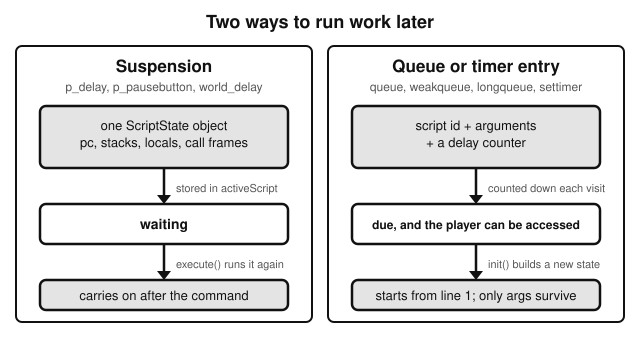
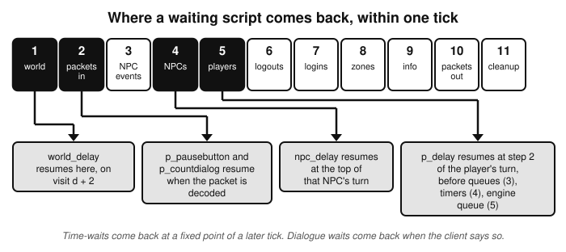
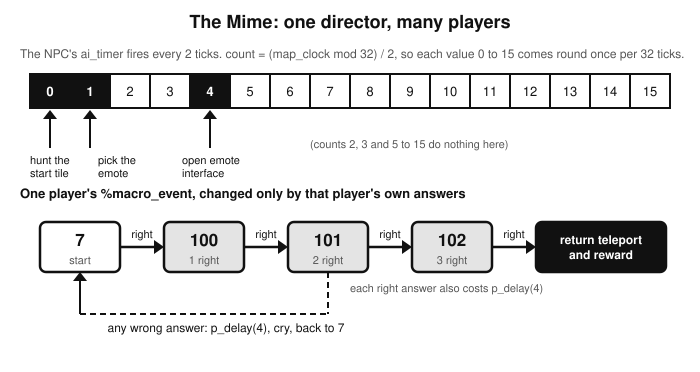
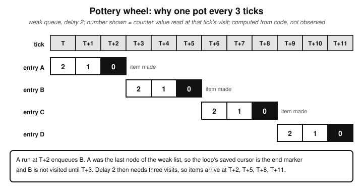
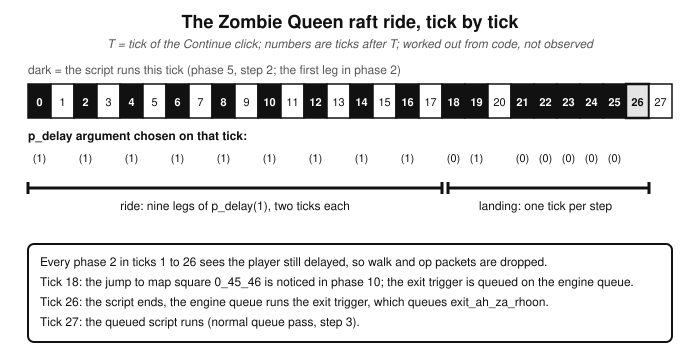
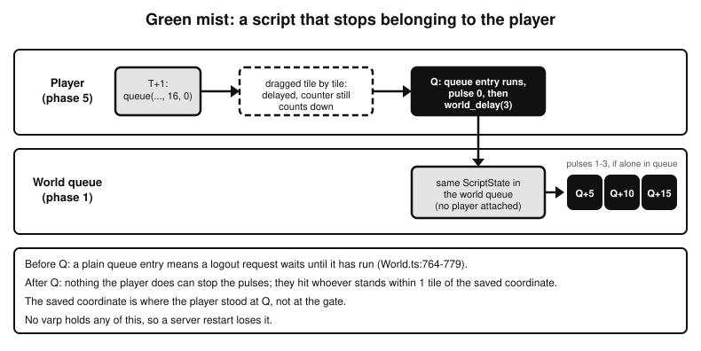
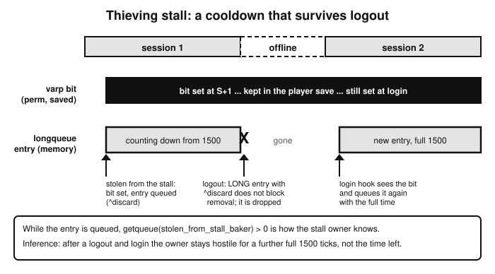
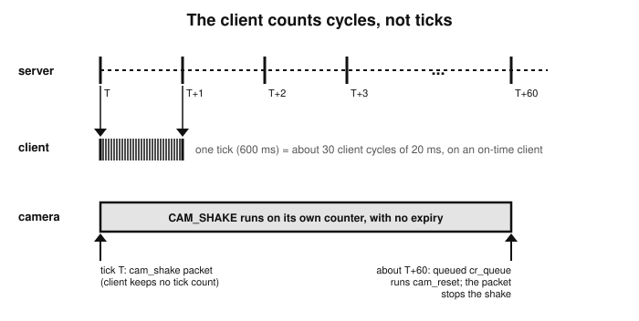

# How Multi-Tick Scripts Run

*How a LostCityRS script spreads its work over many ticks, from the smallest examples to the most involved ones, and what the client does meanwhile*

## Before you start

[Book 1](a-short-introduction-to-the-tick.md) ended with one worked example: a player chops a tree. The script behind it, `[oploc1,_tree]`, never waits. Each time it runs it either does a little work or re-arms the interaction with `p_oploc` and returns, and the engine runs it again on the next tick. That is one way to make something take several ticks. This book is about the others: scripts that stop in the middle and carry on later, scripts that start a new script later, timers, and work handed to the world itself.

Book 1 also ended with a warning. Its "not covered" list says that content was read for woodcutting only. This book is what came next: the engine rules for waiting, then fourteen real scripts from Content, then a look at the client.

You should have read Book 1. This book uses its vocabulary without explaining it again: phases 1 to 11, the player's turn and its steps, `canAccess`, protected, modal, queues, timers, `p_delay`. If the `.rs2` syntax is new to you, [Book 3, an introduction to RuneScript](an-introduction-to-runescript.md), explains it. The examples here use it without comment.

Three things to know about how it was written.

- **Everything comes from reading code.** The engine, content and client files were read at the commits listed in the last section. The server was never run, so every tick number is worked out from the code, not observed. Where a number depends on something I could not verify, the text says so.
- **Each chapter ends with its sources.** The prose stays clean; the footer gives file and line citations. The longer evidence notes behind each chapter are in `docs/books/multi-tick-scripts/`, and the footers name them.
- **It describes one revision.** The engine replicates revision 274. If the code and your memory of the game disagree, this book describes the code.

## 1. A script is an object

In Book 1 a script was something that runs: a click arrives, phase 5 finds the script, it runs from its first line to its last and it is over. To see how a script can stop in the middle, you first need to know what a running script physically is.

The engine gives no script a thread of its own. A running script is one object, a `ScriptState`. It holds the program counter (`pc`, which starts at -1), the integer and string stacks, the local variables, the stack of call frames for procs, and pointers to the entities the script is acting on, such as the active player. Those fields are the whole of the interpreter's state. Nothing else is needed to carry on.

One function runs scripts, `ScriptRunner.execute`. It is a loop. While the state's `execution` field is `RUNNING`, it adds one to `pc`, finds the handler for that opcode and calls it. A command suspends a script by writing something other than `RUNNING` into `execution`. When that handler returns, the loop condition fails, `execute` returns the value and the object is left exactly as it was: `pc` still points at the instruction that suspended, and the stacks, locals and frames are untouched.

To resume, the engine calls `execute` again on the same object. The first thing `execute` does is put `RUNNING` back, and the next turn of the loop takes the instruction after the one that suspended. A useful picture here is a book with a finger holding the place, as an analogy and nothing more. The book is the compiled script, the finger is `pc`, and the notes in the margin are the stack and the locals. Closing the book changes none of it.

The states are numbers. `ABORTED` is -1, `RUNNING` 0, `FINISHED` 1, `SUSPENDED` 2, `PAUSEBUTTON` 3, `COUNTDIALOG` 4, `NPC_SUSPENDED` 5 and `WORLD_SUSPENDED` 6. A search of the engine for every place that writes `execution` found exactly seven commands that suspend: `p_delay`, `p_arrivedelay`, `p_pausebutton`, `p_countdialog`, `npc_delay`, `npc_arrivedelay` and `world_delay`. Everything else that feels like waiting in a script is not suspension. Chapter 4 covers those.

Two consequences follow. A suspended script keeps its locals. A proc called from the script is part of the saved state, because its frame is on the saved stack: a `p_delay` deep inside `~agility_walk` freezes the whole chain of callers. And the instruction limit is cumulative. The counter `opcount` is never reset, so the 500,000-instruction limit applies to a script's whole life, however many times it suspends.

Where does the suspended object live? That depends on the state.

- `SUSPENDED`, `PAUSEBUTTON` and `COUNTDIALOG` go into the field `activeScript` on the player. It is one field, so a player holds one suspended script at a time.
- `NPC_SUSPENDED` goes into `activeScript` on the NPC.
- `WORLD_SUSPENDED` goes into the world queue, which belongs to nobody.



*Figure 1. A suspension continues one script object. A queue entry is only a recipe for starting a new one.*

Compare this with a queue entry. A player queue entry stores a script id, its arguments and a delay counter. Each time it fires, the engine builds a new `ScriptState` from that, starting at the first line. Nothing from the earlier run survives except the arguments. Two scripts that look alike in content can therefore behave very differently: after `p_delay` the locals are still there, after `queue` they are not.

> **What to remember**
>
> - A running script is one `ScriptState` object. `execute` is a loop that runs until `execution` stops being `RUNNING`.
> - Suspending means leaving that loop with the object intact; resuming means calling `execute` on it again.
> - Exactly seven commands suspend. A suspended player script is stored in `activeScript`, an NPC's in its own `activeScript`, and a world-delayed one in the world queue.
> - A queue entry is a recipe, not a paused script.

**Where this comes from.** Evidence note `docs/books/multi-tick-scripts/01-suspension-model.md` (findings 1 to 7). The state class and its constants are at `Engine-TS/src/engine/script/ScriptState.ts:25-33`, with `pc` and the frames at `Engine-TS/src/engine/script/ScriptState.ts:41-45`. The loop and the re-entry are at `Engine-TS/src/engine/script/ScriptRunner.ts:127-130` (resume sets `RUNNING`) and `Engine-TS/src/engine/script/ScriptRunner.ts:137-157` (the loop, with `++state.pc` at line 150), and it returns `state.execution` at `Engine-TS/src/engine/script/ScriptRunner.ts:231`. The limit is `Engine-TS/src/engine/script/ScriptRunner.ts:144-148`; a search of `Engine-TS/src` for `opcount` finds no reset. The seven writers of `execution`, found by a search of `Engine-TS/src` for `execution = `: `Engine-TS/src/engine/script/handlers/PlayerOps.ts:366`, `Engine-TS/src/engine/script/handlers/PlayerOps.ts:371`, `Engine-TS/src/engine/script/handlers/PlayerOps.ts:379`, `Engine-TS/src/engine/script/handlers/PlayerOps.ts:426`, `Engine-TS/src/engine/script/handlers/NpcOps.ts:100`, `Engine-TS/src/engine/script/handlers/NpcOps.ts:569`, `Engine-TS/src/engine/script/handlers/ServerOps.ts:169`, plus `FINISHED` at `Engine-TS/src/engine/script/handlers/CoreOps.ts:208` and `ABORTED` at `Engine-TS/src/engine/script/ScriptRunner.ts:228`. Storage: `Engine-TS/src/engine/entity/Player.ts:2202-2229` (the three destinations), the field at `Engine-TS/src/engine/entity/Player.ts:366`, `Engine-TS/src/engine/entity/Npc.ts:58` and `Engine-TS/src/engine/World.ts:155` (the world queue). A queue entry is built into a new state at `Engine-TS/src/engine/entity/Player.ts:910`, from the entry class at `Engine-TS/src/engine/entity/PlayerQueueRequest.ts:40-46`. Not checked: the compiler's side (how `~proc` calls and `@label` jumps compile) and the opcode handlers other than the ones cited; that is Book 3's subject.

## 2. Waiting, and who wakes you

Each suspending command waits for something different, and the thing it waits for decides which phase of the tick wakes it.

| Command | State | What it waits for | Resumed in |
|---|---|---|---|
| `p_delay(n)` | `SUSPENDED` | a number of ticks | phase 5, step 2 of the player's turn |
| `p_arrivedelay` | `SUSPENDED` | one tick, but only if the player stepped this tick or last | phase 5, step 2 |
| `p_pausebutton` | `PAUSEBUTTON` | the player to press Continue or a choice button | phase 2, when the packet is decoded |
| `p_countdialog` | `COUNTDIALOG` | the player to type a number | phase 2, when the packet is decoded |
| `npc_delay(n)` | `NPC_SUSPENDED` | a number of ticks | phase 4, top of that NPC's turn |
| `npc_arrivedelay` | `NPC_SUSPENDED` | one or two ticks, if the NPC moved | phase 4 |
| `world_delay(d)` | `WORLD_SUSPENDED` | a number of ticks | phase 1, in the world queue |



*Figure 2. The four places in a tick where a suspended script resumes.*

A script waiting on time and a script waiting on the client never mix. A `SUSPENDED` script is only produced by the two player delay commands, which also set `delayed`, so it always waits on the clock. The two dialogue states never set `delayed` and nothing in the player's turn resumes them, so they always wait on a packet.

### The arithmetic

Here is `p_delay`, exactly as written in the engine.

`Engine-TS/src/engine/script/handlers/PlayerOps.ts:376-380`
```ts
    [ScriptOpcode.P_DELAY]: state => {
        state.activePlayer.delayed = true;
        state.activePlayer.delayedUntil = World.currentTick + 1 + check(state.popInt(), NumberNotNull);
        state.execution = ScriptState.SUSPENDED;
    },
```

And here are the first lines of every player's turn in phase 5.

`Engine-TS/src/engine/World.ts:692-697`
```ts
                if (player.delayed && this.currentTick >= player.delayedUntil) player.delayed = false;

                // - resume suspended script
                if (!player.delayed && player.activeScript && player.activeScript.execution === ScriptState.SUSPENDED) {
                    player.executeScript(player.activeScript, true, true);
                }
```

Putting those together gives an inference. A `p_delay(n)` called in tick T resumes at step 2 of the player's turn in tick T + 1 + n, whichever phase called it. So `p_delay(0)` is "carry on next tick" and `p_delay(1)` is two ticks. Content comments such as `// 1t` and `// 2t` next to `p_delay(0)` and `p_delay(1)` agree.

The same shape holds for NPCs: `npc_delay(n)` in tick T resumes in phase 4 of tick T + 1 + n, at the top of the NPC's turn, before its lifecycle, hunt, timer and queue steps.

`world_delay(d)` is different. It stores `d + 1` in the world queue, and phase 1 decrements an entry on each visit and runs it when the value before the decrement is zero or less. The first visit is the tick after the call, so the entry runs on visit d + 2. Inference: a `world_delay(d)` called in tick U resumes in phase 1 of tick U + d + 2. This is the one place where the code and the content disagree. A comment in `necromancer_tower.rs2` says `world_delay(1)` delays by 2 ticks. Two other scripts subtract 2 from the delay and say the engine's `world_delay` is "too slow", which fits the d + 2 reading. Nothing was run to settle it (open question 19).

### Waiting for the client

A dialogue is a script that keeps hitting `p_pausebutton`. The commands you see in content, `~chatnpc`, `~chatplayer`, `~mesbox` and `~p_choice2`, are not engine commands. They are ordinary procs in `chat.rs2`. Each page fills in the interface text, opens it with `if_openchat`, calls `p_pausebutton` and loops to the next page.

`Content/scripts/interface_chat/scripts/chat.rs2:271-279`
```
[proc,chatplayer](string $string)
split_init($string, 380, 4, q8_full);
def_int $page = 0;
def_int $pagetotal = split_pagecount;
while ($page < $pagetotal) {
    ~chatplayer_page($page);
    p_pausebutton;
    $page = calc($page + 1);
}
```

The Continue component is declared with `buttontype=pause`, and clicking it sends a `RESUME_PAUSEBUTTON` packet. A choice button is different: it is `buttontype=normal`, so its click is an ordinary `IF_BUTTON` packet, and the proc has registered it with `if_addresumebutton`. When `IF_BUTTON` arrives, the handler checks whether the clicked component is registered and a script is waiting in `PAUSEBUTTON`, and if so resumes it. Either way the resume happens in phase 2, inside the packet handler, and it is forced: a dialogue resumes even if the player is delayed. After the resume the script keeps running in the same phase 2, so the next page, or a whole chain of work, can run before any tick passes.

The number input works the same way with `p_countdialog`: the server tells the client to show the box, and the typed value comes back in a `RESUME_P_COUNTDIALOG` packet, which stores it as `last_int` before resuming.

> **What to remember**
>
> - `p_delay(n)` resumes in phase 5 of tick T + 1 + n. `npc_delay(n)` resumes in phase 4 of T + 1 + n. `world_delay(d)` resumes in phase 1 of U + d + 2.
> - Dialogue waits resume in phase 2, when the client's packet is decoded. They have no tick length.
> - A resumed dialogue carries on in the same phase 2.

**Where this comes from.** Evidence note `docs/books/multi-tick-scripts/01-suspension-model.md` (findings 4, 8 to 13, 24). Commands and states: see chapter 1's footer; `p_arrivedelay` at `Engine-TS/src/engine/script/handlers/PlayerOps.ts:359-367` (returns when `lastMovement < currentTick`), with `lastMovement` set to `currentTick + 1` on a tick with steps at `Engine-TS/src/engine/entity/Player.ts:694-696`; `npc_arrivedelay` at `Engine-TS/src/engine/script/handlers/NpcOps.ts:557-570`. NPC resume: `Engine-TS/src/engine/entity/Npc.ts:109-118`, with `npc_delay` at `Engine-TS/src/engine/script/handlers/NpcOps.ts:97-101`. World queue: `Engine-TS/src/engine/script/handlers/ServerOps.ts:167-170`, `Engine-TS/src/engine/World.ts:1249-1251` (stores `delay + 1`) and `Engine-TS/src/engine/World.ts:535-557` (visit, post-decrement, run). The hand-over of a world-delayed script is `Engine-TS/src/engine/entity/Player.ts:2212-2213`. The conflicting comment is `Content/scripts/areas/area_ardougne_east/scripts/necromancer_tower.rs2:61`; the compensating scripts are `Content/scripts/skill_firemaking/scripts/firemaking.rs2:130-131` and `Content/scripts/quests/quest_tbwt/scripts/tbwt_jogre_bones.rs2:79-80`. Dialogue resume: `Engine-TS/src/network/game/client/handler/ResumePauseButtonHandler.ts:7-14`, `Engine-TS/src/network/game/client/handler/IfButtonHandler.ts:24-29`, `Engine-TS/src/network/game/client/handler/ResumePCountDialogHandler.ts:10-15`, bound at `Engine-TS/src/network/game/client/ClientGameProtRepository.ts:113` and `Engine-TS/src/network/game/client/ClientGameProtRepository.ts:163-164`; `force` skips the refusal test at `Engine-TS/src/engine/entity/Player.ts:2171-2176`. `if_addresumebutton` pushes the id at `Engine-TS/src/engine/script/handlers/PlayerOps.ts:832-836`. Client side: the Continue component is `Content/scripts/interface_chat/interfaces/npcchat1.if:36` (`buttontype=pause`), which becomes the menu action at `Client-TS/src/client/Client.ts:9837-9841` and sends the packet at `Client-TS/src/client/Client.ts:9190-9196` (id 72, `Client-TS/src/io/ClientProt.ts:75`); the choice buttons are `Content/scripts/interface_chat/interfaces/multi2.if:16` and `Content/scripts/interface_chat/interfaces/multi2.if:28` (`buttontype=normal`, packed as 1 at `Engine-TS/tools/pack/interface/PackShared.ts:31-32`), which become `IF_BUTTON` at `Client-TS/src/client/Client.ts:9800-9811` and are sent at `Client-TS/src/client/Client.ts:9148-9160`. The typed number is sent at `Client-TS/src/client/Client.ts:3033-3044`. Not observed: any resume tick (open questions 16 and 56). Not checked: whether any content hands a dialogue state to the world queue, which `processWorld` would drop (it has no branch for those states, `Engine-TS/src/engine/World.ts:548-557`).

## 3. While a script waits

What can the player do while a script waits? It depends on which kind of waiting it is.

**While delayed.** A `p_delay` makes the player `delayed`, and the engine treats a delayed player as unable to act. The movement and operate packet handlers start with an early return. `MoveClickHandler` checks `player.delayed`, writes an `UnsetMapFlag` packet and returns. `OpNpcHandler`, `OpLocHandler` and `OpHeldHandler` have the same early return. The packet is consumed and thrown away. It is not saved for later. Phase 2 also drops a pending path if the player is delayed. And the player fails `canAccess`, so no queue entry, normal timer or engine-queue entry runs.

Two things are not blocked. Soft timers still run. And a button click that is a registered resume button still resumes a waiting dialogue, because `IfButtonHandler` has no delay check. One timing detail follows from the order of phases: `delayed` is cleared in phase 5, after phase 2 of the same tick, so the packets of the tick in which a script resumes were still refused.

A consequence, and an inference: in a chain of delays, every phase 2 falls inside a delay, so the player cannot interrupt the chain with a click. The Zombie Queen raft in chapter 9 is the longest example.

**While a dialogue waits.** The player is not delayed. What blocks queued work is the open chat modal, which makes `canAccess` false. Queue entries, normal timers and the engine queue wait, still counting down; soft timers run. Movement and operate packets are accepted, and they close the modal. So walking away from a conversation abandons it.

Here is how that works. A walk or operate click calls `clearPendingAction`, which calls `closeModal`. When `closeModal` finds a modal open, it checks whether the stored script is in `COUNTDIALOG` or `PAUSEBUTTON`, and if so sets `activeScript` to null. The script is simply never resumed, and no clean-up code runs for it. A script in `SUSPENDED`, waiting on a delay, is not touched. `closeModal` also empties the weak queue every time it is called with its default argument, which is why the weak queue (chapter 4) disappears whenever the player acts.

Other ways a dialogue is abandoned: the `if_close` command, a `CLOSE_MODAL` packet, a strong queue entry waiting in the queue, opening another chat modal, and logging out.

A dialogue does not abandon itself when it opens its own next page. By the time the script runs again, `execute` has set its state back to `RUNNING`, so the "clear old suspended scripts" test in the modal-opening code does not match it. This is a fact chain from the code, not something observed.

**Logging out.** A player is removed in phase 6 only if it passes `canAccess`, its engine queue is empty and its normal queue holds only discardable entries (chapter 11). A delayed player fails `canAccess`, so in an ordinary logout the delayed script gets to resume first (an inference from the phase order: phase 5 runs before phase 6). During a world shutdown `canAccess` is always true, and a script still waiting is dropped with the player, because removal clears `activeScript`.

**One slot only.** The `activeScript` field is assigned without checking for an earlier value. Inference: if a second script suspended on the same player while another was stored, the first would be lost. It should be rare, because protected scripts cannot start while the player is delayed or has a chat modal open. Whether any content can cause it was not checked.

> **What to remember**
>
> - A delayed player's move and operate packets are dropped, not queued. Dialogue resume buttons and soft timers still work.
> - A waiting dialogue is not a delay. Walking away closes the modal and abandons the script.
> - A suspended `p_delay` script is never abandoned by `closeModal`.
> - A delayed player is not removed at logout until the delay has ended.

**Where this comes from.** Evidence note `docs/books/multi-tick-scripts/01-suspension-model.md` (findings 14 to 23). Dropped packets: `Engine-TS/src/network/game/client/handler/MoveClickHandler.ts:12-15`, `Engine-TS/src/network/game/client/handler/OpNpcHandler.ts:16-31`, `Engine-TS/src/network/game/client/handler/OpLocHandler.ts:14-15`, `Engine-TS/src/network/game/client/handler/OpHeldHandler.ts:16-19`; the pending-path drop is `Engine-TS/src/engine/World.ts:617-622`. `canAccess` and `busy`: `Engine-TS/src/engine/entity/Player.ts:816-832`. The resume-button path with no delay check is `Engine-TS/src/network/game/client/handler/IfButtonHandler.ts:24-29`. Accepted clicks close the modal: `Engine-TS/src/network/game/client/handler/MoveClickHandler.ts:30-32` (not for op-click moves), `Engine-TS/src/network/game/client/handler/OpLocHandler.ts:45`, `Engine-TS/src/network/game/client/handler/OpNpcHandler.ts:47`, `Engine-TS/src/network/game/client/handler/OpHeldHandler.ts:54-56`, and `clearPendingAction` at `Engine-TS/src/engine/entity/Player.ts:970-973`. `closeModal`: `Engine-TS/src/engine/entity/Player.ts:760-778`. Other abandon paths: `if_close` at `Engine-TS/src/engine/script/handlers/PlayerOps.ts:246-248`; `processQueues` (strong entry, `requestModalClose`) at `Engine-TS/src/engine/entity/Player.ts:874-889`; opening another chat modal at `Engine-TS/src/engine/entity/Player.ts:2033-2054`; logout at `Engine-TS/src/engine/World.ts:764-765`. The own-page reasoning rests on `Engine-TS/src/engine/script/ScriptRunner.ts:130` and `Engine-TS/src/engine/entity/Player.ts:2050-2054`. Removal: `Engine-TS/src/engine/World.ts:764-791`, `Engine-TS/src/engine/entity/Player.ts:826-828` (shutdown), and the clean-up that clears `activeScript` and the queues at `Engine-TS/src/engine/entity/Player.ts:449-468`. The single slot: `Engine-TS/src/engine/entity/Player.ts:2216-2218`. Not checked: the `rsbuf`-side effects of a dropped packet, the compiler's handling of `p_delay` in unprotected scripts (Book 3), and the client's own behaviour when a dialogue is abandoned.

## 4. Later, without waiting

Most of what feels like "wait and then" in content is not suspension. It is a new script, started later. There are five mechanisms, and all five count in ticks.

### Player queues

A player has a normal queue and a weak queue. The `queue`, `strongqueue` and `longqueue` commands add to the normal queue, with a type recorded on the entry. `weakqueue` adds to the weak queue. All of them pass the script's delay through unchanged. In step 3 of a player's turn the engine walks the normal queue and then the weak queue. The counter is two lines.

`Engine-TS/src/engine/entity/Player.ts:903-904`
```ts
            const delay = request.delay--;
            if (this.canAccess() && delay <= 0) {
```

The counter drops on every visit, whether or not the player can be accessed. The entry runs when the value before the decrement is zero or less and the player can be accessed. So an entry with delay d is skipped d times and runs on the next visit. If the player was blocked, the counter keeps falling and the entry runs on the first accessible visit. Late is not the same as skipped.

An entry added during the pass has a quirk that the engine comment calls authentic. The list iterator remembers the next node before it runs the current entry. If the running entry was the last node, the iterator's saved next is the end marker, so an entry the script just added is not visited until next tick. If the running entry was not last, the new entry is reached in the same pass. This is why a weak-queue chain with delay d advances every d + 1 ticks, which chapters 5 and 8 show.

The queue types differ in what clears them.

- A **weak** entry is deleted whenever `closeModal` runs with its default argument. That includes every accepted walk or operate click, `if_close`, a `CLOSE_MODAL` packet, a strong entry waiting in the normal queue, and logout. The weak queue is the "stop if the player does anything" queue, and it gets that behaviour for free from the engine.
- A **normal** entry survives all of that. Only the `clearqueue` command (which removes entries by script id) or logout removes it.
- A **long** entry has a logout action, which chapter 11 explains.
- A **strong** entry makes the engine close the player's modal before the queue runs. A search of Content found no call to `strongqueue`: only its declarations in `engine.rs2` and comments mentioning it.

There is a third list, the engine queue. The zone triggers `mapzone`, `mapzoneexit`, `zone` and `zoneexit` are put on it by phase 10 when a player's map square or zone changes, and they run at step 5 of the next tick's turn, if the player passes `canAccess`. A teleport in tick T therefore fires its destination triggers in tick T + 1 at the earliest, and later if the player is delayed or in a dialogue.

### Timers

`settimer(script, n)` stores the script and the tick it was set. Each turn the engine compares the clock with that tick plus the interval, and when it is due, sets the stored tick to now, before running the script. A normal timer needs `canAccess` and runs protected. A soft timer needs nothing. A timer blocked at its due tick fires once, late, and its interval restarts from that firing. There is no catch-up. Setting a timer that already exists replaces it and restarts it, which is how a script changes its own cadence. No timer runs while the player is logging out.

`npc_settimer(n)` gives an NPC a timer, with a different counting rule. The NPC's `ai_timer` fires when a counter, incremented once per turn that reaches that code, reaches the interval, and the counter is reset after the script runs. An NPC queue entry also counts differently from a player's: it is decremented only while the NPC is not delayed, and it runs when the decremented value is zero or less. An entry with delay d therefore runs on visit d (on the first visit if d is 0), one visit earlier than a player's would.

### The world queue

Only `world_delay` writes to it, so it belongs to the previous chapter. The thing to remember is that a script waiting there belongs to no entity. It does not delay, protect or block anyone.

### The re-arming loop

`p_oploc` and `p_opnpc` do not wait. They stop the current action and set a new interaction, which the player's turn tries on the next tick. A script that ends with `p_oploc(3)` keeps its interaction alive; a script that does not ends the loop. This is Book 1's woodcutting example. The "wait" is the pause between ticks, plus a comparison against `map_clock` in the script.

How much does content use each mechanism? These are line counts from a search of `Content/scripts` with test scripts removed, so they include comments and are only indicative. `p_delay(` appears on 1,735 lines, `p_arrivedelay` on 201, `npc_delay(` on 82, `npc_queue(` on 76, `longqueue(` on 33, `world_delay(` on 29, `p_countdialog` on 39 and `p_pausebutton` on 37. Suspension by `p_delay` dominates, and dialogue goes through the few procs in `chat.rs2`.

> **What to remember**
>
> - A queue entry with delay d runs on visit d + 1, a blocked one on the first accessible visit. An NPC queue entry runs on visit d (the first visit if d is 0).
> - An entry added by the last running entry of a list is not visited until next tick. Any other entry is visited in the same pass.
> - Weak entries die on every default `closeModal`. Normal and long entries do not.
> - A timer fires when the clock reaches its last firing plus the interval, and a blocked normal timer fires once, late.

**Where this comes from.** Evidence note `docs/books/multi-tick-scripts/02-multi-tick-without-suspension.md` (findings 26 to 31) and `docs/books/multi-tick-scripts/04-engine-rules-for-the-complex-examples.md` (E1, E6 to E11). Queue commands: `Engine-TS/src/engine/script/handlers/PlayerOps.ts:124-193`; storage by type at `Engine-TS/src/engine/entity/Player.ts:841-851`; passes at `Engine-TS/src/engine/entity/Player.ts:874-926`, with the quirk comment at `Engine-TS/src/engine/entity/Player.ts:892-896`; the iterator at `Engine-TS/src/datastruct/LinkList.ts:47-55`, `Engine-TS/src/datastruct/LinkList.ts:67-75` and `Engine-TS/src/datastruct/LinkList.ts:97-111`. Engine queue: `Engine-TS/src/engine/entity/Player.ts:660-670`; zone detection `Engine-TS/src/engine/entity/NetworkPlayer.ts:251-283`, trigger enqueue `Engine-TS/src/engine/entity/Player.ts:580-615`, and `updateMap` is called in phase 10 at `Engine-TS/src/engine/World.ts:1108`. Timers: `settimer` at `Engine-TS/src/engine/script/handlers/PlayerOps.ts:890-900`, storage and firing at `Engine-TS/src/engine/entity/Player.ts:928-961`, the logout skip at `Engine-TS/src/engine/World.ts:702-707`. NPC timer and queue: `Engine-TS/src/engine/entity/Npc.ts:550-583`, interval setter `Engine-TS/src/engine/entity/Npc.ts:219-223`. Clearing by script id: `Engine-TS/src/engine/script/handlers/PlayerOps.ts:1102-1105` and `Engine-TS/src/engine/entity/Player.ts:853-872`. Re-arming: `Engine-TS/src/engine/script/handlers/PlayerOps.ts:387-401`, `Engine-TS/src/engine/entity/Player.ts:1171-1182`, `Engine-TS/src/engine/entity/Player.ts:1300-1308`. No `strongqueue` call: a search of `Content/scripts` finds only the declarations at `Content/scripts/engine.rs2:93-100` and comments. The counts are from `grep -rn --include=*.rs2 -F` over `Content/scripts` excluding `/_test/`, re-run for this book. Not checked: timer iteration order when a timer is added during the pass (open question 48), and the rest of the `ap` and interaction machinery (open question 4).

## 5. Eight small examples

Before the big stories, here are eight small real ones. Each is a few lines of Content, and each shows one idea. In every case the player is connected, not logging out, and the timeline is read from code, not observed. Times are in ticks after T, the tick the script first runs.

### Bury bones: `p_delay(0)` between an animation and the result

`Content/scripts/skill_prayer/scripts/bury_bone.rs2:4-16`
```
mes("You dig a hole in the ground...");
anim(human_pickupfloor, 0);
sound_synth(bones_down, 1, 0);

p_stopaction;
// bones used to delay: https://www.youtube.com/watch?v=LSpyUVXa4LE&t=84s
p_delay(0);

// delete is after delay: https://www.youtube.com/watch?v=OnW0ZwXLze4&t=141s
def_obj $last_item = inv_getobj(inv, $slot);
inv_delslot(inv, $slot);
stat_advance(prayer, oc_param($last_item, bone_exp));
mes("You bury the bones.");
```

The item-option packet is decoded in phase 2 of T and the script runs there. It shows the message and animation, then suspends. In T + 1 the player's turn clears the delay and resumes it: the bones are removed, the experience given and the second message shown. In between, every click is dropped, so the bones cannot be used twice. The effect is two things one tick apart, which is what `p_delay(0)` is for.

### Searching a hay bale: `p_delay(2)`, then a dialogue, then a queue that has to wait

The loc-operate script runs in phase 5, step 8 of tick T. It shows a message and an animation and calls `p_delay(2)`. The player is delayed through T + 2, and in T + 3 the script resumes and rolls a random number. Two percent of the time it queues `damage_player` with delay 0 and then opens a chat dialogue; ten percent of the time it gives a needle and a dialogue; otherwise it only shows a message.

The interesting branch is the 2 percent one. The dialogue suspends the script in `PAUSEBUTTON`, so the player has a chat modal open, and the queue entry for the damage reaches its visit in the same turn, finds `canAccess` false and does not run. Its counter falls to -1. Inference: the damage lands when the player dismisses the dialogue, not when the "Ow!" line appears, because the entry runs on the first accessible visit. The `damage_self` proc itself was not read.

### A shopkeeper: three waits that have no tick length

`[opnpc1,rommik]` calls `~chatnpc`, then `~p_choice2`, then another `~chatplayer` and `~chatnpc`. The script runs in phase 5, step 8 of tick T, reaches the first `p_pausebutton` and stores itself. Every later step happens in phase 2 of whichever tick the player clicks. When the player clicks Continue, the next page, the choice dialogue and its `p_pausebutton` all run inside that one packet handler, so no tick passes between pages. The choice buttons send `IF_BUTTON`, and the engine resumes the script because they were registered as resume buttons. The whole conversation takes as many ticks as the player takes, and if the player walks away in between, the script is dropped at whatever page it was on.

### Playing a lyre: a chain of weak-queue scripts, no suspension at all

`Content/scripts/quests/quest_viking/scripts/viking_olaf.rs2:276-285`
```abbrev
p_stopaction;
mes("You withdraw your lyre.");
anim(viking_lyre_ready, 0);
weakqueue(viking_play1, 1, 0);

[queue,viking_play1]
anim(viking_lyre_playing_loop, 0);
say("Doh Ray Me So.");
~music_jingle("ballad opening");
weakqueue(viking_play2, 3, 0);
```

The item script finishes at once and the player is free. The first queue entry is added in phase 2 of T with delay 1 and runs in T + 1. Each later script is added from inside the weak pass by the only entry in the list, so it is not visited until the next tick. With delays of 3, 3, 3, 2 and 2, the entries run at T + 1, T + 5, T + 9, T + 13, T + 16 and T + 19. That is an inference from the counting rules, not observed. Walking away empties the weak queue, and "Your lyre is perfectly tuned" never appears.

### A timer: `settimer` and `[timer,...]`

The maze event's `[mapzone,0_45_71]` script calls `settimer(macro_maze, 5)`. The mapzone script runs from the engine queue in step 5 of the player's turn, after the normal timers have already been processed that tick. The timer is stored with that tick as its clock, so `[timer,macro_maze]` first fires five ticks later, in step 4 of the player's turn, then every five ticks, reducing a percentage each time. The timer does not delay or block the player. `cleartimer` ends it. Chapter 6 puts this in its setting.

### An NPC dying: `npc_delay(1)` and `npc_del`

The `[ai_queue3,...]` script of a black demon calls `npc_death`, which, in the no-move case, plays the death animation and calls `npc_delay(1)` before `npc_del`. In tick T, phase 4, the queue entry runs and the NPC suspends with `delayedUntil = T + 2`. While it is delayed, clicks on it are refused and its turn returns early, before hunt, timer, queue and movement. In T + 2 the NPC undelays, resumes and `npc_del` removes it. The script is not aborted by `npc_del`: it carries on and runs the drop lines. A respawning NPC just becomes inactive and gets a respawn timer.

### The tutorial fire: a chain of delays, then `world_delay`

`Content/scripts/tutorial/scripts/skills/tut_firemaking.rs2:26-35`
```
p_delay(0);
anim(human_createfire, 0);
sound_synth(tinderbox_strike, 1, 0);
~tutorial_please_wait_firemaking;
p_delay(3);
sound_synth(tinderbox_strike, 1, 0);
p_delay(2);
anim(null, 0);
~push_player(obj_coord);
~tut_firemaking_success(obj_coord, $log);
```

The script runs in tick T, then resumes at T + 1 (after `p_delay(0)`), T + 5 (after `p_delay(3)`) and T + 8 (after `p_delay(2)`). The same state object is stored again each time. At T + 8 the success proc adds the fire and calls `world_delay(150)`. The state is handed to the world queue with delay 151, and the player is released at once. By the d + 2 reading the ashes appear in phase 1 of tick T + 160. The lesson is the difference between the two: `p_delay` blocks the player and returns in phase 5, while `world_delay` unblocks the player and returns in phase 1.

### The woodcutting loop: a repeat with no delay at all

You have met this in Book 1. `[oploc1,_tree]` sets `%action_delay` to `map_clock + 3` and calls `p_oploc(1)`, and then `p_oploc(3)` on later runs. It never suspends. The pause is the tick boundary, and the three-tick cadence is the script comparing the clock with its own variable.

> **What to remember**
>
> - `p_delay(0)` is the smallest pause: one tick, with the player's clicks dropped in between.
> - A dialogue has no tick length. Every wait in a conversation is a packet in phase 2.
> - A weak-queue chain with delay d advances every d + 1 ticks and stops if the player acts.
> - `world_delay` frees the player at once and resumes in phase 1.

**Where this comes from.** Evidence note `docs/books/multi-tick-scripts/03-simple-examples.md` (examples 1 to 8). Bury bones: `Content/scripts/skill_prayer/scripts/bury_bone.rs2:1-20`; the opheld handler runs the script in phase 2 at `Engine-TS/src/network/game/client/handler/OpHeldHandler.ts:65-68`; `p_stopaction` is `Engine-TS/src/engine/script/handlers/PlayerOps.ts:430-432`; protect is reset in phase 11 at `Engine-TS/src/engine/entity/Player.ts:476` and `Engine-TS/src/engine/World.ts:1148-1149`. Hay bale: `Content/scripts/general_use/scripts/haybales.rs2:17-29`; interaction tries at `Engine-TS/src/engine/entity/Player.ts:1160-1182` and `Engine-TS/src/engine/entity/Player.ts:1289-1290`; the blocked queue entry follows `Engine-TS/src/engine/entity/Player.ts:903-904`. Shopkeeper: `Content/scripts/areas/area_rimmington/scripts/rommik.rs2:1-10`, with the procs at `Content/scripts/interface_chat/scripts/chat.rs2:1-16` (`~p_choice2`) and `Content/scripts/interface_chat/scripts/chat.rs2:323-333` (`~chatnpc`). Lyre: `Content/scripts/quests/quest_viking/scripts/viking_olaf.rs2:276-311`; weak queue add at `Engine-TS/src/engine/script/handlers/PlayerOps.ts:124-133`. Timer: `Content/scripts/login_logout/login.rs2:40` shows the same call style; the maze script is `Content/scripts/macro events/scripts/general/macro_event_maze.rs2:5-9` and `Content/scripts/macro events/scripts/general/macro_event_maze.rs2:43-47`; engine queue at `Engine-TS/src/engine/World.ts:701-709` (order of steps 3 to 5). NPC death: `Content/scripts/skill_combat/scripts/npc/npc_death.rs2:10-24`, started by `npc_queue(3, 0, 0)` at `Content/scripts/skill_combat/scripts/npc/npc_combat.rs2:93`, in `Content/scripts/drop tables/scripts/black_demon.rs2:1-9`; engine side `Engine-TS/src/engine/entity/Npc.ts:152-155` (the `isValid` gate) and `Engine-TS/src/engine/World.ts:1307-1334` (`removeNpc`). Tutorial fire: `Content/scripts/tutorial/scripts/skills/tut_firemaking.rs2:26-35` and `Content/scripts/tutorial/scripts/skills/tut_firemaking.rs2:72-87`. Woodcutting: `Content/scripts/skill_woodcutting/scripts/woodcut.rs2:55-62` and `Content/scripts/skill_woodcutting/scripts/woodcut.rs2:73-78`. Not read: the procs `~damage_self`, `~openshop_activenpc`, `~tutorial_please_wait_firemaking`, and the NPC `lastMovement` setter for the `npc_arrivedelay` branch of the death example (I assumed the no-move branch).

## 6. The Old Man and the Maze

A random event is a small story told across many ticks by two actors: the player's scripts, which run in phase 5, and an NPC's, which run in phase 4. This one starts with a timer and ends, depending on a dice roll, with a gift, a scolding or a trip through a maze.

The player's timer is armed at login: `settimer(general_macro_events, 500)`. It fires every 500 ticks, when the player is accessible. Its script does nothing unless an event is allowed and an `afk_event` check passes, and that flag is a separate dice roll. In phase 2, on every tick that is a multiple of 500, each player gets `afkEventReady` set with probability 1/24, or 1/12 when `zonesAfk()` is true (a comment says that means the player's aggro zone has not changed; the function itself was not read). The `afk_event` command both reports the flag and clears it. So the timer and the roll are independent clocks, and one roll can be spent only once.

When both agree, the script finds a free square, adds an NPC with a 1,000-tick lifetime, records its uid, and runs a per-event proc. Four of the events use the same NPC type, `macro_mage`, whose type sets `timer=20`. We follow two of them.

### The gift that must be accepted

The spawn proc makes the old man bow and greet the player, then calls `p_delay(1)` inside the player's timer script. That works because a normal timer runs protected, so the timer script itself is stored as the player's `activeScript`. After the delay it writes the player's uid into one NPC variable, `%npc_macro_event_target`. That variable is the only link between the two actors from then on.

The NPC's `ai_timer` does the rest. On each firing it finds its target and picks a line by a counter, `%npc_int`: a wave and "ehem... Hello", a thoughtful "Hello, are you there", an angry "It's really rude to ignore someone". On the fourth firing it shouts, queues a teleport script on the player, and deletes itself. If the player talks to it first, `[opnpc1,macro_mage]` gives the reward, sets the counter to "happy", switches the NPC's timer off with `npc_settimer(0)`, queues a goodbye script on the NPC with delay 2 and opens the dialogue.

Let T0 be the tick the player's timer fires.

| Tick | Phase | What happens |
|---|---|---|
| T0 | 5, step 4 | Timer fires. NPC added. `p_delay(1)`: resume at T0 + 2. |
| T0 + 1 | 4 | The NPC's first turn (it was added after phase 4 of T0). Its counter goes to 1. |
| T0 + 2 | 5, step 2 | Player resumes: the target uid is stored in the NPC variable. The script ends. |
| T0 + 20, 40, 60 | 4 | `ai_timer` fires on the NPC's 20th turn: three nudges. |
| T0 + 80 | 4 | Fourth firing. `queue(macro_event_fail_teleport, 0, 0)` on the player, then `npc_delay(0)`. |
| T0 + 80 | 5, step 3 | Player's queue entry runs: `p_delay(1)`, resume at T0 + 82. |
| T0 + 81 | 4 | NPC undelays and resumes at `npc_del`. |
| T0 + 82 | 5, step 2 | Player resumes: puff of smoke, then a jump to a random place. |

The interesting row is T0 + 80. An NPC script in phase 4 queues a script on the player, and the player's turn is a little later in the same tick, so the entry runs at once. Two schedules run in parallel here, one per actor, linked only by a varn value and a `queue` call.

If the player does talk to the NPC in tick R, the reward and the NPC queue are set in phase 5. The NPC's queue entry has delay 2, so it runs at R + 2, where the NPC waves and calls `npc_delay(2)`; at R + 5 it resumes and calls `npc_del`. This happens whether or not the player has finished reading the dialogue.

### The maze

The maze event deletes the old man, saves the player's position in a permanent varp, jumps the player into a maze square, opens a timer overlay and opens a dialogue. The countdown timer is not started there. It is started by a `[mapzone,0_45_71]` script, which is an engine-queue entry, and the engine queue is blocked while the dialogue is open. This ordering has a consequence, shown in the table.

| Tick | Phase | What happens |
|---|---|---|
| T0 | 5, step 4 | Timer fires; the NPC speaks; `p_delay(1)`. |
| T0 + 2 | 5, step 2 | Resume. NPC deleted; `%xplamp = 100`; `p_telejump` into the maze; overlay; dialogue opens (`PAUSEBUTTON`). |
| T0 + 2 | 10 | The map square changed, so `[mapzone,0_45_71]` is queued. |
| T0 + 3 onward | 5, step 5 | The engine queue is blocked by the chat modal. No timer is running yet. |
| Tc | 2 | The player clicks Continue. The dialogue ends. |
| Tc | 5, step 5 | `[mapzone,0_45_71]` runs: `settimer(macro_maze, 5)`, clock = Tc. |
| Tc + 5, +10, ... | 5, step 4 | `[timer,macro_maze]` lowers `%xplamp` by 1, if above 0. |
| Te | 5, step 8 | The player operates the finish statue: `if_close`, `end_macro_maze` clears the timer, then `p_delay(5)`. |
| Te + 6 | 5, step 2 | `~macro_return_teleport`, then the reward uses `%xplamp`. |
| Te + 6 | 10 | The map square changed again: `[mapzoneexit,0_45_71]` queued. |
| Te + 7 | 5, step 5 | Exit trigger runs: varps reset, timer and overlay cleared, `%xplamp = 0`. |

Three consequences. The countdown starts late, only when the dialogue is dismissed. A blocked normal timer fires once, so the percentage falls by at most one per firing. And the reward reads `%xplamp` after the return teleport, which works because the script that zeroes it is an engine-queue script that cannot run before tick Te + 7. Inference: if the player never clicks Continue and never moves, the countdown never starts. If the player walks away, the dialogue is dropped and the trigger runs in that same tick.

One more fact about those triggers: the engine's record of a player's last map square starts at -1, and nothing else in the engine assigns it, so the first map square a player is seen in runs its `mapzone` trigger and no exit trigger. Inference: that includes the square a player logs in to.

> **What to remember**
>
> - A timer script can itself suspend: `p_delay` inside a normal timer works, because normal timers run protected.
> - Two actors can run two schedules, linked only by a variable and a `queue` call. An NPC's queue entry onto a player runs in the same tick.
> - Zone triggers run late if the player is busy. A dialogue holds them back until it closes.

**Where this comes from.** Evidence note `docs/books/multi-tick-scripts/05-random-event-old-man-and-maze.md`. The login timer: `Content/scripts/login_logout/login.rs2:40`, run via the login trigger at `Engine-TS/src/engine/entity/Player.ts:524-528`; the `queue(macro_event_login, 0, 0)` at `Content/scripts/login_logout/login.rs2:48`. The roll: `Engine-TS/src/engine/World.ts:610-611` and constants `Engine-TS/src/engine/World.ts:127-129`; `afk_event` at `Engine-TS/src/engine/script/handlers/PlayerOps.ts:1114-1117`. The timer script, spawn proc, NPC scripts and teleport queue script are in `Content/scripts/macro events/scripts/macro_events.rs2` (lines 1-11, 26-45, 70-72, 113-130, 133-157, 228-234) and `Content/scripts/macro events/scripts/general/macro_event_mysterious_old_man.rs2` (lines 1-41 spawn, 49-88 NPC timer and queues, 90-113 click handler); the NPC type's `timer=20` is `Content/scripts/macro events/configs/antimacro.npc:123-125` and the event numbers are `Content/scripts/macro events/configs/macro_events.enum:1-12`. The maze: `Content/scripts/macro events/scripts/general/macro_event_maze.rs2:1-47` and `Content/scripts/macro events/scripts/general/macro_event_maze.rs2:72-74`, start squares `Content/scripts/macro events/configs/macro_events.enum:73-79`, perm varp `Content/scripts/macro events/configs/antimacro.varp:14-16`. Engine: `p_delay` and the resume as in chapter 2; the NPC's first turn follows from `Engine-TS/src/engine/entity/Npc.ts:550-559` and the add at `Engine-TS/src/engine/World.ts:1296-1305`; NPC queue `Engine-TS/src/engine/entity/Npc.ts:561-583` and `Engine-TS/src/engine/script/handlers/NpcOps.ts:159-165`; zone triggers at `Engine-TS/src/engine/entity/NetworkPlayer.ts:251-262`; the first-visit value `Engine-TS/src/engine/entity/Player.ts:385` (`lastMapZone: number = -1`, and no other assignment in `Engine-TS/src`). Not verified: the procs `~tele_checks`, `~p_telejump_safe`, `chatnpc_specific` beyond the `p_pausebutton` at `Content/scripts/interface_chat/scripts/chat.rs2:393-401`; the maze doors and chests; whether the temp varp `%macro_event`, which `macro_event_login` reads at `Content/scripts/macro events/scripts/macro_events.rs2:76-81`, survives a logout (needs the save code, not read).

## 7. The Mime

The Mime event is where one NPC keeps many players in step. A Mime stands on a stage, performs one emote at a time, and every player at the stage must copy it. All the timing belongs to the NPC's `ai_timer`, which ends its script with `npc_settimer(2)` and so fires every 2 ticks.

Each firing computes `count = (map_clock mod 32) / 2`, which is 0 to 15 over a 32-tick cycle, so each value comes round once per cycle. Only three of the counts do anything.

- **Count 0.** The Mime turns and swaps the spotlights. Then `huntall` finds players within distance 1 of the start tile (the exact hit rules were not read). For each one it calls `if_close()` and queues `mime_step_right_up`, which teleports the player two tiles to the stage. A second `huntall` around the stage tile calls `if_close()` on each player there, closing any emote interface left open.
- **Count 1.** The Mime picks `%npc_int = random(8)` and plays that emote. `%npc_int` is an NPC variable, so there is one shared question per cycle.
- **Count 4.** The Mime bows and, for every player at the stage, opens the emote interface with `if_openchat(macro_mime_emotes)`.



*Figure 3. The director's 32-tick cycle, and one player's progress through the event.*

A `huntall` loop is the trick that makes one script a broadcast. `huntnext` sets the script's active player to each hit in turn, so the `queue` and `if_close` calls inside the loop act on that player.

The player's answer is not a dialogue resume. The emote interface registers no resume buttons, so the click arrives as `IF_BUTTON` and runs a normal button script, `mime_random_emote`. It closes the interface, plays the clicked animation, and then compares the clicked emote with the Mime's current `%npc_int`, read at click time, not when the interface opened. A right answer calls `p_delay(4)`, then cheers and moves the player's `%macro_event` along: 7, then 100, 101, 102. On the fourth right answer there is a second `p_delay(4)`, a return teleport and a reward. A wrong answer costs the same `p_delay(4)` and sets `%macro_event` back to 7.

Take k = `currentTick` mod 32, and assume the timer fires on even k (if it fires on odd k, shift everything by one; the structure is the same). Tb is the tick the player clicks an emote.

| Tick | Phase | What happens |
|---|---|---|
| Arrival | 5, step 2 | The old man's script resumes: `p_teleport` to the start tile, intro dialogue (`PAUSEBUTTON`). |
| Arrival | 10 | New map square: `[mapzone,0_31_74]` queued. It cannot run while the dialogue is open. |
| Next k = 0 | 4 | Director: `if_close()` drops the dialogue; `queue(mime_step_right_up)`. |
| Same tick | 5, step 3 | The queue entry teleports the player two tiles to the stage. |
| Same tick | 5, step 5 | The engine queue is free: `[mapzone,0_31_74]` runs. |
| k = 2 | 4 | The Mime picks and plays the emote. |
| k = 8 | 4 | The emote interface opens (a chat modal). |
| Tb | 2 | Click: `if_close`, animation, compare. Right: `p_delay(4)`, resume at Tb + 5. |
| Tb + 1 to Tb + 4 | 2 | Every walk and operate click is dropped. |
| Tb + 5 | 5, step 2 | Cheer; `%macro_event` goes up one step. |

Three details deserve a note. The director's `if_close()` is an ordinary `closeModal()`, so it also empties the weak queue of a player standing at the stage. A `p_delay(4)` is five ticks long, longer than the director's interval, so a director firing can land inside a player's delay; `closeModal` then runs on a delayed player and does not touch the suspended script. And if the NPC cannot be found at its expected tile, the answer is compared with a random number instead, because the comparison value starts as `random(8)` and is only overwritten when the NPC is found.

Inference: the introductory dialogue never needs to be dismissed, because the next count 0 closes it by force. A second inference: two players on the stage share the question but not the progress, since `%macro_event` is a player variable and `%npc_int` an NPC variable. And a third: a player gets one question per 32 ticks (about 19 seconds), needs four right answers, and each costs 5 ticks of delay, so the fastest run is bounded below by four cycles.

Not resolved: which config supplies the NPC type for revision 274. The only definition of `[macro_mime]` that was found is a dump under `_unpack/254` with `timer=5`. If the packer reads that folder, the first firing comes after 5 turns and the script then sets 2. Nothing in the packer read says either way, so I did not rely on it.

> **What to remember**
>
> - One NPC timer can drive many players, using `huntall` and `huntnext` to act on each in turn. The question is NPC state; the progress is player state.
> - A button script that calls `p_delay` locks the player for n + 1 ticks, and clicks in that window are dropped.
> - The director runs in phase 4, so what it queues on a player runs in the same tick's phase 5.

**Where this comes from.** Evidence note `docs/books/multi-tick-scripts/06-random-event-mime.md`. All script lines are in `Content/scripts/macro events/scripts/general/macro_event_mime.rs2`: entry and mapzone at lines 9-41, the director at lines 43-95, the answer label at lines 109-144; constants `Content/scripts/macro events/configs/macro_events.constant:10-13`; the old man's mime case `Content/scripts/macro events/scripts/general/macro_event_mysterious_old_man.rs2:12-18`. `huntall` and `huntnext`: `Engine-TS/src/engine/script/handlers/PlayerOps.ts:1294-1317`. The button path: `Engine-TS/src/network/game/client/handler/IfButtonHandler.ts:30-38` (protected unless the root layer is an overlay) and `Engine-TS/src/engine/entity/Player.ts:2171-2176` (a protected script is refused if the player is protected or delayed; the handler returns true anyway). `closeModal` with `delayed`: `Engine-TS/src/engine/entity/Player.ts:760-778`. NPC timer: `Engine-TS/src/engine/entity/Npc.ts:550-559`; `npc_settimer` and `setTimer`: `Engine-TS/src/engine/entity/Npc.ts:219-223`. Stage and Mime spawn: `Content/maps/m31_74.jm2:1199`, `Content/pack/npc.pack:1057`. The only `[macro_mime]` definition: `Content/scripts/_unpack/254/all.npc:30`, `timer=5` at `Content/scripts/_unpack/254/all.npc:57`; pack-time directory handling is partly read (`Engine-TS/tools/pack/PackFile.ts:388`). Not checked: the hit rules inside `PlayerHuntAllCommandIterator`, whether `macro_mime_emotes` has an overlay root layer, and `~initalltabs`.

## 8. The pottery wheel

Using soft clay on the pottery wheel and choosing "make 10" produces ten pots over many ticks. There is no `p_delay`, no timer and no `p_oploc` involved. A chain of weak-queue entries keeps it alive, and each entry makes the next.

The first part is a dialogue. The wheel script opens a chat interface with `~skill_multi3` and stops at `p_pausebutton`; the buttons are registered as resume buttons. When the player clicks "10", the click arrives in phase 2 and resumes the script. The rest of the first run happens inside that packet handler.

`Content/scripts/skill_crafting/scripts/pottery/pottery.rs2:83-86`
```
if (%action_delay < map_clock) {
    %action_delay = add(map_clock, 2);
}
weakqueue*(craft_pottery, sub(%action_delay, map_clock))($item, $struct, $name, $level, $count);
```

That puts a weak entry in the queue, with delay 2 and the item, struct, name, level and count as arguments. The script then ends, and because it finished and no main modal is open, the engine closes the chat modal with `closeModal(false)`, which leaves the weak queue alone.

The loop body is a `[queue,craft_pottery]` script, started fresh from those arguments each time. It checks there is soft clay left, swaps one for the product, gives experience, and, if the count has not run out, sets `%action_delay` and calls the same label again.

`Content/scripts/skill_crafting/scripts/pottery/pottery.rs2:97-101`
```
if(sub($count, 1) < 1) {
    return;
}
%action_delay = add(map_clock, 2);
@process_craft_pottery($item, $struct, $name, $level, sub($count, 1));
```

Nothing is suspended, and the loop counter exists only as the `$count` argument of the next entry. Four things end it: the count reaching zero, the clay running out, any accepted walk or operate click (which empties the weak queue), and logging out.



*Figure 4. Each entry counts 2, 1, 0 over three visits, and the next one only starts counting the tick after.*

Now the cadence. Let T be the tick of the click, with the first entry made in phase 2. The weak queue is visited in phase 5 of every tick. The first entry reads 2 at T, 1 at T + 1 and 0 at T + 2, and runs: one pot. It adds the next entry with delay 2 while running. It was the only, and so the last, node in the list, so the next entry is not visited until T + 3. Reading 2, 1, 0 takes T + 3, T + 4 and T + 5. Inference: pots arrive at T + 2, T + 5, T + 8, and so on, one every 3 ticks, not the 2 the script's `+ 2` suggests. If another weak entry stood behind the running one, the new entry would be visited in the same pass and the cadence would be 2. Nothing was run, so the three-tick cadence is a calculation (open question 56).

The oven works the same way in a three-script cycle. Inference: `process_fire_pottery` runs at tick a, sets `%action_delay` to a + 5 and queues `fire_pottery` with delay 5, which runs at a + 6; that script queues the next `process_fire_pottery` with delay 0, which runs at a + 7. That is seven ticks per item.

Two details. The delay passed to `weakqueue*` can be negative, if `%action_delay` is in the past; the engine does no range check and treats zero or less as due. And a recent action in another skill sets the same `%action_delay` variable (84 files use it), so the first delay of a loop can be longer than 2.

A guard in the dialogue proc, `if(%weakqueue_map_clock = map_clock) { if_close; p_delay(0); }`, and an `[if_close,skill_multi3]` hook that sets that variable, exist for a purpose the code does not state. I did not work it out.

> **What to remember**
>
> - A weak-queue loop keeps nothing but a script id, a delay and its arguments. The counter is an argument.
> - Any deliberate click empties the weak queue, so the loop stops when the player does anything else.
> - An entry added by the last entry of a list waits a tick, so a delay of d means a period of d + 1.

**Where this comes from.** Evidence note `docs/books/multi-tick-scripts/07-pottery-wheel-weakqueue-loop.md`. The wheel and loop: `Content/scripts/skill_crafting/scripts/pottery/pottery.rs2:8-20`, `Content/scripts/skill_crafting/scripts/pottery/pottery.rs2:59-101` (interface, label and loop), the oven `Content/scripts/skill_crafting/scripts/pottery/pottery.rs2:121-153`. The dialogue proc: `Content/scripts/interface_chat/scripts/chat.rs2:801-834` (`if_openchat` at line 802, resume buttons, `p_pausebutton` at 828, the guard at 831-834) and the hook `Content/scripts/interface_chat/scripts/chat.rs2:1106-1109`. Engine: the resume `Engine-TS/src/network/game/client/handler/IfButtonHandler.ts:24-29`; finishing and `closeModal(false)` at `Engine-TS/src/engine/entity/Player.ts:2220-2228`; the weak pass `Engine-TS/src/engine/entity/Player.ts:916-926`; the iterator `Engine-TS/src/datastruct/LinkList.ts:97-111`; weak entries cleared by `Engine-TS/src/engine/entity/Player.ts:760-763`. Clicks that clear it, now read for locs, objs, NPCs and held items: `Engine-TS/src/network/game/client/handler/OpLocUHandler.ts:68`, `Engine-TS/src/network/game/client/handler/OpObjHandler.ts:45`, `Engine-TS/src/network/game/client/handler/OpNpcHandler.ts:47`, `Engine-TS/src/network/game/client/handler/OpHeldUHandler.ts:86` and the move handler `Engine-TS/src/network/game/client/handler/MoveClickHandler.ts:30-32`. The 84-file count: `grep -rl action_delay Content/scripts --include=*.rs2`, re-run for this book. The weak entries' effect on walking: `Engine-TS/src/engine/entity/Player.ts:674-678` tests only the normal and engine queues. Not checked: other `weakqueue*` users (smithing, fletching and others), and the 3-tick figure needs a run.

## 9. The raft and the bridge

Two parts of the Zombie Queen quest show a long `p_delay` chain and what happens to the zone triggers the chain sets off.

### The raft ride

The raft cutscene is one script. After two dialogues, the player picks "A crude raft", a crafting roll succeeds, and the script runs on inside phase 2 of the Continue click: it closes the interface, adds the raft loc, shakes the camera twice, teleports the player onto it and calls `p_delay(1)`. From there every leg is the same shape: resume in phase 5 step 2, change the world a little, call `p_delay` again.

`Content/scripts/quests/quest_zombiequeen/scripts/quest_zombiequeen.rs2:687-697`
```
        p_delay(1); // 2t
        mes("You board the raft!");
        p_delay(1);
        mes("You push off!");
        p_delay(1);
        say("Weeeeeeee!");
        // Temp note: dur updated
        loc_del(2);
        loc_add(0_45_146_12_17, zqlograft, 0, centrepiece_straight, 3);
        p_telejump(0_45_146_12_17);
        p_delay(1);
```

Let T be the tick of the click. The first resumes come every 2 ticks, as each `p_delay(1)` is two ticks long. There are nine legs of `p_delay(1)`, ending at T + 18 when the camera resets and the player jumps to a new map square. After that the delays shrink to a mix of `p_delay(0)` and `p_delay(1)`, with the last stretch a recursion of one `p_teleport`, `p_stopaction` and `p_delay(0)` per tile, so one tile per tick. The script ends at T + 26.



*Figure 5. The ride, worked out from the delay arguments. Dark ticks are the ticks the script runs.*

| Tick | Phase | What happens |
|---|---|---|
| T | 2 | Raft added, camera shakes, teleport onto the raft, first `p_delay(1)`. |
| T + 2, T + 4 | 5, step 2 | "You board the raft!", "You push off!". |
| T + 6 to T + 16 | 5, step 2 | Six hops down the river by `p_telejump` (the last by `p_teleport`), the raft loc moved each time; at T + 14 the camera is set, at T + 16 the waterfall. |
| T + 18 | 5, step 2 | `cam_reset`; jump into map square `0_45_46`; `p_delay(0)`. |
| T + 19 to T + 25 | 5, step 2 | Loc swaps, "The raft soons breaks up.", an exact-move and `forcemove` steps. |
| T + 26 | 5, step 2 | The script ends. Then, in step 5, the engine queue runs the queued exit trigger. |
| T + 27 | 5, step 3 | `[queue,exit_ah_za_rhoon]` runs. |

Three things stand out. The player cannot interrupt any of it: every phase 2 from T + 1 to T + 26 sees a delayed player and drops the clicks. Logout waits too, because a delayed player fails `canAccess`. And the zone triggers the jumps caused are not lost. The jump at T + 18 is noticed in phase 10, which queues `[mapzoneexit,0_45_146]` on the engine queue; it waits behind the delay, runs at T + 26 in step 5, and puts a plain `queue` entry on the player, which only runs in T + 27 because the queue pass of T + 26 has already gone by. The music trigger for the new square fires at T + 26, eight ticks after the player arrived there.

The tile counts of the last `forcemove` calls were read from the script but depend on the player's coordinates at that point, so the final ticks are the least certain. The `p_delay` arguments above the last stretch were counted line by line. Which square the raft table stands in was not checked, so whether the first teleport itself set off a trigger is open.

### The bridge

The Cairn Island bridge shows the other half: a timer armed by a zone and a `p_delay` chain run from inside the timer.

`[zone,0_43_46_24_32]` calls `settimer(cairn_island_bridge, 3)` when the player enters the 8x8 zone, and `[zoneexit,...]` clears it. The zone script runs from the engine queue in tick Z + 1 (step 5, after the timers step, so the clock is Z + 1) and the timer first fires at Z + 4. Each firing checks whether the player is on the bridge strip. Off it, nothing happens. On it, `stat_random(agility, 75, 250)` decides. Success gives experience and calls `settimer(cairn_island_bridge, 20)`, which replaces the entry and turns a 3-tick poll into a 20-tick one. Failure shows "You fall!", clears the timer and runs the fall: a chain of `p_delay(0)` legs, one tick per tile of `forcemove`, then three `damage_self` calls.

That works because normal timers run protected, so the fall's `p_delay(0)` suspends the timer's own script and stores it in `activeScript`. The timer entry was already reset before the script ran, and on the failure path it is deleted while the engine is looping over the timer map, which JavaScript defines behaviour for (I did not test it here). Failure leaves no timer, and zone triggers fire only when the zone changes, so the poll is re-armed only after the player leaves and re-enters. Inference: that depends on where the fall ends.

> **What to remember**
>
> - `p_delay(1)` is two ticks, `p_delay(0)` is one. A chain of them locks the player in for the whole ride, and clicks are dropped, not deferred.
> - Teleports during a delay chain queue their zone triggers, and the triggers run when the player is accessible again.
> - A timer script may itself run a long `p_delay` chain.

**Where this comes from.** Evidence note `docs/books/multi-tick-scripts/08-zombie-queen-raft-and-bridge.md`. The raft script: `Content/scripts/quests/quest_zombiequeen/scripts/quest_zombiequeen.rs2:661-761` (dialogues, ride and landing; the nine `p_delay(1)` calls are at lines 687, 689, 691, 697, 702, 708, 713, 722, 728, then `p_delay(0)` at 732, `p_delay(1)` at 736, `p_delay(0)` at 742 and 754). The movement helpers: `Content/scripts/skill_agility/scripts/agility.rs2:18-43` (`agility_walk`), `Content/scripts/skill_agility/scripts/agility.rs2:94-100` (`agility_exactmove`) and `Content/scripts/skill_agility/scripts/agility.rs2:125-128` (`forcemove`). The exit trigger and its queue script: `Content/scripts/quests/quest_zombiequeen/scripts/quest_zombiequeen.rs2:1059-1066`. The bridge: `Content/scripts/quests/quest_zombiequeen/scripts/quest_zombiequeen.rs2:563-610`. Engine: dropped clicks `Engine-TS/src/network/game/client/handler/MoveClickHandler.ts:12-15`; teleports `Engine-TS/src/engine/entity/PathingEntity.ts:281-318`; camera `Engine-TS/src/engine/script/handlers/PlayerOps.ts:207-229` and `Engine-TS/src/engine/entity/NetworkPlayer.ts:238-249`; zone detection in phase 10 `Engine-TS/src/engine/entity/NetworkPlayer.ts:251-283`; engine queue `Engine-TS/src/engine/entity/Player.ts:660-670`; timers `Engine-TS/src/engine/entity/Player.ts:945-961` (protected run at line 958); logout `Engine-TS/src/engine/World.ts:779`. Not checked: `loc_add`, `loc_del`, `p_exactmove` and `say` timing, the client's rendering of the camera and teleport flags, and the number of tiles the last `forcemove` calls cover.

## 10. The green mist

At the gates of Shilo, a script keeps running after the player has gone on with something else. After the player agrees to be dragged through the gates, a mist hurts everything near one spot four times, and it does so even if the player has moved, or logs out. How can a script outlive its player's state?

The gate script, after the player chooses "Yes", does three things in order: `p_delay(0)`, then `queue(shilo_mist_queue, 16, 0)`, then a `~forcemove` that drags the player tile by tile. The queued entry is a plain normal-queue entry with delay 16. While the player is dragged they are delayed, so the entry cannot run, but its counter keeps falling. It runs at the first accessible visit at or after its due tick.

When it runs, it calls a label that does the mist.

`Content/scripts/quests/quest_zombiequeen/scripts/quest_zombiequeen.rs2:71-82`
```
[label,zq_greenmist](coord $mist_coord, int $counter)
if($counter >= 4) {
    return;
}
spotanim_map(shilomist, $mist_coord, 124, 3);
huntall($mist_coord, 1, 0);
while (huntnext = true) {
    if($counter = 0) mes("A green thick mist rises from the ground and starts choking you.");
    queue(damage_player, 0, ~random_range(2,3));
}
world_delay(3); // 4t, might be npc_queue on a zombie or something
@zq_greenmist($mist_coord, calc($counter + 1));
```

The mist's coordinate is where the player stood when the queue entry ran, not at the gate. The `world_delay(3)` is the key. When it runs, `Player.executeScript` sees `WORLD_SUSPENDED`, pops the delay and puts the state in the world queue. It is not stored in any entity's `activeScript`, so the player is not delayed, not protected and not blocked. From now on phase 1 owns the script.



*Figure 6. The same script state moves from the player's queue pass to the world queue.*

Let T be the tick of the click and Q the tick the queue entry runs.

| Tick | Phase | What happens |
|---|---|---|
| T | 2 | Resume (forced): `if_close`, message, `p_delay(0)`. |
| T + 1 | 5, step 2 | Message; `queue(shilo_mist_queue, 16, 0)`; gates open; first drag step. |
| T + 2 onward | 5, step 2 | One tile per tick. The queue entry's counter falls each tick. |
| Q (about T + 17 if the drag is done) | 5, step 3 | Pulse 0: puff, `huntall`, message, `queue(damage_player, ...)` per hit; `world_delay(3)` hands the state to the world queue. |
| Q + 5 | 1 | Pulse 1 runs from `processWorld`; the label calls `world_delay(3)` again. |
| Q + 5 | 5, step 3 | The hit players' `damage_player` entries, queued in phase 1, run this tick. |
| Q + 10, Q + 15 | 1 | Pulses 2 and 3. |
| Q + 20 | 1 | The counter is 4 and the label returns. |

What interrupts it? Before Q, walking only empties the weak queue, so it cannot cancel this normal entry. A logout is held back: a plain normal-queue entry blocks removal until it has run (chapter 11 shows the alternative). After Q, nothing the player does can stop it. The pulses hit whoever stands within a tile of the saved coordinate, whether or not the player is still online. An error in a resumed world-queue script is only logged, so a thrown error would end the mist silently. And nothing about it is kept in a varp, so a restart loses it.

Now the spacing, which is where I disagree with the evidence note. The world-queue delay works as in chapter 2: the first call, from phase 5, reads 4 at Q + 1 and 0 at Q + 5. The second call is made from phase 1, while `processWorld` is walking the list, and the same iterator quirk applies as for player queues: if the running entry was the last node, the new one is not visited until the next tick, and the pulse is Q + 10. If there are other entries behind it in the world queue, the new entry is visited in the same pass with its delay of 4, and the pulse comes at Q + 9. Inference: the spacing is 5 ticks if the mist is alone in the world queue and 4 if not, which would match a content comment that says `4t`. I did not verify this by running more than one entry, and I did not check what else is in the world queue in practice.

For Q itself: if the drag is finished by T + 17, the entry runs then. How many tiles the drag covers was not computed.

> **What to remember**
>
> - `world_delay` moves a script out of the player's hands. The player stays free, and phase 1 runs it.
> - A plain queue entry holds a logout back until it has run.
> - The spacing between world-queue pulses depends on whether other entries are in the world queue (inference).

**Where this comes from.** Evidence note `docs/books/multi-tick-scripts/09-zombie-queen-green-mist.md`. The scripts: `Content/scripts/quests/quest_zombiequeen/scripts/quest_zombiequeen.rs2:43-82`; `damage_player` at `Content/scripts/player/scripts/damage.rs2:20-21`. The hand-over: `Engine-TS/src/engine/script/handlers/ServerOps.ts:167-170`, `Engine-TS/src/engine/entity/Player.ts:2212-2213`, `Engine-TS/src/engine/World.ts:1249-1251`; `runScript` clearing `protect` at `Engine-TS/src/engine/entity/Player.ts:2185-2192`; phase 1 at `Engine-TS/src/engine/World.ts:535-560` (error swallowed at line 558). The iterator: `Engine-TS/src/datastruct/LinkList.ts:47-55`, `Engine-TS/src/datastruct/LinkList.ts:67-75`, `Engine-TS/src/datastruct/LinkList.ts:97-111`; the running entry is unlinked and a world-suspended state re-enqueued at `Engine-TS/src/engine/World.ts:545-557`. Logout holding: `Engine-TS/src/engine/World.ts:766-779`. `huntall` and `huntnext`: `Engine-TS/src/engine/script/handlers/PlayerOps.ts:1294-1317`. The spacing paragraph is my reading of those lines, not in the evidence note, and not run. Not checked: `PlayerHuntAllCommandIterator` hit rules, `~damage_self`, `~forcemove`'s tile count, and whether the VM would reject a protected command in a resumed world-queue script (this script uses none).

## 11. The stall that remembers

Steal from the baker's stall in Ardougne and the baker stays hostile to you for 1,500 ticks, which is 15 minutes at 600 ms. Other stalls use durations from 600 to 1,500. Where is a memory that long kept, and what happens to it when you log out and in?

The theft script ends its animation with `p_delay(0)`. On the next tick it records the theft twice.

`Content/scripts/skill_thieving/scripts/thieving.rs2:68-72`
```
p_delay(0); 
switch_loc (loc_type) {
    case bakers_stall_stealing : 
        longqueue(stolen_from_stall_baker, ^baker_stall_timer, 0, ^discard);
        %thieving_stall_timer = setbit(%thieving_stall_timer, ^baker_stall_index);
```

First, a `longqueue` entry, with the baker's delay of 1,500. Second, a bit in a permanent varp, `%thieving_stall_timer`, one bit per stall. When the entry comes due, `[queue,stolen_from_stall_baker]` clears the bit. In between, `getqueue(stolen_from_stall_baker) > 0` is how the baker NPC's `[opnpc1]` script knows the player is a thief: that command counts entries with that script id in both the normal and weak queues. It makes the baker shout, pause for `p_delay(1)`, and call the guards.

A `longqueue` is a normal-queue entry of type long, whose arguments start with a logout action. The two actions are constants: `^accelerate = 0` and `^discard = 1`. When the entry is due, the engine removes the logout action from its arguments, so the script only sees the rest. The entry does not delay or protect the player and counts down on every visit, whether or not the player is accessible. One engine rule does touch it: a click-move is refused when the player is busy and the normal or engine queue is not empty, so a pending entry counts as "something in the queue" for that rule.

Why a `longqueue` and not a plain `queue`? Because of what logout does with the queue. In phase 6 the engine scans the normal queue, and a long entry whose logout action is `^discard` is skipped as discardable; anything else makes the player wait until it has run. A plain 1,500-tick `queue` would therefore keep a logged-out player online for up to 1,500 ticks, which is what the 16-tick entry of chapter 10 does, for up to 16 ticks.



*Figure 7. The varp bit is saved. The queue entry is not, and is rebuilt at login.*

With `^discard`, logout removes the player and takes its queue with it. The permanent bit is what survives. At login, the login trigger calls `~thieving_stall_timers_login`, which queues a new `longqueue` for each set bit, with the full duration again. Inference: after a logout and login the owner stays hostile for a further full 1,500 ticks, not the time that was left, since the hook passes the constant and no remainder is stored.

`^accelerate` is the opposite. While the player is logging out, an entry with that action has its delay set to 0 and runs at the next accessible visit, and it also holds removal until it has run. A door-hiding script in the same quest uses it: `longqueue(hide_rashiliyia_doors, 50, 0, ^accelerate)` runs immediately if the player logs out inside those 50 ticks.

| Tick | Phase | What happens |
|---|---|---|
| S | 5, step 8 | Op script: checks, `p_arrivedelay`, animation, `p_delay(0)`. |
| S + 1 (or S + 2) | 5, step 2 | `longqueue(..., 1500, 0, ^discard)`, varp bit set, loc swapped. This is S + 1 if `p_arrivedelay` did not delay, and S + 2 if it did, since it then adds one tick before the animation and `p_delay(0)`. |
| next 1,500 visits | 5, step 3 | The counter falls every tick, accessible or not. |
| 1,501st visit | 5, step 3 | Entry runs: bit cleared. |
| Any tick between | 5, step 8 | `getqueue(...) > 0`: the owner shouts. |
| Logout | 6 | Not blocked by the discardable entry. |
| Login | login trigger | A new entry per set bit, delay 1,500 again. |

Two corrections to the evidence note. It called the cooldown a 25-minute memory, but 1,500 ticks of 600 ms is 15 minutes. And it said `longqueue` was used only by thieving and the Zombie Queen. A search of Content finds it also in the keg of beer, the Mortton minigame and quests, `quest_horror`, `quest_tbwt` and the Viking quests, so it is a general tool. Also note that `p_arrivedelay` only delays if the player stepped this tick or last, which is the usual case when the stall was clicked from a distance.

Inference: two thefts from the same stall within the cooldown would add two entries, and the first expiry would clear the bit while the second entry is still pending. Whether a second theft is possible in the window, given the stall is swapped for an empty loc, was not checked.

> **What to remember**
>
> - A `longqueue` with `^discard` is a persistent timer: the queue entry is lost at logout, but a permanent varp bit lets a login hook rebuild it.
> - A plain `queue` entry blocks logout until it has run. A `^discard` long entry does not.
> - `getqueue` counts entries by script id in both normal and weak queues.

**Where this comes from.** Evidence note `docs/books/multi-tick-scripts/10-thieving-stall-longqueue.md`. The theft: `Content/scripts/skill_thieving/scripts/thieving.rs2:56-102`. The login hook and expiry scripts: `Content/scripts/skill_thieving/scripts/stalls/stealing.rs2:111-127`, `Content/scripts/skill_thieving/scripts/stalls/stealing.rs2:154-157`; the login trigger calls the hook at `Content/scripts/login_logout/login.rs2:67`. Durations: `Content/scripts/skill_thieving/configs/stalls/stealing.constant:1-10`; log-out actions `Content/scripts/engine.constant:43-45`; owner `Content/scripts/areas/area_ardougne_east/scripts/baker.rs2:1-4`; the perm varp `Content/scripts/_unpack/225/all.varp:168-169`; `hide_rashiliyia_doors` `Content/scripts/quests/quest_zombiequeen/scripts/quest_zombiequeen.rs2:148`. Engine: `longqueue` `Engine-TS/src/engine/script/handlers/PlayerOps.ts:172-181`; `getqueue` `Engine-TS/src/engine/script/handlers/PlayerOps.ts:960-975`; the accelerate rule and shift of arguments `Engine-TS/src/engine/entity/Player.ts:898-909`; logout scan `Engine-TS/src/engine/World.ts:764-791`; the walking rule `Engine-TS/src/engine/entity/Player.ts:674-678`; `p_arrivedelay` as in chapter 2. `longqueue` users other than thieving and Zombie Queen: a search of `Content/scripts` for `longqueue(` finds `Content/scripts/player/scripts/consumption/effects/scripts/keg_of_beer.rs2:11`, `Content/scripts/quests/quest_viking/scripts/viking_olaf.rs2`, `Content/scripts/quests/quest_horror/scripts/quest_horror.rs2`, `Content/scripts/quests/quest_tbwt/scripts/tbwt_lubufu.rs2`, `Content/scripts/quests/quest_viking/scripts/viking_reveller.rs2`, `Content/scripts/quests/quest_viking/scripts/viking_thorvald.rs2` and the Mortton files under `Content/scripts/minigames/game_mortton/scripts/` and `Content/scripts/quests/quest_mortton/scripts/`. Not checked: how `removePlayer` and the save drop the queue, the order of the login hook against the first queue pass, and `~stealing_check_for_guard`.

## 12. Choosing a mechanism

Put the six stories next to each other and a pattern appears. This chapter is an inference throughout: the "why" column is a reading of the scripts and their comments, not something the code states.

| Mechanism | What is kept between ticks | What cancels it | The player meanwhile |
|---|---|---|---|
| `p_delay` | the whole `ScriptState` in `activeScript` | an error in the script, or removal at shutdown; `closeModal` does not touch it | clicks dropped; queues and normal timers wait; soft timers run |
| `p_pausebutton` | the same, plus the chat modal | walking, operating, `CLOSE_MODAL`, another chat modal | may click Continue or walk away, which abandons it |
| `queue` | script id, arguments, counter | `clearqueue`, logout | free |
| `weakqueue` | the same | every default `closeModal`: any deliberate click | free, but any input cancels it |
| `longqueue` | the same, plus a logout action | logout (`^discard`) | free |
| zone triggers | an engine-queue entry | none found | free; effect is late if busy |
| `settimer` | script, interval, last-fired tick | `cleartimer`; replaced by another `settimer` | free |
| NPC timer, queue, delay | the NPC's own counters and variables | `npc_del`, `npc_settimer(0)` | clicks on a delayed NPC refused |
| `world_delay` | a `ScriptState` in the world queue | an error in the script | unaffected |
| `p_oploc` re-arm | the player's target | any new click | free |

When do authors seem to reach for each?

1. **One thing, a beat, then another: `p_delay`.** The raft has about a dozen in one script, and thieving puts one between an animation and its effect. The player is deliberately locked for the duration, which is what a cutscene or an animation wants.
2. **Do this later, without making the player wait: `queue`.** Damage is applied with `queue(damage_player, 0, n)` from other scripts. A queue entry sets no `delayed` or `protect`.
3. **Repeat while the player does nothing else: `weakqueue`.** Pottery and the lyre. The cancel-on-input comes free from the engine. A `queue` chain would not stop when the player walked away.
4. **Remember for a long time, even across logout: `longqueue` with a perm varp bit.** Thieving.
5. **Do something when the player arrives or leaves a place: a zone trigger.** The maze, the Mime and the bridge arm their timers there.
6. **Poll while in a state: `settimer`.** The maze percentage, the bridge, the random-event roll. A script can re-set its own timer to change the cadence, as the bridge does.
7. **A non-player actor drives the beat: an NPC timer or queue.** The old man and the Mime director.
8. **Something must outlive its script's owner: `world_delay`.** The mist, and the ash from a fire.

Some behaviours worth keeping in mind from combining these.

- A suspended script and a queued one are different things on the same player. The suspended one lives in `activeScript` and blocks others by `delayed` and `protect`. A queue entry that itself calls `p_delay` becomes the suspended one.
- Order inside a tick decides same-tick against next-tick. An NPC's queue entry onto a player (phase 4) runs the same tick. A player script that queues onto itself during the queue pass sees the new entry next tick if it was the last node. An engine-queue script that queues a normal entry waits for the next tick: the raft's T + 26 and T + 27.
- Packets are dropped while delayed. A dialogue is abandoned, not paused, by input. Both are "forgiving for the engine, final for the player".
- Late is not skipped. Queue entries, engine-queue entries and normal timers that fall due while the player is blocked run at the first accessible visit. The one thing dropped is a weak entry, by `closeModal`.

> **What to remember**
>
> - Pick by what must survive: the whole script (`p_delay`), a recipe (`queue`), a recipe that dies on input (`weakqueue`), a recipe that survives logout (`longqueue` with a varp), or a script with no owner (`world_delay`).
> - The "why authors choose it" column is inference.

**Where this comes from.** Evidence note `docs/books/multi-tick-scripts/11-patterns-catalogue.md` (part C), written as inference from chapters 1 to 10. The mechanisms' engine rules are cited in chapters 2 to 4 above. Content examples: `Content/scripts/skill_thieving/scripts/thieving.rs2:65-68`, `Content/scripts/quests/quest_zombiequeen/scripts/quest_zombiequeen.rs2:53`, `Content/scripts/quests/quest_zombiequeen/scripts/quest_zombiequeen.rs2:61`, `Content/scripts/quests/quest_zombiequeen/scripts/quest_zombiequeen.rs2:687` (the `// 1t` and `// 2t` comments). The `strongqueue` claim is in chapter 4's footer. Not checked: other `weakqueue*` users, other `longqueue` users beyond the list in chapter 11, and all other quests and minigames.

## 13. The client

Everything so far happened on the server. Is there a script that runs across several ticks on the client? In this revision, no. What the client does over several ticks is advance counters that a single packet started.

**The client does not count ticks.** The client's main loop has a nominal period of 20 milliseconds. Each pass calls `mainloop`, which adds one to a cycle counter, and then draws; on a slow frame logic runs more than once before one redraw. A case-insensitive search of `Client.ts` for `tick` finds no match at all. Server timing reaches the client only as packets arriving and as numbers the server has already converted. Three places agree that the conversion factor is 30 client cycles per 600 ms tick: the client multiplies a reboot-timer tick count by 30, the engine sends that count in ticks, and Content divides a sequence length by 30 to get a duration in ticks. Inference: on an on-time machine the client runs about 30 cycles per tick.



*Figure 8. The client runs about 30 cycles per tick. A camera shake started by one packet runs until another packet resets it.*

**The only client scripts are interface expressions.** Interface components can carry small data expressions. The client evaluates them with `getIfVar`, a left-to-right accumulator with one pending operator, and `getIfActive` ANDs a few comparisons to pick between an "active" and an "inactive" look. The evaluator reads state such as stat levels, varps, inventory counts, run energy and the player's coordinate. I read the whole function and found no assignment to any field, no jump and no way to loop, call or wait, so every expression ends when it reaches its terminator. The engine decodes the same bytes but a search finds nothing that evaluates them.

The best example is the wilderness level. The interface is a text component with this expression.

`Content/scripts/areas/area_wilderness/interfaces/wilderness_overlay.if:26-31`
```
script1op1=coordz
script1op2=subtract
script1op3=push_constant,3520
script1op4=divide
script1op5=push_constant,8
script1op6=push_constant,1
```

Read left to right, that is the player's z coordinate minus 3520, divided by 8, plus 1. Two comparisons, `gt 0` and `lt 100`, decide whether it is shown. The server only opens and closes the overlay, and no script writes text into it. The client works the level out, every frame the overlay is drawn, from its own idea of where the player is. And it is stateless. The value is recomputed each time, never carried over.

**No packet carries code.** The client has 69 server-to-client opcodes, and none of their names suggests code. The handlers I read (camera, reboot timer, interface packets) only assign fields and return; the evidence note checked this for every handler, which I did not re-read in full. A packet with an unknown opcode makes the client log out. So a client script that spans ticks cannot exist in this revision, by two things I read: a stateless evaluator, and no packet that installs code. This says nothing about the original Jagex client, which was not read (open question 54).

**What does run over many cycles.** A few client counters, each started by one packet. An animation advances frame by frame from a mask in the player-info block and ends by itself, or when the server sends `anim(null, 0)`. The server is not told when the client's animation ends (inference: I found no client-to-server packet for it, but did not list them all). Walking is interpolated across cycles between the one-tile-per-tick steps the server sends. Projectiles, spot animations and the reboot countdown work the same way.

The cleanest example is the camera. `cam_shake` sets a shake on one axis; `cam_moveto` and `cam_lookat` with a rate of 100 or more snap, and smaller rates interpolate each cycle. A shake has no expiry. It stops only when a `cam_reset` packet arrives. The keg of beer shows this: `cam_shake(3, 0, 20, 2)` on one tick, and `longqueue(cr_queue, 60, 0, ^discard)` in the same script, whose queue script is `cam_reset`. The client shakes for about 60 ticks on its own, with no further packets, and the server ends it by queuing a script.

Inference: a cutscene in content is a server script that sets cameras, teleports and waits with `p_delay` between steps, as the raft does. Where the camera seems to move between shots, the "movement" is often just the server waiting.

> **What to remember**
>
> - The client runs about 30 cycles per tick and has no tick counter. Server delays reach it as packets.
> - Client scripts are stateless interface expressions evaluated at draw time. No packet carries code.
> - A camera shake runs by itself until a `cam_reset` packet; the server ends it by scheduling that packet.

**Where this comes from.** Evidence note `docs/books/multi-tick-scripts/12-client-side.md` (sections 1, 2, 4, 5.7, 7.2 and 8), much longer than this chapter. Loop: `Client-TS/src/client/GameShell.ts:11` (`deltime = 20`), `Client-TS/src/client/GameShell.ts:185-197` (the inner loop), `Client-TS/src/client/Client.ts:1259` (`loopCycle++`). Conversion factor: `Client-TS/src/client/Client.ts:6650` (`rebootTimer = this.in.g2() * 30`), `Engine-TS/src/engine/World.ts:1803-1808` (the engine sends ticks), `Content/scripts/general/scripts/sequence.rs2:1-3`. Frame loop and ratio: `Client-TS/src/client/GameShell.ts:145-203`. Evaluator: `Client-TS/src/client/Client.ts:10365-10396` (`getIfActive`) and `Client-TS/src/client/Client.ts:10398-10536` (`getIfVar`, with the combination step at lines 10517-10531). Engine decode only: `Engine-TS/src/cache/config/Component.ts:77-82`. Opcodes: `Client-TS/src/io/ServerProt.ts:1-96` (69 entries); unknown opcode `Client-TS/src/client/Client.ts:7133-7135`. Animation: mask decode `Client-TS/src/client/Client.ts:7843-7873`, per-cycle advance `Client-TS/src/client/Client.ts:3810-3838`; projectiles `Client-TS/src/client/Client.ts:4356-4385`; reboot countdown `Client-TS/src/client/Client.ts:2043-2045`. Camera: look-at and move-to snapping at `Client-TS/src/client/Client.ts:6322-6354` and `Client-TS/src/client/Client.ts:6372-6389`, shake and reset `Client-TS/src/client/Client.ts:6356-6400`, per-cycle `Client-TS/src/client/Client.ts:2348-2354`, engine `Engine-TS/src/engine/script/handlers/PlayerOps.ts:207-229`; the keg `Content/scripts/player/scripts/consumption/effects/scripts/keg_of_beer.rs2:10-11` and `Content/scripts/general/scripts/general_queues.rs2:1-2`. Wilderness: `Content/scripts/areas/area_wilderness/interfaces/wilderness_overlay.if:26-45`; the only scripts that mention the overlay open it, at `Content/scripts/areas/area_wilderness/scripts/wilderness.rs2:2` and `Content/scripts/login_logout/login.rs2:23` (a search of `Content/scripts` for `wilderness_overlay`). Not checked: `PLAYER_INFO` and `NPC_INFO` decoding (open question 14), most draw code, the remaining entity-animation and projectile code (read in the evidence note, not re-read here), and nothing was run.

## 14. Glossary and where to go next

**Glossary**

- **`ScriptState`**: the object holding a running script's program counter, stacks, locals, frames and entity pointers. (chapter 1)
- **suspended**: stopped by a command that set `execution` to something other than `RUNNING`, with its object stored. (chapter 1)
- **resume**: calling `execute` again on a stored object. (chapter 1)
- **`activeScript`**: the one field where a player or NPC stores a suspended script. (chapter 1)
- **`delayed`, `delayedUntil`**: set by `p_delay`, cleared in step 1 of the player's turn. (chapter 2)
- **dialogue wait**: `PAUSEBUTTON` or `COUNTDIALOG`, resumed by a packet in phase 2. (chapter 2)
- **forced resume**: a resume that skips the protected-access check. (chapter 2)
- **`closeModal`**: closes interfaces, drops a waiting dialogue script and, by default, empties the weak queue. (chapter 3)
- **normal, weak, strong, long queue**: lists of scripts waiting with a delay; they differ in what clears them. (chapter 4)
- **engine queue**: the list the engine uses for zone triggers and similar. (chapter 4)
- **world queue**: the list of scripts that belong to no entity, run in phase 1. (chapters 2 and 10)
- **`longqueue` logout action**: `^accelerate` (0) or `^discard` (1). (chapter 11)
- **`huntall`, `huntnext`**: find players near a coordinate and make each the active player in turn. (chapter 7)
- **client cycle**: one pass of the client's main loop, about 20 ms. (chapter 13)

**Where to go next**

| Chapter | Detailed notes |
|---|---|
| 1 A script is an object, 2 Waiting, 3 While a script waits | `docs/books/multi-tick-scripts/01-suspension-model.md` |
| 4 Later, without waiting | `docs/books/multi-tick-scripts/02-multi-tick-without-suspension.md`, `docs/books/multi-tick-scripts/04-engine-rules-for-the-complex-examples.md` |
| 5 Eight small examples | `docs/books/multi-tick-scripts/03-simple-examples.md` |
| 6 Old Man and Maze | `docs/books/multi-tick-scripts/05-random-event-old-man-and-maze.md` |
| 7 The Mime | `docs/books/multi-tick-scripts/06-random-event-mime.md` |
| 8 Pottery wheel | `docs/books/multi-tick-scripts/07-pottery-wheel-weakqueue-loop.md` |
| 9 Raft and bridge | `docs/books/multi-tick-scripts/08-zombie-queen-raft-and-bridge.md` |
| 10 Green mist | `docs/books/multi-tick-scripts/09-zombie-queen-green-mist.md` |
| 11 Stall that remembers | `docs/books/multi-tick-scripts/10-thieving-stall-longqueue.md` |
| 12 Choosing a mechanism | `docs/books/multi-tick-scripts/11-patterns-catalogue.md` |
| 13 The client | `docs/books/multi-tick-scripts/12-client-side.md` |

**Next books in the series** (reading order in `docs/books/README.md`). [Book 1, *A Short Introduction to the Tick*](a-short-introduction-to-the-tick.md) is the foundation. [Book 3, *An Introduction to RuneScript*](an-introduction-to-runescript.md) covers the syntax and the compiler, including what protected access means at compile time, which this book did not re-check.

**Not covered, and not verified**

- Nothing here was observed on a running server. Every tick number is arithmetic from the code. The delay rules (open questions 16, 19 and 56), the pottery cadence and the mist spacing all need a run.
- Content was read for these scripts only: the eight small ones in chapter 5 and the six stories. Maze doors and chests, the other three old-man events, other `weakqueue*` and `longqueue` users, other quests, tutorial island, minigames and NPC combat were not read.
- Procs used inside the stories were not read: `~tele_checks`, `~p_telejump_safe`, `~damage_self`, `~openshop_activenpc`, `~tutorial_please_wait_firemaking`, `~stealing_check_for_guard`. Any `p_delay` or modal inside them would change a timeline.
- Engine parts not read: how a player is saved and removed (`removePlayer`), the hit rules of `huntall`, the `ap` machinery and routefinder (open question 4), and what the client does with the `jump` and `tele` flags (open question 31).
- Whether a temp varp survives logout, and which file defines the Mime NPC type for revision 274, are open.
- The compiler and the interpreter's opcode handlers beyond those cited (open question 15) are Book 3's subject. The client was read only where cited, and `Client-Java` was not read (open question 54).

## About this book and its sources

**Question answered:** How does a RuneScript script, or any server work, spread over several game ticks, on the server and on the client, shown first with the smallest real examples and then with the most involved ones in Content?

**Based on commits:**
- Engine-TS: `1d25566c` (branch `calum-research`, based on `274`)
- Content: `65b754f76` (branch `calum-research`; only the scripts cited were read)
- Client-TS: `7d6ca61` (branch `calum-research`; only the sites cited were read)

**Method:** rewritten from the twelve evidence notes in `docs/books/multi-tick-scripts/`, which were drafted and machine-checked earlier. For this edition the cited engine and content lines were re-opened and re-read for every key claim: the interpreter loop, the seven suspending commands and their handlers, the resume sites, `closeModal`, `canAccess`, the queue and timer passes, the list iterator, the logout scan, and each Content script quoted. The eight simple examples and the tick tables of chapters 6 to 11 were re-derived by hand from the code, with the delay arithmetic worked line by line. These are the timelines and the pottery cadence that the evidence notes' README says were never re-derived by hand. Code read, nothing run. If these commit hashes no longer match the submodules, re-verify before relying on any figure.

**Changes from the evidence notes.** The mist spacing in chapter 10 (5 or 4 ticks, depending on the world queue) is new to this edition and is an inference. Chapter 11 corrects the list of `longqueue` users. The initial value of the last map square (-1) is now answered, and so is whether location, object, NPC and held-item operate handlers clear the weak queue (they do).

**Pointer notation.** Evidence notes are named by path, for example `docs/books/multi-tick-scripts/01-suspension-model.md`. "Open question N" is row N of `docs/open-questions.md`. "Inference" means a conclusion drawn from several facts that were each read, with the facts given.
